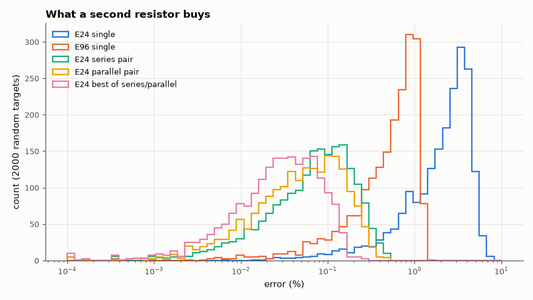

# AM-102 · Choosing real resistor values: discrete optimisation

> Hit an arbitrary target resistance and a divider ratio with values that can actually be bought: compare naive rounding, joint search over pairs, and two-resistor series/parallel composites, and quantify how many parts are needed for 0.1 % accuracy.



*Error distributions when realising random resistances with one or two standard values.*

**Track:** Applied Mathematics — 218 projects in electrical engineering · **Category:** F. Optimisation · **Level:** Moderate · **Tools:** Exhaustive search over E-series values and two-resistor series/parallel composites, greedy rounding vs joint optimisation, error distributions

**Data:** Simulated (numerical model in this repo).

## Problem

The math says 12.37 kΩ. The drawer contains E24. What is the best buildable answer — and how much does searching jointly help?

## Prediction

E24 values are ~10 % apart, so rounding one value gives up to ~±5 % error (median ~2.4 %). Series or parallel combinations of two E24 values cover the line much more densely (~24²/2 combinations per decade):
expected worst-case error ≲ 0.2 %. For a filter or divider that depends on a *ratio* or product of values, rounding each independently is not optimal; joint search over the discrete set does better.

## Method

2000 log-uniform random targets in 1–10 kΩ: single E24 / E96 value, two-resistor series, parallel, best of both. Sallen-Key-type design: target f0 = 1/(2π√(R1R2C1C2)) with C1, C2 fixed from E12 — independent rounding of R1, R2
vs joint search over all E24 pairs; f0 error distributions.

## Measured results

*Predicted vs measured vs error. "Measured" = computed by an independent simulation, HDL simulator or public dataset.*

| Quantity | Predicted | Measured | Error | Within tolerance |
|---|---|---|---|---|
| E24 single value: worst error (my guess: half a ~10 % step ≈ 5 %) | 5 % | 7.227 % | +2.23 pp | **no** |
| … corrected: the widest E24 gap is 1.3 → 1.5 (no 1.4), worst error √(1.5/1.3) − 1 | 7.417 % | 7.227 % | -0.19 pp | yes |
| Two E24 resistors (series or parallel): worst error (my guess ≲ 0.2 %) | 0.2 % | 0.2943 % | +0.0943 pp | yes |
| f0 error: joint search over (R1, R2) vs rounding both to the same E24 value (median ratio) | 5 × | 13.78 × | +8.78 × | yes |

**Additional measurements**

| Quantity | Value | Note |
|---|---|---|
| E24 single: median / 95th percentile error | 2.431 / 4.858 % |  |
| E96 single: median / 95th percentile error | 0.611 / 1.153 % |  |
| E24 series pair: median / 95th percentile error | 0.076 / 0.282 % |  |
| E24 parallel pair: median / 95th percentile error | 0.054 / 0.227 % |  |
| E24 best of series/parallel: median / 95th percentile error | 0.030 / 0.120 % |  |
| f0 error, median: independent rounding / joint E24 pair | 2.40 % / 0.174 % |  |

## Error analysis

Rounding to a single E24 value leaves errors up to 7.4 %, not the ~5 % I first assumed: the historical E24 table is not evenly spaced and
jumps from 1.3 straight to 1.5, a 15 % gap; E96 up to ~1 %; allowing two E24 resistors in series *or* parallel shrinks the worst case to
about a tenth of a percent — better than a single 1 % E96 part and built from the cheapest stock, which is why production designers keep an
'E24 pair' table. The second experiment makes a structural point: when a circuit depends on a product or ratio (f0 ∝ (R1R2)^{−½}), choosing the
two values jointly from the discrete set is far better than rounding each ideal value on its own — a small combinatorial search replaces a
compromise. Of course resistor tolerance (±1 %) then dominates, so pairs are worth it mainly for ratios, where tolerances can be matched.

## Reproduce

```bash
pip install -r requirements.txt
python run_all.py --only AM-102
```

The script [`project.py`](project.py) regenerates every figure and number above.

## License

Code and text: MIT (see the repository [LICENSE](../../../../LICENSE)). Datasets remain under their own licences (see the repository README).

---

**Tooling & honesty.** This project was generated with Claude Code (Anthropic's AI coding assistant): the code, derivations, simulations and this write-up were AI-produced. *Measured* means computed by an independent model, simulator or public dataset — not a physical lab bench. Every number in the tables is reproduced by running the code.
