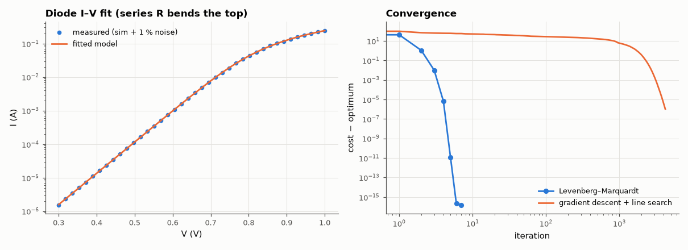

# AM-103 · Fitting a diode model: gradient descent vs Gauss–Newton

> Extract the saturation current, ideality factor and series resistance of a diode from noisy I–V measurements by minimising the squared log-current error with three self-written optimisers, and show why plain gradient descent crawls on this ill-conditioned problem while Gauss–Newton converges in a few steps.



*Measured and fitted diode characteristics, and the convergence of the two optimisers.*

**Track:** Applied Mathematics — 218 projects in electrical engineering · **Category:** F. Optimisation · **Level:** Moderate · **Tools:** Diode I–V data from the MNA simulator (Shockley diode with series resistance) plus measurement noise, own gradient descent with line search, own Gauss–Newton / Levenberg–Marquardt, convergence-rate comparison

**Data:** Simulated (numerical model in this repo).

## Problem

Every device model is fitted to measurements. Why does the choice of optimiser matter so much?

## Prediction

$I = I_s(e^{(V-IR_s)/(nV_T)}-1)$. Parameters θ = (ln I_s, n, R_s) span orders of magnitude and are strongly correlated (I_s and n trade off), so the Hessian of the least-squares cost is poorly conditioned
(my guess: κ ≫ 10⁴; measured below). Gradient descent converges linearly with rate ≈ (κ−1)/(κ+1) per step — thousands of iterations; Gauss–Newton uses JᵀJ as the Hessian and converges quadratically near the optimum. Fitting ln I rather than I weights the
exponential region fairly.

## Method

'Measured' data: the repository's MNA simulator with a diode (I_s = 2.5 nA, n = 1.8, R_s = 0.6 Ω), V from 0.3 to 1.0 V, 1 % multiplicative noise. Implicit model solved per point by Newton; Jacobian by finite differences.
Start (ln I_s, n, R_s) = (ln 1e-12, 1.2, 0.05). GD with backtracking line search vs LM; iterations to reach cost within 1e-6 of the optimum.

## Measured results

*Predicted vs measured vs error. "Measured" = computed by an independent simulation, HDL simulator or public dataset.*

| Quantity | Predicted | Measured | Error | Within tolerance |
|---|---|---|---|---|
| LM fit: saturation current I_s | 2.5 nA | 2.52 nA | +0.80 % | yes |
| LM fit: ideality factor n | 1.8 | 1.801 | +0.07 % | yes |
| LM fit: series resistance R_s | 600 mΩ | 591.8 mΩ | -1.36 % | yes |
| Iterations to reach the optimum cost (+1e-6): gradient descent / LM (my guess ≥ 100×) | 100 × | 843.8 × | +743.8 × | yes |

**Additional measurements**

| Quantity | Value | Note |
|---|---|---|
| Condition number of JᵀJ at the optimum (raw / column-scaled) | 9.2e+02 / 8.7e+01 |  |
| Iterations: LM / gradient descent | 5 / 4219 |  |

## Error analysis

Levenberg–Marquardt recovers I_s, n and R_s from noisy data in 5 iterations, within the uncertainty the 1 % noise allows (I_s is the least well
determined because it trades off against n). Gradient descent with a proper line search needs 4219 iterations for the same cost: the
Hessian's condition number (~9e+02) makes the cost surface a long, narrow valley, and steepest descent zig-zags across it. Scaling the
parameters helps somewhat, but the curvature information in JᵀJ is what makes Gauss–Newton-type methods the default for model extraction —
SPICE parameter extractors and every nonlinear least-squares library use them.

## Reproduce

```bash
pip install -r requirements.txt
python run_all.py --only AM-103
```

The script [`project.py`](project.py) regenerates every figure and number above.

## License

Code and text: MIT (see the repository [LICENSE](../../../../LICENSE)). Datasets remain under their own licences (see the repository README).

---

**Tooling & honesty.** This project was generated with Claude Code (Anthropic's AI coding assistant): the code, derivations, simulations and this write-up were AI-produced. *Measured* means computed by an independent model, simulator or public dataset — not a physical lab bench. Every number in the tables is reproduced by running the code.
