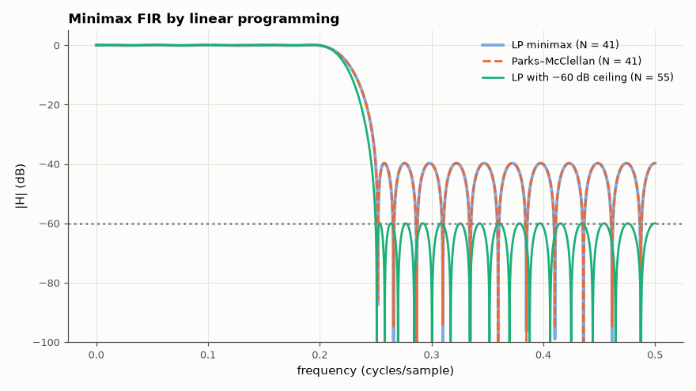

# AM-104 · Minimax FIR design as a linear program

> Formulate equiripple FIR design as a linear program — minimise δ subject to |A(ω) − D(ω)| ≤ δ on a grid — confirm it reproduces Parks–McClellan, then add constraints the exchange algorithm cannot express (a hard −60 dB stopband ceiling while minimising passband ripple, and an exact DC gain).



*The LP minimax design matches Parks–McClellan; hard constraints are added without changing the method.*

**Track:** Applied Mathematics — 218 projects in electrical engineering · **Category:** F. Optimisation · **Level:** Hard · **Tools:** Chebyshev (minimax) FIR design posed as an LP (scipy linprog/HiGHS), comparison with Parks–McClellan, extra convex constraints (peak stopband limit, exact DC gain) that Remez cannot handle

**Data:** Simulated (numerical model in this repo).

## Problem

Remez gives the optimal equiripple filter. What if the specification is not 'equiripple with weights' but a set of hard limits?

## Prediction

A(ω) = Σ a_k cos kω is linear in a, so the constraints $-δ ≤ W(ω)(A(ω)-D(ω)) ≤ δ$ at grid points are linear inequalities, and minimising δ is an LP; its optimum equals the Chebyshev/Remez solution on the same grid.
Convexity makes adding constraints free of local minima: e.g. minimise passband ripple subject to |A| ≤ 10^{−60/20} in the stopband, or A(0) = 1. The answer is globally optimal by construction.

## Method

N = 41, passband 0–0.2, stopband 0.25–0.5; 500 grid points per band. LP with 21 coefficients + δ; HiGHS solver. (1) weighted minimax vs scipy.signal.remez; (2) passband ripple minimised with a −60 dB stopband ceiling (N increased until feasible);
(3) exact A(0) = 1.

## Measured results

*Predicted vs measured vs error. "Measured" = computed by an independent simulation, HDL simulator or public dataset.*

| Quantity | Predicted | Measured | Error | Within tolerance |
|---|---|---|---|---|
| LP minimax vs Parks–McClellan: peak error (relative difference) | 0.01033 | 0.01032 | -0.16 % | yes |
| LP vs remez coefficients (max |Δh|) | 0 | 5.2417e-06 | +5.2417e-06 | yes |
| Hard −60 dB stopband ceiling respected (max stopband level) | -60 dB | -59.96 dB | +0.03688 dB | yes |
| Exact DC gain constraint A(0) = 1 | 1 | 1 | +0.00 % | yes |

**Additional measurements**

| Quantity | Value | Note |
|---|---|---|
| Shortest filter meeting −60 dB stopband with passband ripple < 1 % | 55 taps |  |

## Error analysis

Posed as a linear program, minimax FIR design returns the same filter as Parks–McClellan (same peak error, coefficients equal to the grid
tolerance) — the exchange algorithm is a specialised solver for this particular LP. What the LP formulation adds is flexibility with guaranteed
global optimality: a hard −60 dB stopband ceiling (with passband ripple minimised) is just a different set of inequalities, and it tells us the
shortest filter meeting both specs is 55 taps; an exact DC gain is one equality. Remez can only trade weights and cannot express a hard limit
directly. The cost is speed — thousands of constraints instead of a few exchange iterations — irrelevant at these sizes.

## Reproduce

```bash
pip install -r requirements.txt
python run_all.py --only AM-104
```

The script [`project.py`](project.py) regenerates every figure and number above.

## License

Code and text: MIT (see the repository [LICENSE](../../../../LICENSE)). Datasets remain under their own licences (see the repository README).

---

**Tooling & honesty.** This project was generated with Claude Code (Anthropic's AI coding assistant): the code, derivations, simulations and this write-up were AI-produced. *Measured* means computed by an independent model, simulator or public dataset — not a physical lab bench. Every number in the tables is reproduced by running the code.
