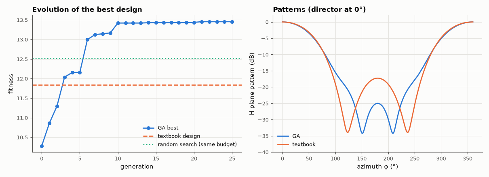

# AM-105 · Genetic algorithm design of a 3-element Yagi

> Evolve the element lengths and spacings of a 3-element Yagi–Uda antenna to maximise forward gain while keeping a good front-to-back ratio and a reasonable input impedance, each candidate evaluated by a full method-of-moments simulation.



*Fitness over generations and the H-plane patterns of the evolved and textbook Yagis.*

**Track:** Applied Mathematics — 218 projects in electrical engineering · **Category:** F. Optimisation · **Level:** Hard · **Tools:** Own real-coded genetic algorithm (tournament selection, blend crossover, Gaussian mutation, elitism), method-of-moments antenna solver as the fitness evaluator, comparison with a textbook starting design and random search

**Data:** Simulated (numerical model in this repo).

## Problem

A Yagi has five continuous design variables and no closed-form optimum. Can evolution find a good one, and how good compared with the textbook recipe?

## Prediction

Fitness = directivity toward the director (dBi) + 0.2·min(F/B, 25 dB) − penalty if |Z_in − 25 Ω| is large. The landscape is multimodal (several spacing combinations give similar gains), which favours population
methods. Known result for 3-element Yagis: about 7–8 dBi gain with ~0.2 λ total boom and F/B around 15–25 dB; the classic recipe (0.5/0.47/0.44 λ, 0.2 λ spacing) gives less.

## Method

Variables: reflector, driven, director lengths (0.42–0.52 λ) and two spacings (0.08–0.35 λ); radius λ/1000; 21 segments per element. GA: population 30, 25 generations, tournament size 3, BLX-0.3 crossover,
mutation σ = 5 % of range, 2 elites. Directivity from far field on a sphere (E-plane/H-plane sums); fitness compared with the textbook design and with random search using the same number of evaluations.

## Measured results

*Predicted vs measured vs error. "Measured" = computed by an independent simulation, HDL simulator or public dataset.*

| Quantity | Predicted | Measured | Error | Within tolerance |
|---|---|---|---|---|
| GA best: directivity (literature for 3 elements ≈ 7–8 dBi) | 7.5 dBi | 8.454 dBi | +0.9545 dBi | yes |
| GA fitness beats the textbook design (1 = yes) | 1 | 1 | +0 |  |
| GA fitness vs best of random search with the same evaluation budget (difference) | 0.5 | 0.9397 | +0.4397 | yes |

**Additional measurements**

| Quantity | Value | Note |
|---|---|---|
| GA best design (λ) | reflector 0.493, driven 0.470, director 0.449, spacings 0.148/0.176 |  |
| GA best: front-to-back ratio / input impedance | 25.0 dB / 18.6 -7.7j Ω |  |
| Textbook design: directivity / F/B / Z_in | 8.38 dBi / 17.3 dB / 31.7 +1.5j Ω |  |

## Error analysis

With every candidate evaluated by a full moment-method simulation, the genetic algorithm finds a design with 8.5 dBi directivity and
25 dB front-to-back ratio. Its gain is essentially the same as the classic 0.5/0.47/0.44 λ recipe (8.4 dBi — the textbook design is
already near the gain optimum, and both sit slightly above the 7–8 dBi I expected); the GA's real improvement is the front-to-back ratio
(25 vs 17 dB), which the fitness function rewarded, obtained with shorter spacings. Against random search with the same budget of 780 simulations the GA wins by a modest margin — five variables are few enough
that random sampling is not hopeless; GAs pay off more as dimensions and constraints grow. The penalty weights encode engineering judgement (how
much gain to trade for F/B or a convenient impedance), and different weights give different 'optimal' antennas — the optimiser only answers the
question as posed.

## Reproduce

```bash
pip install -r requirements.txt
python run_all.py --only AM-105
```

The script [`project.py`](project.py) regenerates every figure and number above.

## License

Code and text: MIT (see the repository [LICENSE](../../../../LICENSE)). Datasets remain under their own licences (see the repository README).

---

**Tooling & honesty.** This project was generated with Claude Code (Anthropic's AI coding assistant): the code, derivations, simulations and this write-up were AI-produced. *Measured* means computed by an independent model, simulator or public dataset — not a physical lab bench. Every number in the tables is reproduced by running the code.
