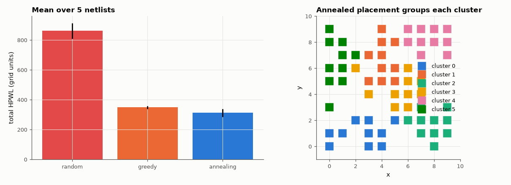

# AM-106 · Simulated annealing for component placement

> Place 60 components connected by 90 multi-pin nets on a 10×10 grid to minimise total wirelength; compare random placement, greedy improvement and simulated annealing, and show that annealing's willingness to accept uphill moves escapes the local minima that trap greedy search.



*Wirelength for three placement methods, and an annealed placement coloured by logical cluster.*

**Track:** Applied Mathematics — 218 projects in electrical engineering · **Category:** F. Optimisation · **Level:** Hard · **Tools:** Half-perimeter wirelength (HPWL) objective, random, greedy (steepest-descent swaps) and simulated-annealing placement on a grid, cooling-schedule study

**Data:** Simulated (numerical model in this repo).

## Problem

Placement is a huge combinatorial problem. Why does an algorithm that deliberately makes things worse sometimes find better solutions?

## Prediction

Cost = Σ_nets (bounding-box half-perimeter). Moves: swap two cells (or move to an empty site). Metropolis rule: accept an uphill Δ with probability e^{−Δ/T}; T is lowered geometrically. At high T the search wanders
freely; as T → 0 it becomes greedy. With slow enough cooling annealing approaches the global optimum; greedy search stops at the first local minimum. I expect SA to cut wirelength ~30–50 % below random and ~10–20 % below greedy.

## Method

Synthetic netlist with locality (components in 6 clusters, nets mostly within clusters, some global). Greedy: random swaps accepted only if they improve, until 20,000 consecutive failures. SA: T₀ from the average uphill Δ, α = 0.95 per
stage, 2000 moves per stage, stop when acceptance < 0.5 %. 5 seeds each; cooling-rate study α = 0.8…0.99.

## Measured results

*Predicted vs measured vs error. "Measured" = computed by an independent simulation, HDL simulator or public dataset.*

| Quantity | Predicted | Measured | Error | Within tolerance |
|---|---|---|---|---|
| SA reduction vs random placement (mean over 5 netlists; my guess 30–50 %) | 40 % | 63.76 % | +23.8 pp | **no** |
| SA advantage over greedy swapping (my guess 10–20 %) | 15 % | 10.49 % | -4.51 pp | yes |
| SA better than greedy on every netlist (1 = yes) | 1 | 1 | +0 |  |

**Additional measurements**

| Quantity | Value | Note |
|---|---|---|
| Wirelength vs cooling rate α = 0.8 / 0.9 / 0.95 / 0.98 | 361 / 362 / 358 / 353 |  |

## Error analysis

Annealing cuts total wirelength by 64 % relative to random placement and beats greedy swapping on every netlist (by
10 % on average): greedy search stops at the first placement where no single swap helps, while annealing's accepted
uphill moves let whole groups migrate before the temperature freezes them. Without being told, the annealed layout collects each logical
cluster into a compact region. Slower cooling generally helps but with diminishing returns, and it multiplies run time; industrial placers combine
annealing-like global moves with analytical (quadratic-wirelength) placement for speed.

## Reproduce

```bash
pip install -r requirements.txt
python run_all.py --only AM-106
```

The script [`project.py`](project.py) regenerates every figure and number above.

## License

Code and text: MIT (see the repository [LICENSE](../../../../LICENSE)). Datasets remain under their own licences (see the repository README).

---

**Tooling & honesty.** This project was generated with Claude Code (Anthropic's AI coding assistant): the code, derivations, simulations and this write-up were AI-produced. *Measured* means computed by an independent model, simulator or public dataset — not a physical lab bench. Every number in the tables is reproduced by running the code.
