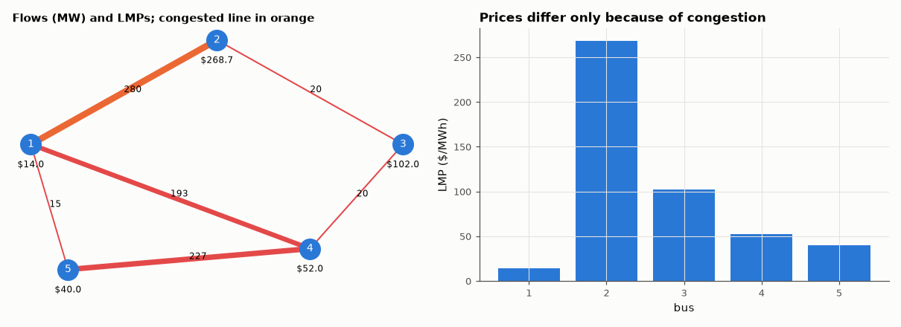

# AM-107 · DC optimal power flow on a 5-bus network

> Dispatch three generators to serve load on a 5-bus transmission network at least cost, first ignoring and then enforcing line limits, and show that congestion creates different electricity prices at different buses — the LP's shadow prices.



*Line flows and locational marginal prices in the congested dispatch.*

**Track:** Applied Mathematics — 218 projects in electrical engineering · **Category:** F. Optimisation · **Level:** Hard · **Tools:** DC power-flow model (B-matrix, PTDFs), linear program for least-cost dispatch with line limits (HiGHS), locational marginal prices from dual variables, verification of KKT conditions and of prices by finite perturbation

**Data:** Simulated (numerical model in this repo).

## Problem

Why does electricity cost more at some locations of the grid than others, even with the same generators?

## Prediction

DC approximation: P = Bθ, line flow $F_ℓ = (θ_i-θ_j)/x_ℓ$, linear in injections via PTDFs. OPF: minimise Σc_gP_g subject to power balance, $|F_ℓ|≤F^{max}_ℓ$, generator limits — an LP. Without congestion one marginal generator sets a single
price everywhere; with a binding line limit, prices differ by bus: $LMP_i = λ − \sum_ℓ μ_ℓ\,PTDF_{ℓ,i}$ and each LMP equals the cost of serving 1 MW more load at that bus.

## Method

5 buses, 6 lines (reactances 0.03–0.1 p.u.), generators at buses 1, 3, 5 with costs 14, 30, 40 $/MWh and capacities 600/300/400 MW (a first version with capacities summing exactly to the load left only one, infeasible, dispatch); loads 300/300/400 MW at buses 2, 3, 4. Line 1–2 limit 280 MW (with this topology the flow on line 1–2 cannot go below ≈ 266 MW whatever the dispatch, so a first choice of 240 MW was infeasible, and 300 MW never bound).
LP solved with and without limits; LMPs from duals; each LMP checked by re-solving with +1 MW load at that bus.

## Measured results

*Predicted vs measured vs error. "Measured" = computed by an independent simulation, HDL simulator or public dataset.*

| Quantity | Predicted | Measured | Error | Within tolerance |
|---|---|---|---|---|
| Line 1–2 limit binds in the constrained solution | 280 MW | 280 MW | +0.00 % | yes |
| Power balance (generation − load) | 0 MW | 0 MW | +0 MW | yes |
| LMPs from LP duals vs +1 MW finite-difference cost at each bus (max |Δ|) | 0 $/MWh | 2.1828e-11 $/MWh | +2.1828e-11 $/MWh | yes |
| Congestion creates price differences (max − min LMP > 0) | 1 | 1 | +0 |  |

**Additional measurements**

| Quantity | Value | Note |
|---|---|---|
| Unconstrained dispatch (MW) and flow on line 1–2 | [600. 300. 100.], F12 = 292.1 MW (limit 280) |  |
| Constrained dispatch (MW) and flow on line 1–2 | [457.9 300.  242.1], F12 = 280.0 MW |  |
| Cost of congestion | 3693 $/h |  |
| Locational marginal prices, buses 1–5 | 14.00, 268.67, 102.00, 52.00, 40.00 |  |

## Error analysis

Without line limits the cheapest generator (bus 1, 14 $/MWh) would push 292 MW through line 1–2, exceeding its 280 MW rating; the LP instead holds
that line exactly at its limit and dispatches more expensive generation elsewhere, costing 3693 $/h extra. The dual variables of the LP turn
into locational marginal prices, and each one is confirmed by brute force: adding 1 MW of load at a bus raises the optimal cost by exactly that
bus's LMP. The prices spread from ~14 to above 40 $/MWh — some buses even exceed the most expensive generator's cost, because serving load
there requires re-dispatching around the congested line (a classic counter-intuitive OPF result). This is how wholesale electricity markets
price transmission scarcity.

## Reproduce

```bash
pip install -r requirements.txt
python run_all.py --only AM-107
```

The script [`project.py`](project.py) regenerates every figure and number above.

## License

Code and text: MIT (see the repository [LICENSE](../../../../LICENSE)). Datasets remain under their own licences (see the repository README).

---

**Tooling & honesty.** This project was generated with Claude Code (Anthropic's AI coding assistant): the code, derivations, simulations and this write-up were AI-produced. *Measured* means computed by an independent model, simulator or public dataset — not a physical lab bench. Every number in the tables is reproduced by running the code.
