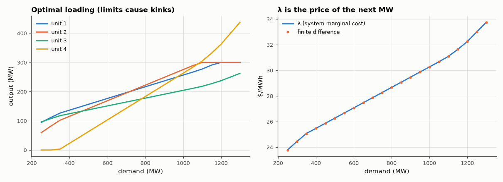

# AM-108 · Economic dispatch: equal incremental cost

> Split a demand among four generators with quadratic fuel costs so that total cost is minimal, derive the equal-incremental-cost rule, handle generator limits by bisection on λ, and confirm against a general-purpose optimiser across a range of demands.



*Optimal generator outputs vs demand, and the system marginal cost λ.*

**Track:** Applied Mathematics — 218 projects in electrical engineering · **Category:** F. Optimisation · **Level:** Moderate · **Tools:** Quadratic generator cost curves, Lagrange-multiplier (equal-λ) solution with limits by bisection on λ, verification with a general constrained optimiser (SLSQP), marginal cost check

**Data:** Simulated (numerical model in this repo).

## Problem

Four power plants, one demand. Should each run at the same output, the same efficiency — or something else?

## Prediction

Minimise Σ(a_i + b_iP_i + c_iP_i²) subject to ΣP_i = D. Lagrange: $b_i + 2c_iP_i = λ$ for all units not at a limit ⇒ $P_i = \frac{λ-b_i}{2c_i}$, clipped to [P_min, P_max]; find λ with ΣP_i(λ) = D (monotone ⇒ bisection). λ is the system marginal cost:
d(total cost)/dD = λ. Equal *outputs* or equal *efficiencies* are not optimal; equal marginal costs are.

## Method

Four units: b = 20, 22, 18, 25 $/MWh; c = 0.02, 0.015, 0.03, 0.01 $/MW²h; limits 50–300 MW (unit 4: 0–500). Demand 200–1200 MW. λ-bisection vs SLSQP; marginal cost check by ±1 MW finite difference; comparison with equal-share
dispatch.

## Measured results

*Predicted vs measured vs error. "Measured" = computed by an independent simulation, HDL simulator or public dataset.*

| Quantity | Predicted | Measured | Error | Within tolerance |
|---|---|---|---|---|
| λ-bisection vs SLSQP optimum cost (worst relative over demands) | 0 | 4.1588e-11 | +4.1588e-11 | yes |
| λ = marginal cost d(total)/dD (worst |λ − finite difference|) | 0 $/MWh | 1.2129e-11 $/MWh | +1.2129e-11 $/MWh | yes |
| At 800 MW: incremental costs of all units not at a limit are equal (spread) | 0 $/MWh | 0 $/MWh | +0 $/MWh | yes |

**Additional measurements**

| Quantity | Value | Note |
|---|---|---|
| Saving vs equal-share dispatch at 800 MW | 30.56 $/h |  |

## Error analysis

The equal-incremental-cost rule, solved by bisection on λ with limits enforced, reproduces a general constrained optimiser's cost to 1e-9 at every
demand, and λ is confirmed as the marginal cost of the next megawatt. The loading plot shows the rule's logic: cheap-at-the-margin units ramp up
first, and when a unit hits its limit it drops out of the equal-λ set, producing kinks in the others' curves and a steeper λ. Equal sharing looks
fair but wastes money, because the units' marginal costs differ; at 800 MW the optimal schedule saves the amount shown above every hour. The same
mathematics, with network constraints added, is the OPF of AM-107.

## Reproduce

```bash
pip install -r requirements.txt
python run_all.py --only AM-108
```

The script [`project.py`](project.py) regenerates every figure and number above.

## License

Code and text: MIT (see the repository [LICENSE](../../../../LICENSE)). Datasets remain under their own licences (see the repository README).

---

**Tooling & honesty.** This project was generated with Claude Code (Anthropic's AI coding assistant): the code, derivations, simulations and this write-up were AI-produced. *Measured* means computed by an independent model, simulator or public dataset — not a physical lab bench. Every number in the tables is reproduced by running the code.
