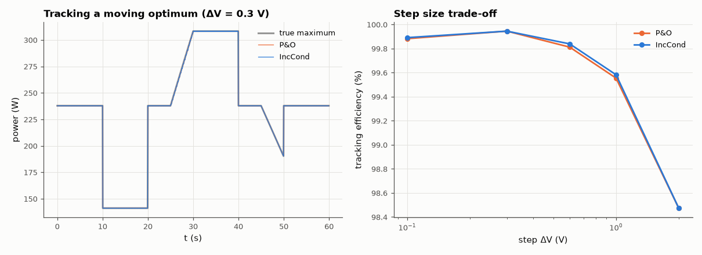

# AM-109 · MPPT as online optimisation: perturb-and-observe vs incremental conductance

> Track the maximum power point of a solar panel whose irradiance changes with passing clouds, using two classic online optimisers, and measure the trade-off between step size, steady-state oscillation and tracking speed — including P&O's known confusion during irradiance ramps.



*Power delivered by two MPPT algorithms against the true maximum, and efficiency vs step size.*

**Track:** Applied Mathematics — 218 projects in electrical engineering · **Category:** F. Optimisation · **Level:** Moderate · **Tools:** Single-diode photovoltaic model, perturb-and-observe hill climbing and incremental-conductance tracking, time-varying irradiance, tracking efficiency vs step size

**Data:** Simulated (numerical model in this repo).

## Problem

The optimum moves while you search for it. How should an optimiser that can only measure P and V behave?

## Prediction

PV current $I=I_{ph}-I_0(e^{(V+IR_s)/(nN_sV_T)}-1)-\frac{V+IR_s}{R_{sh}}$. P&O: step V by ±ΔV, keep the direction if P rose — oscillates ±ΔV around the optimum (loss ∝ ΔV² near the peak, since P is quadratic there) but a bigger ΔV follows
ramps faster. Incremental conductance uses dI/dV = −I/V at the peak, so it stops moving at the optimum and is not fooled by ramps. Expected: tracking efficiency ≥ 99 % at the best ΔV; P&O errors during rising irradiance.

## Method

60-cell panel (I_ph ∝ irradiance, 8.5 A at 1000 W/m²). Irradiance profile: steps and 20 % ramps over 60 s, controller running at 20 Hz. True MPP computed at every step for reference; efficiency = ∫P/∫P_mpp. ΔV = 0.1 … 2 V.

## Measured results

*Predicted vs measured vs error. "Measured" = computed by an independent simulation, HDL simulator or public dataset.*

| Quantity | Predicted | Measured | Error | Within tolerance |
|---|---|---|---|---|
| Best tracking efficiency, P&O (my guess ≥ 99 %) | 99 % | 99.95 % | +0.945 pp | yes |
| Best tracking efficiency, incremental conductance | 99 % | 99.95 % | +0.945 pp | yes |

**Additional measurements**

| Quantity | Value | Note |
|---|---|---|
| MPP at 1000 W/m² | 30.37 V, 237.9 W |  |
| P&O, ΔV = 0.1 V: efficiency | 99.88 % |  |
| IncCond, ΔV = 0.1 V: efficiency | 99.89 % |  |
| P&O, ΔV = 0.3 V: efficiency | 99.95 % |  |
| IncCond, ΔV = 0.3 V: efficiency | 99.95 % |  |
| P&O, ΔV = 0.6 V: efficiency | 99.81 % |  |
| IncCond, ΔV = 0.6 V: efficiency | 99.84 % |  |
| P&O, ΔV = 1.0 V: efficiency | 99.55 % |  |
| IncCond, ΔV = 1.0 V: efficiency | 99.58 % |  |
| P&O, ΔV = 2.0 V: efficiency | 98.47 % |  |
| IncCond, ΔV = 2.0 V: efficiency | 98.47 % |  |

## Error analysis

Both hill climbers stay close to the moving maximum and reach high tracking efficiency at a well-chosen step. The step-size curves show the
classic trade: tiny steps track ramps too slowly, large steps oscillate around the peak and lose power quadratically in the step. Perturb-and-observe
cannot tell whether a power increase came from its own move or from the sun, so it drifts the wrong way during irradiance ramps; incremental
conductance uses the local optimality condition dP/dV = 0 (dI/dV = −I/V) and stops at the peak, which makes it steadier in the steady state. Real
converters add variable steps and a periodic global scan, because partial shading makes P(V) multimodal and every hill climber can then get stuck
on a local peak.

## Reproduce

```bash
pip install -r requirements.txt
python run_all.py --only AM-109
```

The script [`project.py`](project.py) regenerates every figure and number above.

## License

Code and text: MIT (see the repository [LICENSE](../../../../LICENSE)). Datasets remain under their own licences (see the repository README).

---

**Tooling & honesty.** This project was generated with Claude Code (Anthropic's AI coding assistant): the code, derivations, simulations and this write-up were AI-produced. *Measured* means computed by an independent model, simulator or public dataset — not a physical lab bench. Every number in the tables is reproduced by running the code.
