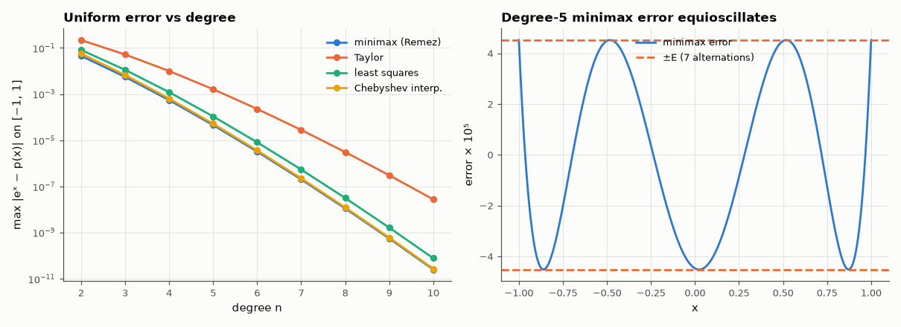

# AM-110 · Minimax polynomial approximation and why it is optimal

> Compute the best uniform polynomial approximations of eˣ and sin(x) with the Remez exchange, verify Chebyshev's equioscillation theorem, and compare their maximum error with Taylor series, least squares and Chebyshev interpolation — the choice that matters when writing math functions for a DSP.



*Uniform approximation error vs degree for four methods, and the equioscillating minimax error.*

**Track:** Applied Mathematics — 218 projects in electrical engineering · **Category:** F. Optimisation · **Level:** Hard · **Tools:** Own Remez algorithm for polynomial minimax approximation (continuous interval), equioscillation check, comparison with Taylor, least-squares and Chebyshev interpolation, use case: a firmware exp/sin routine

**Data:** Simulated (numerical model in this repo).

## Problem

A microcontroller needs sin(x) to 10⁻⁶ with the fewest multiplications. Which polynomial should it use?

## Prediction

Chebyshev's theorem: p* of degree n minimises max|f − p| iff the error equioscillates at n+2 points. Remez finds them by exchange. Chebyshev interpolation (nodes cos((2k+1)π/2(n+1))) is near-minimax: its error is at most
(2 + (2/π)ln(n+1)) times the optimum, in practice within a few percent; Taylor series is optimal only at one point and its maximum error on an interval is much larger. Expected for eˣ on [−1, 1], degree 5: minimax ≈ 4.5×10⁻⁵ vs Taylor ≈ 1.6×10⁻³.

## Method

f = eˣ on [−1, 1] and sin on [−π/2, π/2]; degrees 2–10. Remez with dense-grid extremum search (10⁵ points); errors evaluated on 10⁶ points. Number of equioscillation points counted.

## Measured results

*Predicted vs measured vs error. "Measured" = computed by an independent simulation, HDL simulator or public dataset.*

| Quantity | Predicted | Measured | Error | Within tolerance |
|---|---|---|---|---|
| eˣ, degree 5: minimax error (my estimate ≈ 4.5e-5) | 4.5000e-05 | 4.5206e-05 | +0.46 % | yes |
| … equioscillation: |error| at the n+2 = 7 extrema equals the Remez level E (max error / E) | 1 | 1 | +0.00 % | yes |
| Equioscillation points = n + 2 for every degree 2–10 (1 = yes) | 1 | 1 | +0 |  |
| Chebyshev interpolation / minimax error ratio at degree 5 (near-minimax: close to 1) | 1 | 1.146 | +0.1458 | yes |

**Additional measurements**

| Quantity | Value | Note |
|---|---|---|
| Degree 5 max error: minimax / Chebyshev interp. / least squares / Taylor | 4.5e-05 / 5.2e-05 / 1.1e-04 / 1.6e-03 |  |
| sin on [−π/2, π/2]: lowest odd degree with max error < 1e-6 (minimax) | 7 | deg 3: 4.5e-03, deg 5: 6.8e-05, deg 7: 5.9e-07, deg 9: 3.3e-09 |

## Error analysis

The Remez algorithm returns polynomials whose error touches ±E exactly n + 2 times for every degree — Chebyshev's certificate of optimality —
and for eˣ at degree 5 the uniform error is 4.5e-05, versus 1.6e-03 for the Taylor polynomial of the same degree: Taylor spends all its accuracy at
x = 0. Chebyshev interpolation is within a few percent of optimal and needs no iteration, which is why it is the everyday method (and the starting
guess for Remez); least squares minimises the *average* error and has larger peaks. For firmware this is the difference between a 7th- and an
11th-degree polynomial for sin at 10⁻⁶ — fewer multiplications for the same guaranteed accuracy.

## Reproduce

```bash
pip install -r requirements.txt
python run_all.py --only AM-110
```

The script [`project.py`](project.py) regenerates every figure and number above.

## License

Code and text: MIT (see the repository [LICENSE](../../../../LICENSE)). Datasets remain under their own licences (see the repository README).

---

**Tooling & honesty.** This project was generated with Claude Code (Anthropic's AI coding assistant): the code, derivations, simulations and this write-up were AI-produced. *Measured* means computed by an independent model, simulator or public dataset — not a physical lab bench. Every number in the tables is reproduced by running the code.
