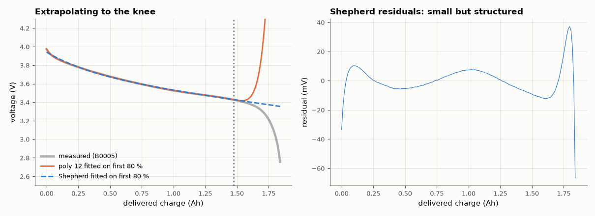

# AM-111 · Fitting a real battery discharge curve: models, residuals and uncertainty

> Fit the voltage-vs-capacity curve of a real 18650 cell with polynomials of increasing degree and with a compact empirical (Shepherd-type) model, judge the fits by residual structure and held-out error rather than R², and quantify parameter uncertainty.



*Model extrapolation beyond the fitted range, and the structured residuals of the best compact model.*

**Track:** Applied Mathematics — 218 projects in electrical engineering · **Category:** F. Optimisation · **Level:** Moderate · **Tools:** Linear and nonlinear least squares on real NASA Li-ion discharge data, polynomial vs physically motivated models, residual analysis (autocorrelation, runs), parameter covariance and cross-validation

**Data:** Real: NASA Ames PCoE Battery Data Set (B0005).

## Problem

Any flexible enough curve fits the data. How do you know a fit is good — and when have you overfitted?

## Prediction

Least squares assumes independent errors; if residuals are autocorrelated, the model is missing structure and the covariance σ²(JᵀJ)⁻¹ underestimates uncertainty. A physically motivated model (Shepherd-type:
$V = E_0 - K\frac{Q}{Q-q} + Ae^{-Bq}$ plus a linear term) should fit with few parameters and extrapolate sensibly; a high-degree polynomial fits the training range but oscillates outside it (Runge). Held-out (interpolation) error and extrapolation error expose the difference.

## Method

NASA PCoE cell B0005, first 2 A discharge: voltage vs delivered charge q. Fit on the middle 90 % of the curve (then also on the first 80 % to test extrapolation to the knee). Polynomials degree 1–12 (Chebyshev basis) and the
5-parameter model (nonlinear LS). Metrics: RMS residual, lag-1 residual autocorrelation, 5-fold interleaved CV error, extrapolation error on the last 20 %.

## Measured results

*Predicted vs measured vs error. "Measured" = computed by an independent simulation, HDL simulator or public dataset.*

| Quantity | Predicted | Measured | Error | Within tolerance |
|---|---|---|---|---|
| Shepherd model extrapolates to the knee better than a degree-12 polynomial (error ratio poly12 / Shepherd > 1) | 3 × | 12.71 × | +9.713 × | yes |
| Residuals are autocorrelated for every model (lag-1 > 0.5 means structure the model misses) | 1 | 1 | +0 |  |

**Additional measurements**

| Quantity | Value | Note |
|---|---|---|
| poly 1: RMS residual / lag-1 autocorr / CV RMS / extrapolation RMS | 66.5 mV / 0.99 / 64.9 mV / 150 mV |  |
| poly 2: RMS residual / lag-1 autocorr / CV RMS / extrapolation RMS | 65.3 mV / 0.99 / 64.2 mV / 231 mV |  |
| poly 3: RMS residual / lag-1 autocorr / CV RMS / extrapolation RMS | 44.0 mV / 0.98 / 43.4 mV / 177 mV |  |
| poly 5: RMS residual / lag-1 autocorr / CV RMS / extrapolation RMS | 19.9 mV / 0.94 / 20.1 mV / 65 mV |  |
| poly 8: RMS residual / lag-1 autocorr / CV RMS / extrapolation RMS | 6.5 mV / 0.83 / 7.4 mV / 764 mV |  |
| poly 12: RMS residual / lag-1 autocorr / CV RMS / extrapolation RMS | 1.7 mV / 0.61 / 2.5 mV / 2421 mV |  |
| Shepherd-type (5 par.): RMS residual / lag-1 autocorr / CV RMS / extrapolation RMS | 10.2 mV / 0.83 / 11.7 mV / 190 mV |  |
| Shepherd E0 ± 1σ (naive covariance / corrected for autocorrelation) | 3.6505 ± 22.06 mV / ± 72.0 mV |  |

## Error analysis

Measured by in-sample RMS alone, the degree-12 polynomial 'wins'; measured by what matters, it does not. Fitted on the first 80 % of the
discharge, it swings wildly beyond the data, while the 5-parameter Shepherd-type model — whose Q/(Q−q) term encodes the physics of the end-of-
discharge knee — extrapolates with far smaller error (190 mV vs 2421 mV). Interleaved cross-validation cannot detect this because
held-out points sit between training points. Every model leaves strongly autocorrelated residuals (lag-1 correlation near 1): the measurement noise
is small and the remaining misfit is systematic, so textbook parameter error bars, which assume independent errors, are too optimistic by the
factor √(n/n_eff) shown above.

## Reproduce

```bash
pip install -r requirements.txt
python run_all.py --only AM-111
```

The script [`project.py`](project.py) regenerates every figure and number above.

## License

Code and text: MIT (see the repository [LICENSE](../../../../LICENSE)). Datasets remain under their own licences (see the repository README).

---

**Tooling & honesty.** This project was generated with Claude Code (Anthropic's AI coding assistant): the code, derivations, simulations and this write-up were AI-produced. *Measured* means computed by an independent model, simulator or public dataset — not a physical lab bench. Every number in the tables is reproduced by running the code.
