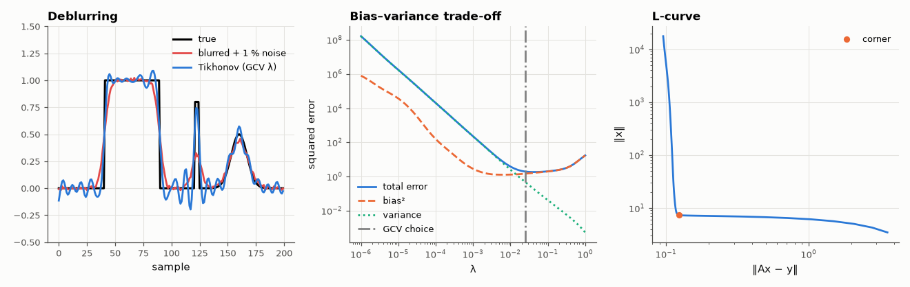

# AM-112 · Tikhonov regularisation: deblurring a sensor signal

> Undo the blur of a slow sensor from noisy data: show that naive inversion amplifies noise catastrophically, regularise with Tikhonov and truncated SVD, choose the parameter by the L-curve and GCV, and decompose the error into bias and variance as the parameter varies.



*Deblurring result, the bias–variance decomposition of the error vs λ, and the L-curve.*

**Track:** Applied Mathematics — 218 projects in electrical engineering · **Category:** F. Optimisation · **Level:** Hard · **Tools:** Ill-posed deconvolution (Gaussian blur Toeplitz matrix), SVD analysis, truncated SVD and Tikhonov (ridge) solutions, L-curve and generalised cross-validation, bias–variance decomposition by Monte Carlo

**Data:** Simulated (numerical model in this repo).

## Problem

A sensor smooths the true signal. Inverting the smoothing should restore it — why does that produce garbage, and what is the principled fix?

## Prediction

y = Ax + n with A = UΣVᵀ having singular values decaying to ~10⁻¹⁵: naive $x=\sum \frac{u_i^Ty}{σ_i}v_i$ amplifies noise by 1/σ_i. Tikhonov $\min\|Ax-y\|^2+λ^2\|x\|^2$ applies filter factors $f_i=\frac{σ_i^2}{σ_i^2+λ^2}$. Error = bias² (grows with λ) +
variance (shrinks with λ): U-shaped with a minimum. GCV $G(λ)=\frac{\|Ax_λ-y\|^2}{(\mathrm{trace}(I-AA_λ^+))^2}$ estimates the optimum without knowing x.

## Method

x: piecewise signal (steps + a bump), N = 200; Gaussian blur σ = 4 samples; noise 1 % of max. λ from 10⁻⁶ to 1: error, bias², variance (100 noise realisations), residual/solution norms (L-curve corner by max curvature), GCV minimum.

## Measured results

*Predicted vs measured vs error. "Measured" = computed by an independent simulation, HDL simulator or public dataset.*

| Quantity | Predicted | Measured | Error | Within tolerance |
|---|---|---|---|---|
| Naive inversion: error norm / signal norm (≫ 1: noise amplified) | 100 × | 2.0693e+15 × | +2.0693e+15 × | yes |
| Error = bias² + variance (max relative mismatch over λ) | 0 | 4.5543e-16 | +4.5543e-16 | yes |
| GCV-chosen λ vs true error-minimising λ (ratio, within ×3 is good) | 1 × | 0.631 × | -0.369 × | yes |
| Regularised error at the GCV λ relative to the best possible (ratio) | 1 | 1.061 | +6.15 % | yes |

**Additional measurements**

| Quantity | Value | Note |
|---|---|---|
| Singular values of the blur matrix: largest / smallest | 1.00 / 2.0e-17 | condition number 5.0e+16 |
| λ: error-optimal / GCV / L-curve corner | 4.0e-02 / 2.5e-02 / 2.0e-02 |  |

## Error analysis

The blur matrix has a condition number around 10¹⁵ (its singular values decay like the Gaussian's spectrum), so naive inversion multiplies the 1 %
noise into an estimate hundreds of times larger than the signal itself. Tikhonov regularisation damps each singular component by σ²/(σ² + λ²), and the
Monte-Carlo decomposition shows the textbook U-curve exactly: variance falls and bias grows with λ, and their sum (matching the measured error to
rounding) has a clear minimum. GCV picks a λ close to that optimum without knowing the true signal; the L-curve corner lands nearby. The
regularised solution recovers the steps and bump but rounds their edges — information destroyed by the blur (high frequencies below the noise)
cannot be restored, only traded between bias and noise.

## Reproduce

```bash
pip install -r requirements.txt
python run_all.py --only AM-112
```

The script [`project.py`](project.py) regenerates every figure and number above.

## License

Code and text: MIT (see the repository [LICENSE](../../../../LICENSE)). Datasets remain under their own licences (see the repository README).

---

**Tooling & honesty.** This project was generated with Claude Code (Anthropic's AI coding assistant): the code, derivations, simulations and this write-up were AI-produced. *Measured* means computed by an independent model, simulator or public dataset — not a physical lab bench. Every number in the tables is reproduced by running the code.
