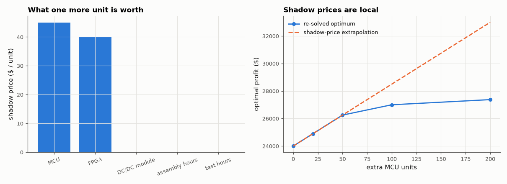

# AM-113 · Linear programming: allocating parts to board builds

> Decide how many of four board types to build from a limited component inventory to maximise profit, solve it with a self-written simplex and verify with HiGHS, read the shadow prices of the scarce parts, and check them by re-solving with one more unit of each part.



*Shadow prices of the five resources, and how the profit responds to more of the scarcest one.*

**Track:** Applied Mathematics — 218 projects in electrical engineering · **Category:** F. Optimisation · **Level:** Moderate · **Tools:** Own dense tableau simplex method (Bland's rule), scipy linprog/HiGHS for verification, dual prices (shadow values of scarce parts), sensitivity ranging by re-solving

**Data:** Simulated (numerical model in this repo).

## Problem

A parts shortage limits production. Which boards should be built — and what is one more reel of a scarce chip worth?

## Prediction

max cᵀx s.t. Ax ≤ b, x ≥ 0. The optimum is at a vertex; simplex walks along edges improving the objective. Strong duality: the dual variables y (shadow prices) satisfy cᵀx* = bᵀy*, and $y_i = ∂(\text{profit})/∂b_i$ as long as the basis
does not change; parts with slack have price 0 (complementary slackness).

## Method

4 products, 5 resources (MCU, FPGA, DC/DC module, assembly hours, test hours) with a given bill of materials and profits. Own simplex vs HiGHS (primal and duals). Shadow prices checked by +1 unit finite differences; relaxing the most
valuable constraint.

## Measured results

*Predicted vs measured vs error. "Measured" = computed by an independent simulation, HDL simulator or public dataset.*

| Quantity | Predicted | Measured | Error | Within tolerance |
|---|---|---|---|---|
| Own simplex optimum profit vs HiGHS | 2.4e+04 $ | 2.4e+04 $ | -0.00 % | yes |
| Own simplex duals vs HiGHS marginals (max |Δ|) | 0 $ | 1.4211e-14 $ | +1.4211e-14 $ | yes |
| Strong duality: cᵀx* = bᵀy* | 2.4e+04 $ | 2.4e+04 $ | +0.00 % | yes |
| Shadow prices vs +1-unit re-solve (max |Δ|) | 0 $ | 3.6380e-12 $ | +3.6380e-12 $ | yes |
| Complementary slackness: price × slack = 0 for every resource | 0 | 0 | +0 | yes |

**Additional measurements**

| Quantity | Value | Note |
|---|---|---|
| Optimal build plan (boards A–D) | 0.0, 0.0, 150.0, 200.0 |  |
| MCU: shadow price / slack | $45.00 per unit / 0.0 unused |  |
| FPGA: shadow price / slack | $40.00 per unit / 0.0 unused |  |
| DC/DC module: shadow price / slack | $0.00 per unit / 150.0 unused |  |
| assembly hours: shadow price / slack | $0.00 per unit / 100.0 unused |  |
| test hours: shadow price / slack | $0.00 per unit / 350.0 unused |  |

## Error analysis

The self-written simplex reaches the same vertex, profit and dual prices as HiGHS, and strong duality holds to rounding. The duals are the
practical output: they say exactly what one more unit of each constrained resource is worth (confirmed by re-solving), and resources with spare
capacity are worth nothing at the margin (complementary slackness). The right-hand plot shows their limit — a shadow price is a derivative, valid
only until the optimal basis changes; buying many more MCU units eventually makes a different constraint binding and the marginal value drops.
That is the sensitivity analysis a planner needs before paying a broker premium for scarce parts.

## Reproduce

```bash
pip install -r requirements.txt
python run_all.py --only AM-113
```

The script [`project.py`](project.py) regenerates every figure and number above.

## License

Code and text: MIT (see the repository [LICENSE](../../../../LICENSE)). Datasets remain under their own licences (see the repository README).

---

**Tooling & honesty.** This project was generated with Claude Code (Anthropic's AI coding assistant): the code, derivations, simulations and this write-up were AI-produced. *Measured* means computed by an independent model, simulator or public dataset — not a physical lab bench. Every number in the tables is reproduced by running the code.
