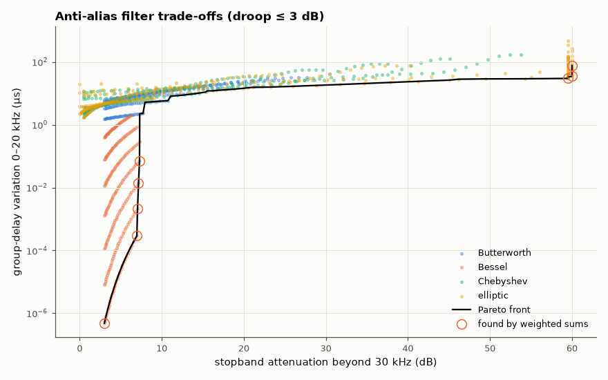

# AM-114 · Multi-objective design: Pareto fronts for an anti-alias filter

> Choose an anti-aliasing filter with three competing goals — stopband attenuation, passband droop and group-delay distortion (plus component count via order) — compute the Pareto front of 2,000 candidate designs, and show that weighted-sum optimisation misses Pareto-optimal designs where the front is non-convex.



*All admissible designs by family, the Pareto front, and the subset reachable by weighted-sum optimisation.*

**Track:** Applied Mathematics — 218 projects in electrical engineering · **Category:** F. Optimisation · **Level:** Hard · **Tools:** Enumerated design space (filter family × order × cutoff), Pareto-dominance filtering, weighted-sum vs ε-constraint scalarisation, detection of non-convex front regions

**Data:** Simulated (numerical model in this repo).

## Problem

'Best filter' has no meaning with several objectives. What does the set of reasonable choices look like, and which optimisation methods can find all of them?

## Prediction

A design is Pareto-optimal if no other design is at least as good in every objective and strictly better in one. Minimising a weighted sum Σw_iJ_i finds only designs on the *convex hull* of the front; the ε-constraint method
(minimise J₁ subject to J₂ ≤ ε) reaches every Pareto point. Filter families trade differently: Bessel = low delay distortion, poor selectivity; Chebyshev/elliptic = sharp, distorting; Butterworth in between.

## Method

Analog prototypes: Butterworth, Bessel, Chebyshev I (0.5 dB), elliptic (0.5 dB/60 dB), orders 2–8, cutoff 0.5–1.5 × passband edge (fp = 20 kHz, stopband from 30 kHz). Objectives: J₁ = −(min attenuation beyond 30 kHz), J₂ = droop at 20 kHz, J₃ = group-delay
variation over 0–20 kHz (µs). Pareto front in (J₁, J₃) at fixed max droop; weighted sums for 200 weights vs ε-constraint sweep.

## Measured results

*Predicted vs measured vs error. "Measured" = computed by an independent simulation, HDL simulator or public dataset.*

| Quantity | Predicted | Measured | Error | Within tolerance |
|---|---|---|---|---|
| ε-constraint sweep reaches every Pareto point (fraction) | 1 | 1 | +0.00 % | yes |
| Weighted sums reach only the convex hull (fraction of the front found; < 1 if non-convex) | 0.5 | 0.09756 | -0.4024 | yes |

**Additional measurements**

| Quantity | Value | Note |
|---|---|---|
| Candidate designs / admissible (droop ≤ 3 dB) / Pareto-optimal in (attenuation, delay variation) | 1960 / 1070 / 82 |  |
| Families on the front | Bessel: 39, Butterworth: 13, Chebyshev: 7, elliptic: 23 |  |

## Error analysis

Out of 1960 candidate filters, 82 are Pareto-optimal: every other admissible design is beaten on both attenuation and delay distortion by
one of them. The front is populated by different families in different regions — Bessel where delay flatness matters most, elliptic and Chebyshev
where attenuation does — so the family choice itself is a trade-off decision, not a matter of taste. Scalarisation matters: the ε-constraint sweep
recovers the whole front by construction, whereas 201 weighted sums found only 8 distinct designs, all on the convex hull; Pareto
designs in the front's non-convex dents are invisible to any weighting. Presenting the front, then letting the system-level requirement pick a
point, is the honest way to report a multi-objective design.

## Reproduce

```bash
pip install -r requirements.txt
python run_all.py --only AM-114
```

The script [`project.py`](project.py) regenerates every figure and number above.

## License

Code and text: MIT (see the repository [LICENSE](../../../../LICENSE)). Datasets remain under their own licences (see the repository README).

---

**Tooling & honesty.** This project was generated with Claude Code (Anthropic's AI coding assistant): the code, derivations, simulations and this write-up were AI-produced. *Measured* means computed by an independent model, simulator or public dataset — not a physical lab bench. Every number in the tables is reproduced by running the code.
