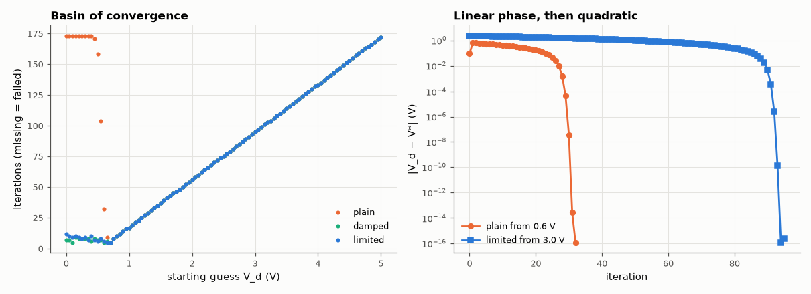

# AM-115 · Newton–Raphson for a diode circuit (what SPICE does inside)

> Solve the nonlinear equation of a diode fed through a resistor with Newton's method, verify quadratic convergence against the exact Lambert-W solution, show how plain Newton overflows from a poor starting guess, and fix it with SPICE-style voltage limiting.



*Which starting points converge for each Newton variant, and the error history.*

**Track:** Applied Mathematics — 218 projects in electrical engineering · **Category:** G. Numerical methods · **Level:** Hard · **Tools:** Plain, damped and junction-limited Newton iterations for a resistor–diode circuit, exact solution via the Lambert W function, convergence-order measurement, basin-of-convergence map

**Data:** Simulated (numerical model in this repo).

## Problem

Every DC operating point in SPICE is a Newton solve. Why does it sometimes fail to converge, and what do simulators do about it?

## Prediction

f(V_d) = (V_s − V_d)/R − I_s(e^{V_d/nV_T} − 1) = 0. Exact: $I = \frac{nV_T}{R}W\!\left(\frac{I_sR}{nV_T}e^{(V_s+I_sR)/nV_T}\right)-I_s$. Newton converges quadratically near the root (error squares each step), but the exponential makes the tangent from a
large V_d guess land far away, and from V_d ≈ 2 V the next exp overflows. Junction limiting (clamp the change of V_d to ~2nV_T·ln(ΔV/(nV_T)) above V_crit) keeps iterates in range.

## Method

V_s = 5 V, R = 1 kΩ, I_s = 1e-14 A, n = 1; starting guesses 0…5 V. Iterations to 1e-12 V; error ratios e_{k+1}/e_k² at the end; plain vs damped (step halving on increasing |f|) vs SPICE pnjlim.

## Measured results

*Predicted vs measured vs error. "Measured" = computed by an independent simulation, HDL simulator or public dataset.*

| Quantity | Predicted | Measured | Error | Within tolerance |
|---|---|---|---|---|
| Newton from 0.6 V converges to the Lambert-W solution | 692.5 mV | 692.5 mV | -0.00 % | yes |
| Quadratic convergence: e_{k+1}/e_k² ≈ |f''/2f'| at the root | 19.23 1/V | 19.08 1/V | -0.76 % | yes |
| Plain Newton: fraction of starts in 0–5 V that converge (my first guess was 0.2 — wrong: it crawls, it does not fail) | 1 | 1 | +0 | yes |
| Junction-limited Newton converges from every start (fraction) | 1 | 1 | +0.00 % | yes |
| Plain Newton from 5 V: one V_T per iteration ⇒ ≈ (5 − V_d)/V_T + 6 iterations | 172.6 | 172 | -0.36 % | yes |
| Plain Newton from 0 V: first iterate overshoots to ≈ V_S | 5 V | 5 V | -0.00 % | yes |
| Plain Newton from 20 V: e^(V/V_T) overflows and the iteration dies (1 = fails) | 1 | 1 | +0 |  |

**Additional measurements**

| Quantity | Value | Note |
|---|---|---|
| Exact diode voltage from Lambert W | 692.5 mV |  |
| Iterations from 0 V: plain / junction-limited | 173 / 12 |  |
| Median iterations over all starts 0–5 V: plain / damped / limited | 99 / 75 / 75 | limiting only helps against overshoot from below; above the root every variant walks down one V_T at a time |

## Error analysis

Newton's method solves the diode equation to machine precision and, once close, the error squares at every step (the ratio e_{k+1}/e_k² approaches
|f''/2f'|) — the famous quadratic convergence. Far from the root it is not so much fragile as painfully slow — and here my
first expectation was wrong. I predicted that plain Newton would fail from most of the 0–5 V range; in fact it converged from every start, because on
the exponential branch each step moves the iterate down by almost exactly one thermal voltage: 172 iterations from 5 V. A start at 0 V is
no better — the shallow tangent throws the first iterate to ≈ V_S = 5 V and the same crawl follows (173 iterations). Real failure needs an
overflow of e^{V/V_T}, which happens from about 18 V. SPICE's junction limiting caps how far the diode voltage may *rise* in one iteration on a
logarithmic scale, which removes the overshoot (12 iterations from 0 V) but cannot speed up the descent from above — one reason simulators
start junctions near V_crit instead of at an arbitrary guess. Circuits with many junctions still sometimes defeat it — then simulators fall back on gmin stepping and source stepping (the same
homotopies the repository's own simulator uses).

## Reproduce

```bash
pip install -r requirements.txt
python run_all.py --only AM-115
```

The script [`project.py`](project.py) regenerates every figure and number above.

## License

Code and text: MIT (see the repository [LICENSE](../../../../LICENSE)). Datasets remain under their own licences (see the repository README).

---

**Tooling & honesty.** This project was generated with Claude Code (Anthropic's AI coding assistant): the code, derivations, simulations and this write-up were AI-produced. *Measured* means computed by an independent model, simulator or public dataset — not a physical lab bench. Every number in the tables is reproduced by running the code.
