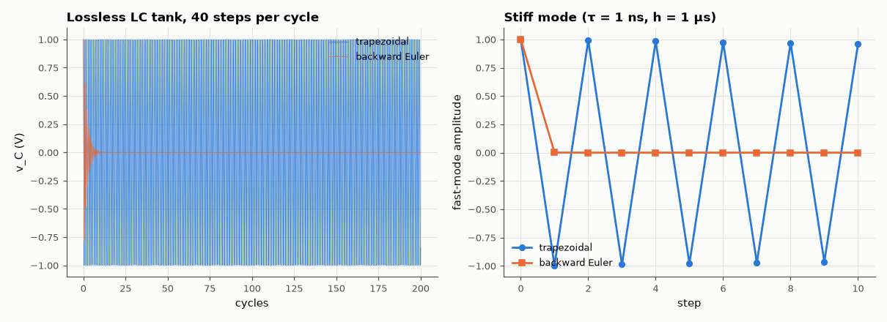

# AM-116 · Trapezoidal vs backward Euler in circuit transients

> Integrate a lossless LC tank and a stiff RC network with the two workhorse methods of SPICE, predict per-step amplitude factors from the stability functions, and show each method's characteristic artefact: backward Euler's artificial damping and the trapezoidal rule's point-to-point ringing.



*An undamped LC tank integrated with each method, and the behaviour of a fast stiff mode.*

**Track:** Applied Mathematics — 218 projects in electrical engineering · **Category:** G. Numerical methods · **Level:** Hard · **Tools:** Both integration rules applied to an LC tank and a stiff RC step (own implementation and the repository's MNA simulator), amplitude factors per step, numerical damping and trapezoidal 'ringing'

**Data:** Simulated (numerical model in this repo).

## Problem

SPICE offers 'trap' and 'gear'. What does each do wrong, and when does it matter?

## Prediction

For y' = λy: backward Euler multiplies by $R_{BE}=\frac1{1-hλ}$, trapezoidal by $R_{TR}=\frac{1+hλ/2}{1-hλ/2}$. On an undamped oscillator (λ = ±jω) |R_TR| = 1 exactly — energy is conserved — while |R_BE| = 1/√(1+(hω)²) < 1: the tank decays
artificially, e.g. by e^{−½(hω)²·N} over N steps. For a very fast real pole (hλ ≪ −1), R_TR → −1: the component does not decay but flips sign each step (ringing), whereas R_BE → 0 damps it at once.

## Method

LC tank: L = 1 mH, C = 1 µF (ω = 31.6 krad/s), initial 1 V, 200 cycles, h = T/40. Stiff RC: τ_fast = 1 ns with h = 1 µs after a step. Own integrators on the state equations and the repository's simulator with method = 'be'/'trap'.

## Measured results

*Predicted vs measured vs error. "Measured" = computed by an independent simulation, HDL simulator or public dataset.*

| Quantity | Predicted | Measured | Error | Within tolerance |
|---|---|---|---|---|
| Trapezoidal: energy after 200 cycles (conserved, |R| = 1) | 1 | 1 | +0.00 % | yes |
| Backward Euler: energy after 200 cycles = (1+(hω)²)^(−N) | 2.0617e-85 | 2.0617e-85 | +0.00 % | yes |
| Repository simulator, trap, 50 cycles: amplitude = (1+(hω)²)^(−½) (it takes one backward-Euler start-up step) | 987.9 mV | 987.9 mV | -0.00 % | yes |
| Repository simulator, trap: decay rate per step after start-up | 0 1/step | 1.5384e-07 1/step | +1.5384e-07 1/step | yes |
| Repository simulator, BE: decay rate per step = −½·ln(1+(hω)²) | -0.01219 1/step | -0.01219 1/step | +0.00 % | yes |
| Stiff fast mode (hλ = −1000): trapezoidal factor → −1 (ringing) | -0.996 | -0.996 | +0.00 % | yes |

**Additional measurements**

| Quantity | Value | Note |
|---|---|---|
| Fast-mode value after 10 steps: BE / trap | 9.9e-31 / +0.961 |  |

## Error analysis

Both artefacts appear exactly as the stability functions predict. Backward Euler loses energy at a rate set by (hω)², so a lossless tank simulated
with a reasonable 40 steps per cycle decays visibly over a few hundred cycles — a real danger when simulating high-Q resonators or oscillators
(oscillators may even fail to start). The trapezoidal rule conserves the tank's energy to machine precision, which is why SPICE uses it by default.
(The repository's own simulator shows a 1.2 % amplitude loss with 'trap' that puzzled me at first: it is exactly one backward-Euler step, which the
simulator takes at t = 0 to start the trapezoidal recursion — after that the amplitude is constant.) The trapezoidal rule has its own flaw, though:
a fast stiff mode is not damped at all: its factor tends to −1, so the node voltage alternates sign every step ('trap ringing') after sharp
switching edges. Simulators therefore switch to backward Euler or Gear for a step or two after breakpoints — the best of both, and the reason the
'gear' option exists.

## Reproduce

```bash
pip install -r requirements.txt
python run_all.py --only AM-116
```

The script [`project.py`](project.py) regenerates every figure and number above.

## License

Code and text: MIT (see the repository [LICENSE](../../../../LICENSE)). Datasets remain under their own licences (see the repository README).

---

**Tooling & honesty.** This project was generated with Claude Code (Anthropic's AI coding assistant): the code, derivations, simulations and this write-up were AI-produced. *Measured* means computed by an independent model, simulator or public dataset — not a physical lab bench. Every number in the tables is reproduced by running the code.
