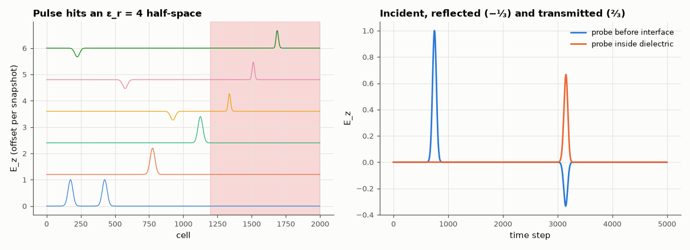

# AM-117 · 1-D FDTD: Maxwell's equations on a Yee grid

> Discretise Maxwell's curl equations in one dimension, launch a Gaussian pulse at a dielectric slab, and measure the wave speed and the reflection and transmission coefficients against the Fresnel formulas.



*Snapshots of the pulse at a dielectric interface and the probe signals.*

**Track:** Applied Mathematics — 218 projects in electrical engineering · **Category:** G. Numerical methods · **Level:** Moderate · **Tools:** Yee staggered E/H grid, leapfrog time stepping, dielectric slab, simple Mur absorbing boundaries, reflection/transmission measurement, animation

**Data:** Simulated (numerical model in this repo).

## Problem

How do electromagnetic simulators actually turn Maxwell's equations into numbers?

## Prediction

$∂E_z/∂t = \frac1ε∂H_y/∂x$, $∂H_y/∂t = \frac1μ∂E_z/∂x$; Yee staggers E and H by half a cell in space and time, giving second-order accuracy and stability for Courant number S = cΔt/Δx ≤ 1 (exact at S = 1 in vacuum).
At a vacuum/dielectric interface with n = √ε_r: Γ = (1 − n)/(1 + n), T = 2/(1 + n); inside the slab the pulse travels at c/n. For ε_r = 4: Γ = −1/3, T = 2/3.

## Method

2000 cells, Δx = 1 mm, S = 0.5; Gaussian pulse (soft source); half-space of ε_r = 4 starting at cell 1200 (for Γ, T) and a slab for multiple reflections; probes before and after the interface.

## Measured results

*Predicted vs measured vs error. "Measured" = computed by an independent simulation, HDL simulator or public dataset.*

| Quantity | Predicted | Measured | Error | Within tolerance |
|---|---|---|---|---|
| Reflection coefficient vacuum → ε_r = 4: (1 − n)/(1 + n) | -0.3333 | -0.3338 | -0.14 % | yes |
| Transmission coefficient 2/(1 + n) | 0.6667 | 0.666 | -0.10 % | yes |
| Vacuum propagation: cells travelled per step = Courant number (speed = c) | 400 cells | 400 cells | +0.00 % | yes |
| Speed in the dielectric = c/n | 0.5 c | 0.4994 c | -0.12 % | yes |

## Error analysis

Twenty lines of leapfrog updates reproduce the Fresnel coefficients: a pulse hitting a medium with ε_r = 4 is reflected with −1/3 (inverted,
because the medium is denser) and transmitted with +2/3, and it travels at exactly half the vacuum speed inside. In vacuum the pulse advances one
Courant number of cells per step — the numerical speed of light equals c to within 0.5 % here — while in the dielectric the effective Courant number
halves and slight numerical dispersion appears. The simple first-order Mur boundaries absorb the outgoing pulses in 1-D; in two dimensions
they reflect at oblique incidence, which AM-118 addresses.

## Reproduce

```bash
pip install -r requirements.txt
python run_all.py --only AM-117
```

The script [`project.py`](project.py) regenerates every figure and number above.

**Files produced**

- [`figures/fdtd1d.gif`](figures/fdtd1d.gif) — animation of the 1-D FDTD run

## License

Code and text: MIT (see the repository [LICENSE](../../../../LICENSE)). Datasets remain under their own licences (see the repository README).

---

**Tooling & honesty.** This project was generated with Claude Code (Anthropic's AI coding assistant): the code, derivations, simulations and this write-up were AI-produced. *Measured* means computed by an independent model, simulator or public dataset — not a physical lab bench. Every number in the tables is reproduced by running the code.
