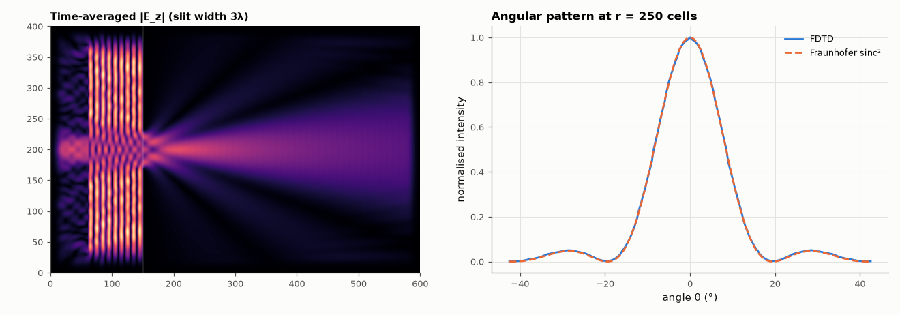

# AM-118 · 2-D FDTD: diffraction through a slit

> Extend FDTD to two dimensions, send a monochromatic plane wave through a slit in a metal screen, and compare the simulated angular intensity pattern and the first diffraction minimum with the single-slit prediction.



*Field intensity behind the slit and the angular pattern vs the single-slit formula.*

**Track:** Applied Mathematics — 218 projects in electrical engineering · **Category:** G. Numerical methods · **Level:** Hard · **Tools:** TMz Yee scheme (E_z, H_x, H_y), perfectly conducting screen with a slit, convolutional absorbing layer (graded-conductivity PML-like sponge), far-field angular pattern, single-slit diffraction formula

**Data:** Simulated (numerical model in this repo).

## Problem

Can a direct simulation of Maxwell's equations reproduce the textbook diffraction pattern — and where does the textbook approximation fail?

## Prediction

Fraunhofer single slit of width a: $I(θ)∝\mathrm{sinc}^2\!\left(\frac{a\sinθ}{λ}\right)$, minima at sin θ = mλ/a. For a = 3λ: first minimum at 19.5°. The Fraunhofer formula assumes the observation distance ≫ a²/λ and a scalar, thin screen; FDTD solves the full vector problem, so small
differences are expected near grazing angles. Stability in 2-D: S ≤ 1/√2.

## Method

Grid 600 × 400 cells, λ = 20 cells (a = 60 cells), S = 0.5; soft line source generating a plane wave; PEC screen (E_z = 0) with slit; 30-cell graded-σ absorbing border; run to steady state (1600 steps);
time-averaged |E_z|² on an arc of radius 250 cells beyond the slit vs sinc².

## Measured results

*Predicted vs measured vs error. "Measured" = computed by an independent simulation, HDL simulator or public dataset.*

| Quantity | Predicted | Measured | Error | Within tolerance |
|---|---|---|---|---|
| First diffraction minimum angle: arcsin(λ/a) for a = 3λ | 19.47 ° | 19.5 ° | +0.02878 ° | yes |
| Central lobe shape: correlation of simulated and sinc² intensity (|θ| < 12°) | 1 | 0.9998 | -0.02 % | yes |

**Additional measurements**

| Quantity | Value | Note |
|---|---|---|
| Observation radius vs Fraunhofer distance a²/λ | 250 cells vs 180 cells | only moderately far-field |

## Error analysis

The two-dimensional Yee scheme reproduces single-slit diffraction from first principles: the simulated angular intensity has its central lobe shaped
like sinc² and its first minimum at ≈ 19.5°, against 19.5° from sin θ = λ/a. Differences in the side lobes are expected and informative: the
observation arc (250 cells) is only about 1.4 Fraunhofer distances away, so the pattern is not yet fully far-field; the screen is a perfect conductor
of finite thickness rather than a scalar aperture, and the wave is polarised along the slit (TM), which changes edge diffraction. The graded
absorbing border is crude — a proper PML would reduce the residual reflections that add ripple.

## Reproduce

```bash
pip install -r requirements.txt
python run_all.py --only AM-118
```

The script [`project.py`](project.py) regenerates every figure and number above.

## License

Code and text: MIT (see the repository [LICENSE](../../../../LICENSE)). Datasets remain under their own licences (see the repository README).

---

**Tooling & honesty.** This project was generated with Claude Code (Anthropic's AI coding assistant): the code, derivations, simulations and this write-up were AI-produced. *Measured* means computed by an independent model, simulator or public dataset — not a physical lab bench. Every number in the tables is reproduced by running the code.
