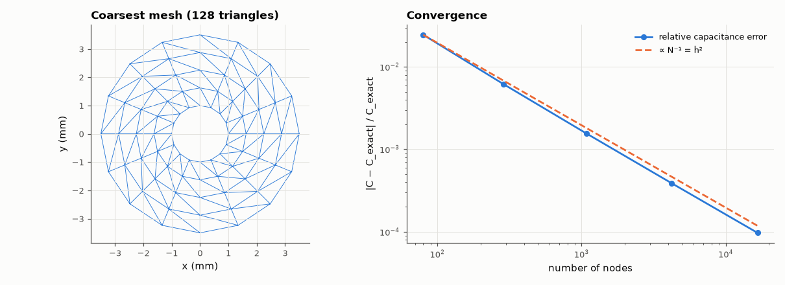

# AM-119 · Finite elements from scratch: capacitance of a coaxial line

> Solve Laplace's equation in the annulus between the conductors of a coaxial line with self-written linear finite elements, compute the capacitance per metre from the stored energy, and verify both the exact value and the method's convergence rate.



*The FEM mesh of the coaxial cross-section and the convergence of the computed capacitance.*

**Track:** Applied Mathematics — 218 projects in electrical engineering · **Category:** G. Numerical methods · **Level:** Hard · **Tools:** Own 2-D FEM with linear triangles (mesh generation, element stiffness matrices, sparse assembly, Dirichlet conditions), energy-based capacitance, convergence study; comparison with 2πε/ln(b/a)

**Data:** Simulated (numerical model in this repo).

## Problem

Finite differences need rectangular grids. How does FEM handle curved conductors — and how fast does it converge?

## Prediction

Weak form: find φ with ∫∇φ·∇v dA = 0 for all test functions v vanishing on the conductors. Linear triangles give element matrices $K_e=\frac{1}{4A}B B^T$ (B from edge vectors). Capacitance from energy: $C = ε\,φ^TKφ/V^2$.
Exact for a coax: $C'=\frac{2πε}{\ln(b/a)}$. With conforming linear elements the energy error is O(h²), so C converges from above with order 2; curved boundaries approximated by chords also contribute O(h²).

## Method

a = 1 mm, b = 3.5 mm, air. Structured polar mesh: n_r radial × n_θ angular divisions, each quad split into two triangles; refined 5 times. Inner conductor 1 V, outer 0 V. Error vs 2πε₀/ln 3.5; observed order; potential vs ln(r) profile.

## Measured results

*Predicted vs measured vs error. "Measured" = computed by an independent simulation, HDL simulator or public dataset.*

| Quantity | Predicted | Measured | Error | Within tolerance |
|---|---|---|---|---|
| Finest mesh: FEM capacitance vs 2πε/ln(b/a) | 44.41 pF/m | 44.41 pF/m | +0.01 % | yes |
| Observed convergence order of the capacitance error (linear elements: 2) | 2 | 1.996 | -0.003645 | yes |
| Energy principle: FEM capacitance approaches from above (all errors positive; 1 = yes) | 1 | 1 | +0 |  |
| Potential follows ln(b/r)/ln(b/a) (max deviation) | 0 V | 53.78 µV | +53.78 µV | yes |

## Error analysis

A hundred-odd lines of finite elements — mesh, element stiffness matrices, sparse assembly, Dirichlet conditions — compute the coax's capacitance to
0.010 % on the finest mesh, with the error falling as h² (observed order 2.00) and always from above, as the energy (Thomson) principle guarantees
for conforming elements. The mesh follows the round conductors naturally, which is FEM's main advantage over rectangular finite differences (AM-189),
where staircased boundaries limit accuracy. Here most of the remaining error comes from representing circles by polygons; curved (isoparametric)
elements or higher-order shape functions would remove it.

## Reproduce

```bash
pip install -r requirements.txt
python run_all.py --only AM-119
```

The script [`project.py`](project.py) regenerates every figure and number above.

## License

Code and text: MIT (see the repository [LICENSE](../../../../LICENSE)). Datasets remain under their own licences (see the repository README).

---

**Tooling & honesty.** This project was generated with Claude Code (Anthropic's AI coding assistant): the code, derivations, simulations and this write-up were AI-produced. *Measured* means computed by an independent model, simulator or public dataset — not a physical lab bench. Every number in the tables is reproduced by running the code.
