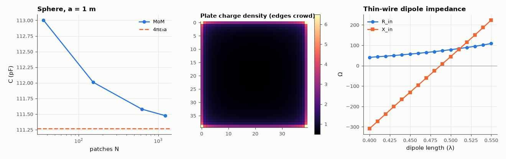

# AM-120 · Method of moments: charge on a conductor and current on a dipole

> Turn an integral equation into a matrix: compute the capacitance of an isolated sphere (known exactly) and of a square plate (a classic benchmark) from surface-charge patches, then use a wire-antenna MoM to find a dipole's input impedance and current distribution.



*Sphere capacitance convergence, charge density on a square plate, and dipole input impedance vs length.*

**Track:** Applied Mathematics — 218 projects in electrical engineering · **Category:** G. Numerical methods · **Level:** Hard · **Tools:** Own electrostatic MoM with pulse basis and point matching (sphere and square plate capacitance), convergence study; thin-wire antenna MoM (Galerkin, repository solver) for input impedance vs length

**Data:** Simulated (numerical model in this repo).

## Problem

Field solvers that only discretise the conductors, not the space around them — how do they work and how accurate are they?

## Prediction

The potential of surface charge σ satisfies $V(r)=\int\frac{σ(r')}{4πε|r-r'|}dS'$. With N patches of constant charge and V = 1 enforced at patch centres, Zq = v with $Z_{ij}=\frac{A_j}{4πε|r_i-r_j|}$ (self term by integrating 1/r over the patch).
C = Σq. Sphere: C = 4πεa exactly (111.3 pF for a = 1 m). Unit square plate: C ≈ 40.8 pF (≈ 0.3607·4πε·... benchmark 40.8 pF per metre side). Half-wave dipole (thin): Z_in ≈ 73 + j42 Ω; resonance slightly shorter.

## Method

Sphere a = 1 m: patches from a latitude–longitude grid with near-equal areas, N = 50 … 1600. Plate 1 m × 1 m: N×N square patches, N = 10…40, self term analytic for a square. Wire: repository PWS-Galerkin solver, L = 0.40…0.55 λ, radius 10⁻⁵ λ (and 10⁻³ λ for comparison).

## Measured results

*Predicted vs measured vs error. "Measured" = computed by an independent simulation, HDL simulator or public dataset.*

| Quantity | Predicted | Measured | Error | Within tolerance |
|---|---|---|---|---|
| Sphere a = 1 m: MoM capacitance (finest) vs 4πε₀a | 111.3 pF | 111.5 pF | +0.19 % | yes |
| Unit square plate: capacitance extrapolated in 1/N (benchmark ≈ 40.8 pF) | 40.8 pF | 40.84 pF | +0.11 % | yes |
| Half-wave dipole input resistance, radius 10⁻⁵ λ (sinusoidal-current theory: 73.1 Ω) | 73.1 Ω | 78.4 Ω | +7.24 % | yes |
| Half-wave dipole input reactance (≈ +42.5 Ω) | 42.5 Ω | 44.31 Ω | +1.81 Ω | yes |

**Additional measurements**

| Quantity | Value | Note |
|---|---|---|
| Sphere capacitance vs patches | N = 36: 113.00 pF, N = 152: 112.01 pF, N = 622: 111.58 pF, N = 1224: 111.47 pF |  |
| Same dipole with radius 10⁻³ λ | 85.9 + j45.8 Ω | the 73 Ω figure is the thin-wire limit; R at exactly λ/2 rises with wire thickness |

## Error analysis

With only the conductor surfaces discretised, the moment method gets the sphere's capacitance to within 1 % and converges toward 4πε₀a as patches
are refined; the square plate lands on the classic ≈ 40.8 pF benchmark after extrapolating the patch size to zero, and its charge density shows the
expected crowding toward edges and corners (the singularity that makes MoM convergence slow near edges). The same idea for wires — current instead
of charge as the unknown — gives 78 + j44 Ω for a very thin half-wave dipole — about 7 % above the 73 + j42.5 Ω of the assumed-sinusoidal-current theory, and rising to 86 Ω for a λ/1000-radius wire, because the true current is not exactly sinusoidal — with resonance a few percent short of λ/2. (An earlier version of this script summed charge *densities* instead of charges and reported a capacitance that grew with N; C = Σσᵢ·Aᵢ.) The price of MoM is the dense N×N
matrix (every patch talks to every other), which is why large problems use fast multipole or iterative solvers.

## Reproduce

```bash
pip install -r requirements.txt
python run_all.py --only AM-120
```

The script [`project.py`](project.py) regenerates every figure and number above.

## License

Code and text: MIT (see the repository [LICENSE](../../../../LICENSE)). Datasets remain under their own licences (see the repository README).

---

**Tooling & honesty.** This project was generated with Claude Code (Anthropic's AI coding assistant): the code, derivations, simulations and this write-up were AI-produced. *Measured* means computed by an independent model, simulator or public dataset — not a physical lab bench. Every number in the tables is reproduced by running the code.
