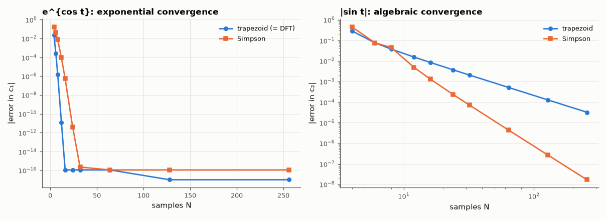

# AM-121 · Computing Fourier coefficients accurately

> Compute Fourier coefficients of periodic waveforms numerically and show a surprising fact: for smooth periodic functions the humble trapezoidal rule converges exponentially and beats Simpson's rule, while for a waveform with a corner both converge only algebraically — plus the aliasing error that bounds everything.



*Quadrature errors for Fourier coefficients of a smooth and of a kinked periodic function.*

**Track:** Applied Mathematics — 218 projects in electrical engineering · **Category:** G. Numerical methods · **Level:** Moderate · **Tools:** Trapezoidal (rectangle) rule, Simpson's rule and adaptive quadrature for Fourier integrals, spectral accuracy for smooth periodic integrands, aliasing of coefficients, error bounds

**Data:** Simulated (numerical model in this repo).

## Problem

Fourier coefficients are integrals. Which quadrature rule should compute them, and how accurate can the result be?

## Prediction

For a periodic analytic f, the N-point trapezoidal rule for $c_k=\frac1T\int f e^{-2πikt/T}$ equals the DFT and its error is the aliased sum $\sum_{m≠0}c_{k+mN}$ — exponentially small when c_k decays exponentially. Simpson (non-uniform
weights) destroys this and is only O(h⁴). For f with a kink (|sin t|, c_k ∝ 1/k²) the aliasing error is O(N⁻²) for both. Example: f = e^{cos t} has $c_k = I_k(1)$ (modified Bessel).

## Method

f₁ = e^{cos t} (analytic, exact c_k = I_k(1)); f₂ = |sin t| (kink, exact c_{2m} = −2/(π(4m²−1))). N = 4…256 samples: trapezoid (= FFT), composite Simpson, error in c₁/c₂ vs exact; adaptive quad as a reference cost.

## Measured results

*Predicted vs measured vs error. "Measured" = computed by an independent simulation, HDL simulator or public dataset.*

| Quantity | Predicted | Measured | Error | Within tolerance |
|---|---|---|---|---|
| Smooth periodic f = e^{cos t}: trapezoid error for c₁ with N = 16 (spectral: ≈ I₁₅(1) ≈ 1e-19 → machine ε) | 0 | 1.1102e-16 | +1.1102e-16 | yes |
| … Simpson with N = 16 is far worse (ratio Simpson / trapezoid error ≫ 1) | 1.0000e+06 × | 4.8181e+09 × | +4.8171e+09 × | yes |
| Kinked f = |sin t|: trapezoid error for c₂ decays as N^slope (−2) | -2 | -2.01 | -0.01022 | yes |
| N = 16 error for |sin t| equals the aliased sum Σ c_{2+16j} | -0.008464 | -0.008464 | -2.4867e-07 | yes |

**Additional measurements**

| Quantity | Value | Note |
|---|---|---|
| Adaptive quadrature (quad) for c₁ of e^{cos t}: error | 0 | many more function evaluations than N = 16 |

## Error analysis

For the smooth periodic function e^{cos t} the plain trapezoidal rule — which is exactly what the FFT computes — reaches machine precision with 16
samples, because its only error is aliasing of coefficients that decay like Bessel functions. Simpson's rule, usually 'more accurate', is millions
of times worse here: its uneven weights break the exact cancellation that equally weighted samples enjoy for periodic integrands. For |sin t|, whose
kink makes coefficients decay only as 1/k², both rules converge as N⁻², and the trapezoid error equals the aliased tail Σc_{k+mN} to rounding
precision. Lesson: compute Fourier coefficients of periodic signals with equally spaced samples (FFT), and expect accuracy to be limited by
smoothness, not by the quadrature rule.

## Reproduce

```bash
pip install -r requirements.txt
python run_all.py --only AM-121
```

The script [`project.py`](project.py) regenerates every figure and number above.

## License

Code and text: MIT (see the repository [LICENSE](../../../../LICENSE)). Datasets remain under their own licences (see the repository README).

---

**Tooling & honesty.** This project was generated with Claude Code (Anthropic's AI coding assistant): the code, derivations, simulations and this write-up were AI-produced. *Measured* means computed by an independent model, simulator or public dataset — not a physical lab bench. Every number in the tables is reproduced by running the code.
