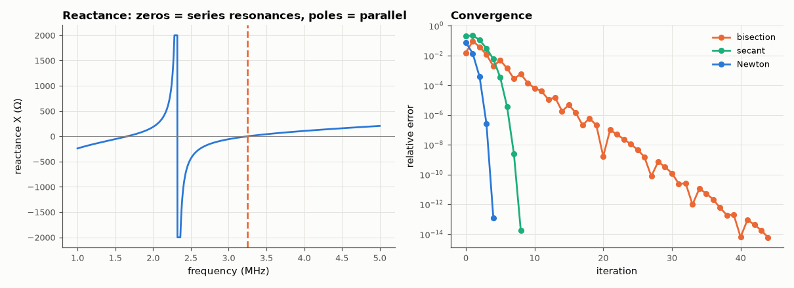

# AM-122 · Root finding for resonance: bisection, secant and Newton

> Find the series-resonance frequency of a two-tank network (a zero of its reactance) with three root finders, and measure their convergence orders — 1 (with factor ½), the golden ratio 1.618, and 2 — from the error sequences.



*Reactance of the two-tank network and the error histories of three root finders.*

**Track:** Applied Mathematics — 218 projects in electrical engineering · **Category:** G. Numerical methods · **Level:** Easy · **Tools:** Own bisection, secant, Newton and Brent-free comparison on the reactance of an LC network, convergence-order measurement from error sequences

**Data:** Simulated (numerical model in this repo).

## Problem

Resonance is where reactance crosses zero. Which root finder should a filter-tuning script use?

## Prediction

Bisection halves the bracket: linear convergence, error ratio ½, guaranteed. Secant: order φ = (1+√5)/2 ≈ 1.618, one function evaluation per step. Newton: order 2 but needs the derivative (two evaluations per step for
reactance plus slope), so per *function evaluation* the secant method's efficiency index 1.618 beats Newton's √2 ≈ 1.414. Order estimated as $p ≈ \frac{\ln(e_{k+1}/e_k)}{\ln(e_k/e_{k-1})}$.

## Method

Network: L1 = 10 µH in series with (L2 = 4.7 µH ∥ C2 = 1 nF) in series with C1 = 470 pF — its reactance X(ω) has series-resonance zeros on either side of the parallel resonance (a pole) at 2.32 MHz. Reference root: closed form (a quadratic in ω²). The three methods search the upper zero from the bracket
[2.6, 4.0] MHz (Newton from 3.0 MHz); orders from the last three errors above round-off; evaluations to 1e-12 relative. A second bisection on [2, 3] MHz demonstrates the pole pitfall.

## Measured results

*Predicted vs measured vs error. "Measured" = computed by an independent simulation, HDL simulator or public dataset.*

| Quantity | Predicted | Measured | Error | Within tolerance |
|---|---|---|---|---|
| Upper series resonance: bisection root vs closed form (quadratic in ω²) | 3.25 MHz | 3.25 MHz | +0.00 % | yes |
| Pitfall: bisection on [2, 3] MHz (sign change across a pole) converges to the parallel resonance 1/2π√(L₂C₂) | 2.322 MHz | 2.322 MHz | +0.00 % | yes |
| Bisection: bracket (error bound) ratio per step (½) | 0.5 | 0.5 | +0.00 % | yes |
| Bisection: midpoint error never exceeds half the bracket (violations) | 0 | 0 | +0 |  |
| Secant: convergence order (golden ratio 1.618) | 1.618 | 1.619 | +0.05 % | yes |
| Newton: convergence order (2) | 2 | 2.01 | +0.52 % | yes |

**Additional measurements**

| Quantity | Value | Note |
|---|---|---|
| Lower series resonance / parallel resonance (pole) | 1.6583 MHz / 2.3215 MHz |  |
| |X| at that 'root' | 1.441e+05 TΩ | not a zero at all — always check the residual |
| Function evaluations to 1e-12 relative: bisection / secant / Newton (derivative by 2 extra evaluations) | 35 / 9 / 12 |  |

## Error analysis

The measured orders match theory: bisection halves the error every step (slow but unconditionally safe once bracketed), the secant method converges
with order ≈ 1.62 and Newton with order 2. Counted in function evaluations — the real cost when each evaluation is a circuit simulation — the secant
method wins, because Newton's derivative costs extra evaluations here (finite differences). Reactance functions have poles between their zeros, and the first version of this
project fell into exactly that trap: the bracket [2, 3] MHz has a sign change, bisection converged beautifully — to the parallel resonance, where X
jumps from +∞ to −∞ and is nowhere near zero. A sign change is necessary for a root, not sufficient; checking the residual |X| exposes it at once.
Unbracketed Newton or secant can likewise jump across a pole to the wrong resonance; production code (Brent's method) combines the bracket of bisection with
the speed of secant/inverse-quadratic steps for exactly this reason.

## Reproduce

```bash
pip install -r requirements.txt
python run_all.py --only AM-122
```

The script [`project.py`](project.py) regenerates every figure and number above.

## License

Code and text: MIT (see the repository [LICENSE](../../../../LICENSE)). Datasets remain under their own licences (see the repository README).

---

**Tooling & honesty.** This project was generated with Claude Code (Anthropic's AI coding assistant): the code, derivations, simulations and this write-up were AI-produced. *Measured* means computed by an independent model, simulator or public dataset — not a physical lab bench. Every number in the tables is reproduced by running the code.
