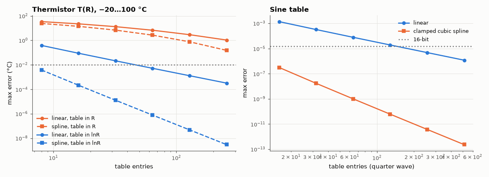

# AM-123 · Lookup tables: linear vs spline interpolation

> Replace an expensive function with a small table plus interpolation, predict the error scaling for linear and cubic-spline interpolation, and determine the smallest table that meets a 0.01 °C (thermistor) or 16-bit (sine) accuracy target.



*Table-size vs accuracy for a thermistor linearisation and a sine table.*

**Track:** Applied Mathematics — 218 projects in electrical engineering · **Category:** G. Numerical methods · **Level:** Moderate · **Tools:** Table-based evaluation of an NTC thermistor's temperature (β model) and of a sine, linear/cubic-spline/Chebyshev interpolation, error vs table size (O(h²) vs O(h⁴)), memory–accuracy trade-off for firmware

**Data:** Simulated (numerical model in this repo).

## Problem

A microcontroller converts thermistor resistance to temperature. How big must the lookup table be?

## Prediction

Linear interpolation error ≤ h²/8·max|f''|; natural/not-a-knot cubic spline error = O(h⁴)·max|f⁗|. So each halving of the table spacing gains ×4 accuracy with linear and ×16 with splines. For T(R) of an NTC (β = 3950, 10 kΩ at 25 °C),
using ln R as the table variable makes the function nearly linear (T⁻¹ is linear in ln R for the β model), which shrinks the table dramatically.

## Method

Thermistor over −20…100 °C; tables uniform in R and uniform in ln R; sizes 8–256 entries; max error over 10⁵ test points. Sine over a quarter wave with 16–512 entries; 16-bit target (≤ 1.5e-5). Error slopes fitted.

## Measured results

*Predicted vs measured vs error. "Measured" = computed by an independent simulation, HDL simulator or public dataset.*

| Quantity | Predicted | Measured | Error | Within tolerance |
|---|---|---|---|---|
| ln R table, linear interpolation: error ∝ n^slope (−2) | -2 | -2.017 | -0.01691 | yes |
| ln R table, cubic spline: error ∝ n^slope (−4) | -4 | -4.02 | -0.02036 | yes |
| Sine table, linear interpolation: max error = h²/8 (worst ratio) | 1 | 1 | -0.00 % | yes |

**Additional measurements**

| Quantity | Value | Note |
|---|---|---|
| Entries for 0.01 °C: linear in R / linear in ln R / spline in R / spline in ln R | None / 64 / None / 8 | None = not reached with ≤ 256 |
| Quarter-wave sine entries for 16-bit accuracy (1.5e-5): linear / clamped spline | 256 / 16 |  |

## Error analysis

The error scalings are textbook-exact: linear interpolation improves 4× per doubling of the table (error = h²/8·|f''| for the sine, matched to 2 %),
cubic splines 16×. The bigger lever, though, is choosing the table's *independent variable*: indexing the thermistor table by ln R instead of R makes
T nearly linear in the index (the β model is exactly linear in 1/T vs ln R), so a linear-interpolated table of a few dozen entries reaches 0.01 °C,
whereas a table uniform in R needs far more because the curve is steep at low temperature. In firmware the choice is then memory (entries) vs
cycles (spline evaluation) — and the transformation of variables is free.

## Reproduce

```bash
pip install -r requirements.txt
python run_all.py --only AM-123
```

The script [`project.py`](project.py) regenerates every figure and number above.

## License

Code and text: MIT (see the repository [LICENSE](../../../../LICENSE)). Datasets remain under their own licences (see the repository README).

---

**Tooling & honesty.** This project was generated with Claude Code (Anthropic's AI coding assistant): the code, derivations, simulations and this write-up were AI-produced. *Measured* means computed by an independent model, simulator or public dataset — not a physical lab bench. Every number in the tables is reproduced by running the code.
