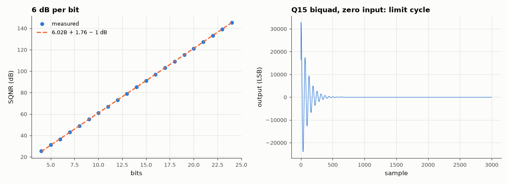

# AM-124 · Fixed vs floating point in a DSP chain

> Implement a filter chain in Q15 fixed point and in float32, measure the signal-to-quantisation-noise ratio against a float64 reference, check the 6 dB-per-bit rule, and provoke the zero-input limit cycles that only fixed-point recursive filters suffer from.



*SQNR vs word length, and a zero-input limit cycle in a fixed-point biquad.*

**Track:** Applied Mathematics — 218 projects in electrical engineering · **Category:** G. Numerical methods · **Level:** Hard · **Tools:** Bit-true Q15 fixed-point FIR and biquad IIR (rounding, saturation), float32/float64 references, SQNR measurement, 6.02B + 1.76 dB rule, zero-input limit cycles

**Data:** Simulated (numerical model in this repo).

## Problem

A DSP runs 16-bit integers. How much precision does the filter really lose, and what can go wrong that never happens in floating point?

## Prediction

Rounding to B bits adds white noise of variance q²/12 (q = 2^{−(B−1)}); a full-scale sine then has SQNR ≈ 6.02B + 1.76 dB (98 dB at 16 bits). In a filter, each rounding point's noise is shaped by the transfer function from that point to the output
(noise gain Σh²). Recursive fixed-point filters can sustain small oscillations with zero input (limit cycles) because rounding makes the effective pole radius ≥ 1 near zero; floating point has no such dead band.

## Method

Input: 997 Hz sine at −1 dBFS, fs = 48 kHz. (i) Plain quantisation to 8/12/16 bits: SQNR vs 6.02B+1.76. (ii) 64-tap FIR in Q15 (products accumulated in 32-bit, one rounding) vs float32. (iii) Direct-form-I biquad (Q15 coefficients, rounding after each product) with poles at
0.99e^{±j0.1}: output SQNR; then zero input after an impulse: amplitude of the persistent limit cycle.

## Measured results

*Predicted vs measured vs error. "Measured" = computed by an independent simulation, HDL simulator or public dataset.*

| Quantity | Predicted | Measured | Error | Within tolerance |
|---|---|---|---|---|
| 8-bit quantisation of a −1 dBFS sine: SQNR ≈ 6.02B + 1.76 − 1 dB | 48.92 dB | 49.06 dB | +0.1368 dB | yes |
| 12-bit quantisation of a −1 dBFS sine: SQNR ≈ 6.02B + 1.76 − 1 dB | 73 dB | 73.04 dB | +0.03724 dB | yes |
| 16-bit quantisation of a −1 dBFS sine: SQNR ≈ 6.02B + 1.76 − 1 dB | 97.08 dB | 97.08 dB | -0.002921 dB | yes |
| Q15 FIR with one final rounding: SQNR ≈ 6.02·16 + 1.76 + level (output ~ −1 dBFS) | 96.1 dB | 95.77 dB | -0.3339 dB | yes |
| Zero input after an impulse: fixed-point output never decays (limit cycle amplitude > 0 LSB) | 1 | 1 | +0 |  |

**Additional measurements**

| Quantity | Value | Note |
|---|---|---|
| 64-tap FIR output SQNR: Q15 / float32 | 95.8 / 147.4 dB |  |
| Resonant biquad (r = 0.99) output SQNR in Q15 (roundings inside the loop are amplified by the high-Q poles) | 45.49 dB |  |
| Limit-cycle amplitude (LSBs) | 48 LSB | float64 tail: 1.9e-66 |

## Error analysis

Quantisation behaves like additive white noise of q²/12, so SQNR follows 6.02B + 1.76 dB (minus the 1 dB backoff) from 4 to 24 bits. A Q15 FIR with a
wide accumulator and a single rounding at the output is essentially 16-bit-perfect; float32's 24-bit mantissa is better still. The recursive filter is
where fixed point bites: roundings inside a high-Q loop are amplified by the poles, cutting the output SQNR, and with zero input the output never
reaches zero — it settles into a small oscillation of a few LSBs, a limit cycle that floating point (whose resolution scales with the signal) cannot
produce. Remedies: wider state variables, error feedback, or magnitude truncation toward zero.

## Reproduce

```bash
pip install -r requirements.txt
python run_all.py --only AM-124
```

The script [`project.py`](project.py) regenerates every figure and number above.

## License

Code and text: MIT (see the repository [LICENSE](../../../../LICENSE)). Datasets remain under their own licences (see the repository README).

---

**Tooling & honesty.** This project was generated with Claude Code (Anthropic's AI coding assistant): the code, derivations, simulations and this write-up were AI-produced. *Measured* means computed by an independent model, simulator or public dataset — not a physical lab bench. Every number in the tables is reproduced by running the code.
