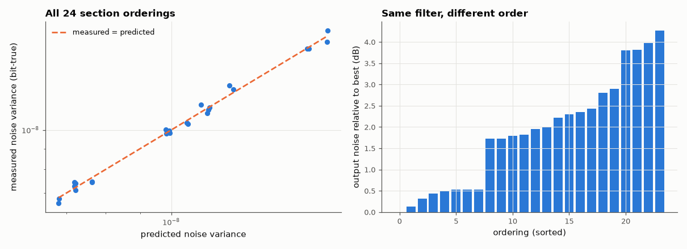

# AM-125 · Quantisation noise through a filter cascade: ordering matters

> Implement an 8th-order narrow band-pass as four fixed-point biquads, scale each ordering so that no internal node can overflow on a sine wave, predict the output round-off noise from the noise gains, verify all 24 section orderings against a bit-true simulation, and measure how much the ordering alone changes the noise.



*Predicted vs measured round-off noise for every ordering of the four sections.*

**Track:** Applied Mathematics — 218 projects in electrical engineering · **Category:** G. Numerical methods · **Level:** Hard · **Tools:** Bit-true direct-form-I biquad cascade with the accumulator rounded to Q15 inside each recursion, L∞ scaling between sections for every ordering, noise-gain prediction from each rounding point to the output, all 24 orderings of four sections simulated in parallel

**Data:** Simulated (numerical model in this repo).

## Problem

Same filter, same word length — why does re-ordering the sections change the output noise?

## Prediction

Rounding the accumulator of section k injects white noise of variance q²/12 *inside* its recursion, so it reaches the output through $1/A_k(z)$ and all later (scaled) sections: $σ^2=\frac{q^2}{12}\sum_k\|\,\tfrac{1}{A_k}\prod_{j>k}s_jH_j\|_2^2$.
The scale factors $s_j$ are forced by overflow: the response from the input to every section output must not exceed 1 (L∞ scaling). Ordering changes both the scale factors and what each noise source sees downstream, so the output noise depends on the order
even though the overall transfer function does not. Rule of thumb (Jackson): order sections by increasing pole radius — the peakiest section last.

## Method

8th-order elliptic band-pass (0.19–0.21 fs) → 4 SOS. For each of the 24 orderings: L∞ scaling of the partial cascades, then a bit-true simulation (rounding to 2⁻¹⁵ in every recursion) of 2¹⁷ samples of white noise at −26 dBFS against the same scaled
cascade in float64. Predicted σ² from 60 000-sample impulse responses.

## Measured results

*Predicted vs measured vs error. "Measured" = computed by an independent simulation, HDL simulator or public dataset.*

| Quantity | Predicted | Measured | Error | Within tolerance |
|---|---|---|---|---|
| Predicted vs measured output noise, worst ratio over all 24 orderings | 1 | 1.055 | +5.50 % | yes |
| Spread between best and worst ordering: bit-true simulation vs noise-gain model | 3.988 dB | 4.262 dB | +0.2742 dB | yes |
| The model picks the same best ordering as the simulation (1 = yes) | 1 | 1 | +0 |  |

**Additional measurements**

| Quantity | Value | Note |
|---|---|---|
| Section pole radii (sections 0…3) | 0.9729, 0.9734, 0.9897, 0.9901 |  |
| Best / worst ordering (section indices) | (1, 2, 3, 0) / (2, 0, 1, 3) |  |
| Rule of thumb 'increasing pole radius' ordering: noise relative to the best | 0.489 dB | ordering (0, 1, 2, 3) |
| Output noise of the best ordering, in units of q²/12 | 84.94 | i.e. the noise gain of the whole structure |

## Error analysis

The noise-gain model matches the bit-true simulation for every ordering, and re-arranging the same four sections changes the output round-off noise by
4.3 dB (the model says 4.0 dB) — 0.7 bits of word length for free. The first version of this project got this badly wrong in an
instructive way: it rounded only each section's *output* and scaled every section to unit peak gain independently, and found a spread of 0.1 dB —
no ordering effect at all. The effect appears only when the model is faithful to a real fixed-point filter: the rounding happens inside the
recursion, so each noise source is amplified by its own poles (enormously, for pole radii close to 1), and the inter-section scale factors needed to
prevent overflow depend on the order. The best ordering here is (1, 2, 3, 0); the classical 'peakiest section last' rule lands within
0.5 dB of it. This is why tools such as zpk2sos pair poles with zeros and order sections deliberately.

## Reproduce

```bash
pip install -r requirements.txt
python run_all.py --only AM-125
```

The script [`project.py`](project.py) regenerates every figure and number above.

**Files produced**

- [`data/orderings.csv`](data/orderings.csv)

## License

Code and text: MIT (see the repository [LICENSE](../../../../LICENSE)). Datasets remain under their own licences (see the repository README).

---

**Tooling & honesty.** This project was generated with Claude Code (Anthropic's AI coding assistant): the code, derivations, simulations and this write-up were AI-produced. *Measured* means computed by an independent model, simulator or public dataset — not a physical lab bench. Every number in the tables is reproduced by running the code.
