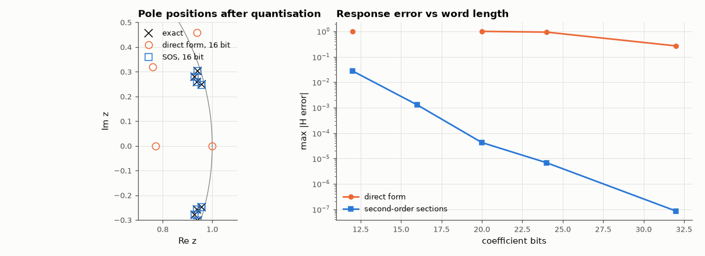

# AM-126 · Where round-off destroys a filter: direct form vs second-order sections

> Quantise the coefficients of the same narrow-band filter in two structures and watch the direct form's poles scatter — some outside the unit circle — while the second-order-section form survives; explain it with the sensitivity of polynomial roots to their coefficients.



*Quantised pole positions for both structures and response error vs coefficient word length.*

**Track:** Applied Mathematics — 218 projects in electrical engineering · **Category:** G. Numerical methods · **Level:** Moderate · **Tools:** Polynomial root sensitivity, coefficient quantisation of an 8th-order narrow-band IIR in direct form vs cascaded biquads, pole displacement and response distortion

**Data:** Simulated (numerical model in this repo).

## Problem

Why does every DSP library implement high-order IIR filters as cascades of biquads?

## Prediction

A root of $A(z)=\sum a_kz^{-k}$ moves by $δp_i ≈ -\frac{\sum_k δa_k p_i^{N-k}}{\prod_{j\ne i}(p_i-p_j)}$: when poles cluster (narrow band, low cutoff) the denominator is tiny and a coefficient error of 2⁻¹⁶ moves poles by orders of magnitude more. In biquads each section has only two poles, so the product has
one factor — sensitivity is bounded. Prediction: 8th-order band-pass with poles near 0.99 in direct form becomes unstable at 16-bit coefficients; as SOS it stays within spec.

## Method

8th-order Butterworth band-pass 0.04–0.05 fs (poles clustered near z = 1). Coefficients rounded to B = 12…32 fractional bits (after scaling to |a| < 2^k). Pole radii and response error vs the float64 design; sensitivity bound
from the formula.

## Measured results

*Predicted vs measured vs error. "Measured" = computed by an independent simulation, HDL simulator or public dataset.*

| Quantity | Predicted | Measured | Error |
|---|---|---|---|
| Direct form, 16-bit coefficients: largest pole radius ≥ 1 (unstable; 1 = yes) | 1 | 1 | +0 |
| SOS, 16-bit coefficients: all poles inside the unit circle (1 = yes) | 1 | 1 | +0 |

**Additional measurements**

| Quantity | Value | Note |
|---|---|---|
| Min |Π(p_i − p_j)| over poles (small ⇒ sensitive) | 1.8129e-06 |  |
| Max |ΔH| at 16 bits: direct form / SOS | nan / 1.28e-03 |  |
| Coefficient bits needed for < 1 % response error: direct form / SOS | None / 16 |  |

## Error analysis

The narrow band-pass puts eight poles in a tight cluster near z ≈ 1, so the product of pole differences in the root-sensitivity formula is tiny and the
direct-form denominator polynomial is catastrophically ill-conditioned: rounding its coefficients to 16 bits throws poles outside the unit circle (an
unstable filter from a stable design). The same filter as four biquads keeps each pole pair's sensitivity bounded — each quadratic has only two roots —
and stays accurate at 16 bits. This is the numerical-analysis reason for the universal practice of cascading second-order sections (or lattice
structures), and it is also why high-order polynomials should never be expanded from their roots unless necessary (AM-078).

## Reproduce

```bash
pip install -r requirements.txt
python run_all.py --only AM-126
```

The script [`project.py`](project.py) regenerates every figure and number above.

## License

Code and text: MIT (see the repository [LICENSE](../../../../LICENSE)). Datasets remain under their own licences (see the repository README).

---

**Tooling & honesty.** This project was generated with Claude Code (Anthropic's AI coding assistant): the code, derivations, simulations and this write-up were AI-produced. *Measured* means computed by an independent model, simulator or public dataset — not a physical lab bench. Every number in the tables is reproduced by running the code.
