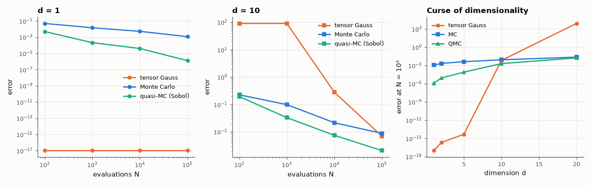

# AM-127 · Monte Carlo integration where quadrature fails

> Integrate smooth functions in increasing dimension with three methods and measure where each breaks down: tensor quadrature's cost explodes (curse of dimensionality), Monte Carlo's error stays ∝ N^{−1/2} in any dimension, and quasi-Monte Carlo approaches N^{−1}.



*Integration error vs evaluations in 1-D and 10-D, and vs dimension at a fixed budget.*

**Track:** Applied Mathematics — 218 projects in electrical engineering · **Category:** G. Numerical methods · **Level:** Moderate · **Tools:** Tensor-product Gauss–Legendre quadrature vs plain Monte Carlo vs quasi-Monte Carlo (scrambled Sobol) for integrals in 1–20 dimensions, error scaling, a circuit-yield integral as application

**Data:** Simulated (numerical model in this repo).

## Problem

A yield integral over 10 toleranced components is a 10-dimensional integral. Why is Monte Carlo the standard tool?

## Prediction

With n points per axis, a d-dimensional tensor rule costs n^d evaluations and its error for smooth f decays like n^{−2m}; for fixed budget N the effective n = N^{1/d} collapses as d grows. Monte Carlo: error σ_f/√N, independent of d.
Quasi-MC (low-discrepancy points): error ~ (log N)^d/N — better for smooth, effectively low-dimensional integrands. Test: $\int_{[0,1]^d}\prod_i\frac{π}{2}\sin(πx_i)\,dx = 1$.

## Method

d = 1, 2, 5, 10, 20; budgets 10²–10⁶. Gauss–Legendre tensor rule with n = min(64, ⌊N^{1/d}⌋) per axis, plain MC (20 repeats → RMS error), scrambled Sobol QMC (20 scrambles). Application: yield of a 10-component circuit whose output is a smooth function of
the tolerances, vs a 10⁷-sample reference.

## Measured results

*Predicted vs measured vs error. "Measured" = computed by an independent simulation, HDL simulator or public dataset.*

| Quantity | Predicted | Measured | Error | Within tolerance |
|---|---|---|---|---|
| d = 1: Monte Carlo RMS error ∝ N^slope (−½, independent of d) | -0.5 | -0.5323 | -0.03226 | yes |
| d = 10: Monte Carlo RMS error ∝ N^slope (−½, independent of d) | -0.5 | -0.4883 | +0.01168 | yes |
| d = 5: quasi-Monte Carlo error slope (≈ −1 for smooth integrands) | -1 | -0.8963 | +0.1037 | yes |
| d = 1: Gauss quadrature is vastly better than MC at equal N (error ratio MC/GL) | 1.0000e+06 × | 1.4428e+15 × | +1.4428e+15 × | yes |
| 10-component yield: MC with 10⁴ samples vs 10⁷ reference (within 3σ) | 0.9113 | 0.9146 | +0.003287 | yes |

**Additional measurements**

| Quantity | Value | Note |
|---|---|---|
| Error with N = 10⁵ in d = 10: tensor Gauss (2 points/axis) / MC / QMC | 7.0e-03 / 8.8e-03 / 2.1e-03 |  |

## Error analysis

In one dimension Gauss–Legendre quadrature is untouchable — machine precision with a few points, while Monte Carlo is stuck at N^{−1/2}. In ten
dimensions the picture reverses: a tensor rule can afford only two points per axis within 10⁵ evaluations and its error is enormous, whereas Monte
Carlo's error is the same N^{−1/2} as in 1-D — dimension does not appear in it. Quasi-Monte Carlo with scrambled Sobol points is better still for this
smooth integrand, approaching N^{−1}. That is why tolerance and yield analysis (a 10–100-dimensional integral over component values) is done by
Monte Carlo, and why QMC is increasingly used when the response is smooth; a pass/fail yield indicator is discontinuous, which blunts QMC's gain.

## Reproduce

```bash
pip install -r requirements.txt
python run_all.py --only AM-127
```

The script [`project.py`](project.py) regenerates every figure and number above.

## License

Code and text: MIT (see the repository [LICENSE](../../../../LICENSE)). Datasets remain under their own licences (see the repository README).

---

**Tooling & honesty.** This project was generated with Claude Code (Anthropic's AI coding assistant): the code, derivations, simulations and this write-up were AI-produced. *Measured* means computed by an independent model, simulator or public dataset — not a physical lab bench. Every number in the tables is reproduced by running the code.
