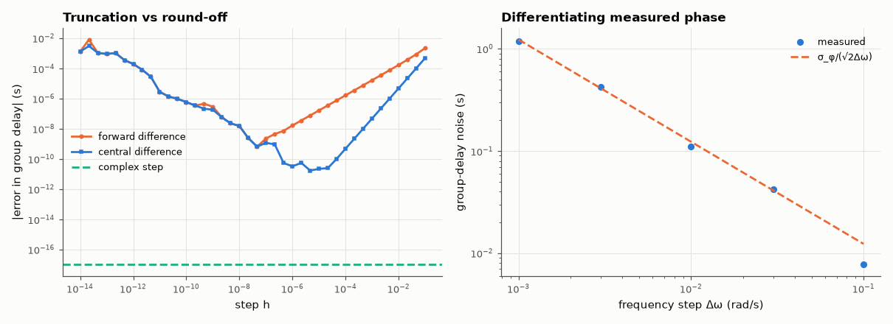

# AM-128 · Numerical differentiation: step size, round-off and noise

> Differentiate a circuit's phase response numerically, find the optimal step where truncation and round-off errors balance, show the complex-step method's immunity to cancellation, and quantify the noise amplification that makes group delay from measured phase so hard.



*Error vs step for finite differences and the complex step, and noise amplification when differentiating measured phase.*

**Track:** Applied Mathematics — 218 projects in electrical engineering · **Category:** G. Numerical methods · **Level:** Moderate · **Tools:** Forward/central differences, the truncation–round-off trade-off and optimal step, the complex-step derivative, Richardson extrapolation, group delay from noisy measured phase with smoothing

**Data:** Simulated (numerical model in this repo).

## Problem

Group delay is a derivative of measured phase. Why is it always noisy — and how small should the frequency step be?

## Prediction

Central difference error ≈ h²f‴/6 + ε|f|/h ⇒ optimal h ~ (3ε|f|/|f‴|)^{1/3} ≈ ε^{1/3} (≈ 6×10⁻⁶ relative), best error ~ ε^{2/3}. Forward difference: h ~ ε^{1/2}, error ~ ε^{1/2}. Complex step $f'(x)≈\mathrm{Im}f(x+ih)/h$ has no subtraction, so h can be 10⁻²⁰⁰ and the result is exact to
machine precision (for analytic f). Measured phase noise σ_φ gives group-delay noise σ_φ√2/(Δω) (central): halving the step doubles the noise.

## Method

f(ω) = phase of a 4th-order Bessel low-pass; exact derivative from the pole formula. Steps h = 10⁻¹⁴…10⁻¹ (relative). Complex-step on the phase via log H. Measured-phase case: σ_φ = 0.1°, steps 0.1–10 % of the band; smoothing by
fitting a local quadratic.

## Measured results

*Predicted vs measured vs error. "Measured" = computed by an independent simulation, HDL simulator or public dataset.*

| Quantity | Predicted | Measured | Error | Within tolerance |
|---|---|---|---|---|
| Central difference: log₁₀ of the optimal step, from (3ε_f/|φ‴|)^(1/3) | -4.824 | -5.333 | -0.5096 | yes |
| Central difference: log₁₀ of the best error, 1.5·ε_f/h* | -10.48 | -10.76 | -0.2785 | yes |
| Forward difference: log₁₀ of the best error, 2√(ε_f·|φ″|) | -8.179 | -9.178 | -0.9992 | yes |
| Complex-step derivative (h = 1e-200): error at machine precision | 0 s | 0 s | +0 s | yes |
| Noisy phase (0.1°): group-delay noise = σ_φ/(√2·Δω) (worst ratio over steps) | 1 | 1.032 | +3.20 % | yes |

**Additional measurements**

| Quantity | Value | Note |
|---|---|---|
| Generic rule of thumb ε^(2/3) / ε^(1/2) vs the actual best errors | 3.7e-11 / 1.5e-08 vs 1.7e-11 / 6.6e-10 | the best error on a grid of steps is the luckiest sample — truncation and round-off partly cancel there — so it sits below the envelope estimates |

## Error analysis

The V-shaped error curves are the whole story of numerical differentiation: too large a step and truncation error (∝ h² for central differences)
dominates, too small and cancellation in f(x+h) − f(x−h) leaves only round-off (∝ ε/h). The optimum sits near ε^{1/3} for central and ε^{1/2} for forward
differences, with best achievable errors ~ε^{2/3} and ~ε^{1/2} — about 10 and 8 correct digits. That is the generic rule, and my first comparison used
exactly those scales — and missed the forward-difference result by a factor of 20. Putting the actual derivatives |φ″| and |φ‴| of this filter into
the error model improves the estimates but still leaves the measured minima up to a decade *below* them: the model gives the envelope of the error,
whereas the smallest error found on a grid of 40 steps is the lucky one where truncation and round-off happen to cancel. The scaling laws and the
location of the optimum are what the theory really predicts; the last digit of 'best error' is luck. The complex-step trick avoids the subtraction entirely
and gives a derivative correct to machine precision with an absurdly small step, for any analytic function. With *measured* phase the round-off
floor is replaced by measurement noise, and the noise of the derivative grows as 1/Δω exactly as predicted — the reason network analysers
specify a group-delay 'aperture' and why group-delay plots from real data are always smoothed.

## Reproduce

```bash
pip install -r requirements.txt
python run_all.py --only AM-128
```

The script [`project.py`](project.py) regenerates every figure and number above.

## License

Code and text: MIT (see the repository [LICENSE](../../../../LICENSE)). Datasets remain under their own licences (see the repository README).

---

**Tooling & honesty.** This project was generated with Claude Code (Anthropic's AI coding assistant): the code, derivations, simulations and this write-up were AI-produced. *Measured* means computed by an independent model, simulator or public dataset — not a physical lab bench. Every number in the tables is reproduced by running the code.
