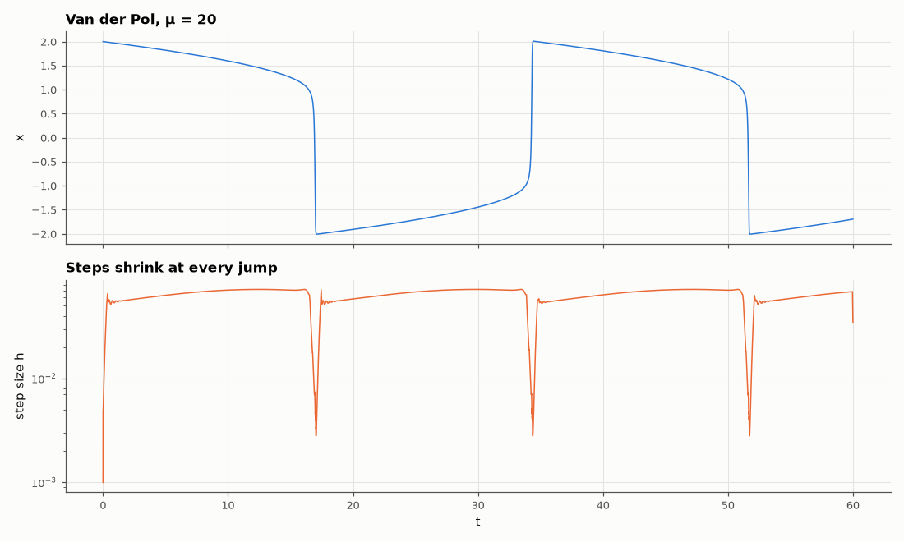

# AM-129 · Error-controlled adaptive time stepping (Dormand–Prince RK45)

> Implement an adaptive integrator that estimates its own local error and chooses the step accordingly, show that it takes tiny steps during fast switching and large ones in slow phases, that the global error scales with the requested tolerance, and that it needs far fewer steps than fixed-step RK4 for the same accuracy.



*The relaxation oscillation and the step sizes chosen by the error controller.*

**Track:** Applied Mathematics — 218 projects in electrical engineering · **Category:** G. Numerical methods · **Level:** Hard · **Tools:** Own embedded Runge–Kutta 5(4) integrator with local error estimate and step-size controller, applied to a relaxation oscillator; comparison with fixed-step RK4 at equal accuracy; tolerance proportionality

**Data:** Simulated (numerical model in this repo).

## Problem

A multivibrator switches in microseconds and then drifts for milliseconds. How should a simulator choose its time step?

## Prediction

Two embedded solutions of orders 5 and 4 share stages; their difference estimates the local error err. Accept if err ≤ tol and set $h_{new}=h\cdot 0.9(\mathrm{tol}/err)^{1/5}$. Steps shrink where the solution changes rapidly. The global error is roughly
proportional to tol ('tolerance proportionality'). For a relaxation oscillator (Van der Pol, μ = 20) most time is spent on slow branches, so adaptive stepping should save one to two orders of magnitude in function evaluations over the smallest fixed step that resolves the jumps.

## Method

Van der Pol μ = 20, t = 0…60 (≈ 2 periods). Own Dormand–Prince 5(4) with tol = 10⁻³…10⁻⁹; reference from a tight solve (tol 10⁻¹²). Fixed-step RK4 with the step needed for the same final error. Step-size history vs the solution.

## Measured results

*Predicted vs measured vs error. "Measured" = computed by an independent simulation, HDL simulator or public dataset.*

| Quantity | Predicted | Measured | Error | Within tolerance |
|---|---|---|---|---|
| Tolerance proportionality: global error ∝ tol^slope (≈ 1) | 1 | 1.221 | +0.2215 | yes |
| Step sizes at tol 1e-7 span more than a decade (1 = yes; my guess of ~1000× was too high) | 1 | 1 | +0 |  |
| Function evaluations: fixed-step RK4 / adaptive RK45 at equal accuracy (my guess 10–100×) | 30 × | 28.08 × | -1.92 × | yes |

**Additional measurements**

| Quantity | Value | Note |
|---|---|---|
| Step-size range at tol 1e-7: max/min | 71.95 × |  |
| Evaluations at tol 1e-7: adaptive / fixed RK4 (h = 1e-03) | 8547 / 240000 |  |

## Error analysis

The embedded error estimate lets the integrator take steps spanning 72× in size at tol = 1e-7: tiny during each fast jump, large along the slow
branches — exactly the step pattern a circuit designer would choose by hand. The global error follows the requested tolerance roughly
proportionally (slope 1.22; controllers bound *local* error, so global proportionality is only approximate), and to match its accuracy a fixed-step RK4
needs 28× more function evaluations because its single step must be small enough for the fastest part everywhere. SPICE's time-step control does the
same with local truncation-error estimates from its implicit formulas.

## Reproduce

```bash
pip install -r requirements.txt
python run_all.py --only AM-129
```

The script [`project.py`](project.py) regenerates every figure and number above.

## License

Code and text: MIT (see the repository [LICENSE](../../../../LICENSE)). Datasets remain under their own licences (see the repository README).

---

**Tooling & honesty.** This project was generated with Claude Code (Anthropic's AI coding assistant): the code, derivations, simulations and this write-up were AI-produced. *Measured* means computed by an independent model, simulator or public dataset — not a physical lab bench. Every number in the tables is reproduced by running the code.
