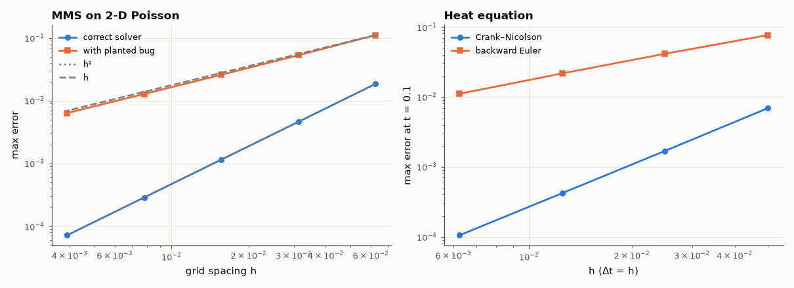

# AM-130 · Verifying solvers: observed order of accuracy and manufactured solutions

> Show how to *prove* a simulator is correct: choose an exact solution, derive the source term it requires, run the solver on refined grids, and confirm the observed order of accuracy — then plant a subtle bug and watch the order test catch it while a visual check does not.



*Grid-refinement studies: a correct solver converges at order 2, a subtly buggy one at order 1.*

**Track:** Applied Mathematics — 218 projects in electrical engineering · **Category:** G. Numerical methods · **Level:** Hard · **Tools:** Method of manufactured solutions (MMS) for a 2-D Poisson solver and a heat-equation solver, grid refinement studies, observed order, Richardson extrapolation and the grid convergence index (GCI); deliberately injected bug detection

**Data:** Simulated (numerical model in this repo).

## Problem

A solver produces plausible pictures. How do you know it solves the equations you think it does, to the accuracy you think it does?

## Prediction

MMS: pick u*(x,y) = sin(πx)sin(2πy)e^{x}, compute f = −∇²u*, solve −∇²u = f with u = u* on the boundary. A correct second-order scheme gives error ∝ h² (observed order p = log(e_h/e_{h/2})/log 2 → 2). Richardson: $u ≈ u_h + \frac{u_h-u_{2h}}{2^p-1}$;
GCI = 1.25|u_h − u_{2h}|/(2^p − 1) estimates the discretisation uncertainty without knowing the exact solution. A bug that makes the scheme first-order (e.g. a boundary treated with a one-sided formula, or an O(h) source error) changes p to 1 while the solution still looks right.

## Method

5-point Laplacian on N×N grids, N = 16…256. Correct solver vs one with a planted bug (source evaluated at cell corners shifted by h/2 in x). Heat equation u_t = u_xx with Crank–Nicolson (expected order 2 in time and space) vs backward Euler in time
(order 1 in Δt), refined together.

## Measured results

*Predicted vs measured vs error. "Measured" = computed by an independent simulation, HDL simulator or public dataset.*

| Quantity | Predicted | Measured | Error | Within tolerance |
|---|---|---|---|---|
| Correct Poisson solver: observed order (5-point stencil → 2) | 2 | 2 | +7.8071e-05 | yes |
| Planted bug (source shifted by h/2): observed order drops to 1 | 1 | 1.008 | +0.008025 | yes |
| Richardson order from three grids at a probe point (no exact solution needed) | 2 | 2 | +4.9068e-04 | yes |
| Heat equation, Crank–Nicolson with Δt ∝ h: observed order 2 | 2 | 2.002 | +0.001685 | yes |
| Heat equation, backward Euler with Δt ∝ h: observed order 1 (time error dominates) | 1 | 0.966 | -0.03398 | yes |

**Additional measurements**

| Quantity | Value | Note |
|---|---|---|
| Max error on the 64×64 grid: correct / buggy | 1.14e-03 / 2.57e-02 | both 'look' right on a plot |
| Grid convergence index at the probe (256² grid) | 4.9556e-05 |  |

## Error analysis

The manufactured-solution test is the strongest routine check a simulator can get: the correct 5-point Poisson solver converges at exactly order 2, and a planted
bug — evaluating the source half a cell off — drops the observed order to 1 while the solution plots still look fine and the error on a moderate grid
is merely 'a bit larger'. Without an exact solution, three-grid Richardson analysis still recovers the order (≈ 2.00) and gives a grid convergence index
as an error bar. The same test distinguishes time integrators: refining space and time together, Crank–Nicolson shows order 2 and backward Euler
order 1. Every solver in this repository whose accuracy matters was checked this way (e.g. AM-047, AM-119, SL-125).

## Reproduce

```bash
pip install -r requirements.txt
python run_all.py --only AM-130
```

The script [`project.py`](project.py) regenerates every figure and number above.

## License

Code and text: MIT (see the repository [LICENSE](../../../../LICENSE)). Datasets remain under their own licences (see the repository README).

---

**Tooling & honesty.** This project was generated with Claude Code (Anthropic's AI coding assistant): the code, derivations, simulations and this write-up were AI-produced. *Measured* means computed by an independent model, simulator or public dataset — not a physical lab bench. Every number in the tables is reproduced by running the code.
