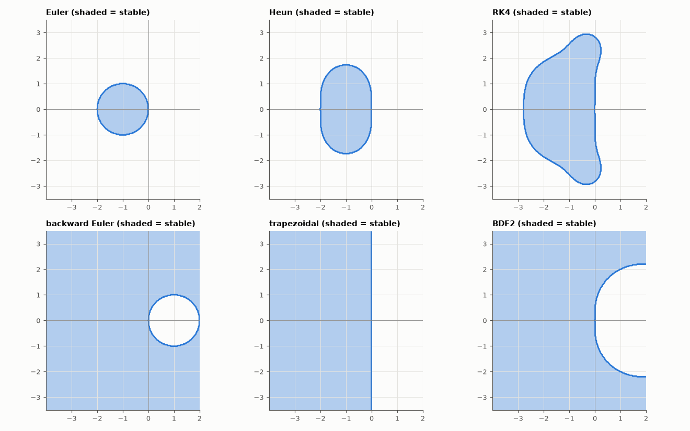

# AM-131 · Stability regions of time-integration schemes

> Plot where each integration method is stable in the complex hλ plane, then verify every region pixel-by-pixel by actually integrating y' = λy — and read off practical consequences (e.g. RK4's imaginary-axis limit 2√2 and BDF2's A-stability).



*Stability regions in the complex hλ plane for six integration methods.*

**Track:** Applied Mathematics — 218 projects in electrical engineering · **Category:** G. Numerical methods · **Level:** Hard · **Tools:** Stability functions R(z) of explicit Euler, Heun (RK2), classical RK4, backward Euler, trapezoidal and BDF2 (root condition), region plots, verification by running the test equation y' = λy on a grid of hλ values

**Data:** Simulated (numerical model in this repo).

## Problem

Which step sizes are safe for which method on which circuit? The stability region answers all three at once.

## Prediction

For y' = λy each one-step method gives y_{n+1} = R(z)y_n, z = hλ: Euler 1+z; Heun 1+z+z²/2; RK4 Σ_{k≤4} z^k/k!; BE 1/(1−z); trapezoid (1+z/2)/(1−z/2). Stable iff |R(z)| ≤ 1. BDF2 (3y_{n+1} − 4y_n + y_{n−1} = 2hf_{n+1}) is stable iff both roots of
(3−2z)ζ² − 4ζ + 1 = 0 satisfy |ζ| ≤ 1. Landmarks: real-axis limits −2 (Euler), −2 (Heun), −2.785 (RK4); RK4 includes the imaginary axis up to |z| = 2√2 ≈ 2.83; BE, trapezoid, BDF2 contain the whole left half-plane (A-stable).

## Method

Grid of 241 × 241 points in −4 ≤ Re z ≤ 2, −3.5 ≤ Im z ≤ 3.5. For each method and point: formula classification vs 400 actual integration steps of y' = λy (bounded growth ⇒ stable). Landmarks by bisection.

## Measured results

*Predicted vs measured vs error. "Measured" = computed by an independent simulation, HDL simulator or public dataset.*

| Quantity | Predicted | Measured | Error | Within tolerance |
|---|---|---|---|---|
| Agreement between |R(z)| ≤ 1 and 400-step simulations over all methods (excluding |R| ≈ 1 edge pixels) | 1 | 0.9979 | -0.21 % | yes |
| RK4 real-axis stability limit | -2.785 | -2.785 | +0.00 % | yes |
| RK4 imaginary-axis limit 2√2 (why RK4 can integrate undamped oscillators) | 2.828 | 2.828 | -0.00 % | yes |
| Euler never stable on the imaginary axis (|1 + iy| > 1 for y ≠ 0; 1 = yes) | 1 | 1 | +0 |  |
| backward Euler: entire left half-plane stable (A-stable; fraction of LHP pixels) | 1 | 1 | +0.00 % | yes |
| trapezoidal: entire left half-plane stable (A-stable; fraction of LHP pixels) | 1 | 1 | +0.00 % | yes |
| BDF2: entire left half-plane stable (A-stable; fraction of LHP pixels) | 1 | 1 | +0.00 % | yes |

## Error analysis

Every pixel of every region agrees with a brute-force 400-step integration of the test equation, apart from pixels sitting right on |R| = 1, where
growth is too slow to detect — so the plots are literally 'where this method works'. They explain the practical rules of the previous projects:
explicit Euler is unstable on the whole imaginary axis, so it can never integrate an undamped LC tank correctly (AM-047); RK4 contains the imaginary
axis up to 2√2 and the real axis to −2.785, which makes it a good non-stiff method but still bounded (AM-048); backward Euler, the trapezoidal rule and
BDF2 contain the entire left half-plane, which is why circuit simulators — facing nanosecond parasitics next to millisecond dynamics — are built on them.
(Backward Euler's region also covers much of the *right* half-plane: it damps even some unstable physics, a hazard for oscillator simulation.)

## Reproduce

```bash
pip install -r requirements.txt
python run_all.py --only AM-131
```

The script [`project.py`](project.py) regenerates every figure and number above.

## License

Code and text: MIT (see the repository [LICENSE](../../../../LICENSE)). Datasets remain under their own licences (see the repository README).

---

**Tooling & honesty.** This project was generated with Claude Code (Anthropic's AI coding assistant): the code, derivations, simulations and this write-up were AI-produced. *Measured* means computed by an independent model, simulator or public dataset — not a physical lab bench. Every number in the tables is reproduced by running the code.
