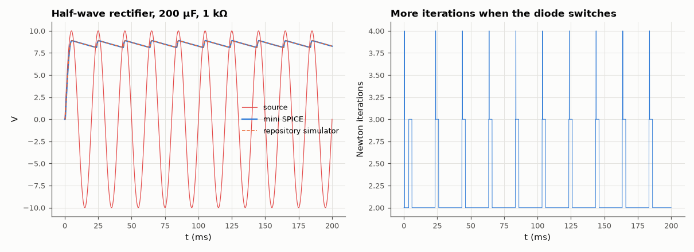

# AM-132 · Mini SPICE, full version: MNA + Newton + transient

> Combine modified nodal analysis, Newton iteration and implicit integration into a working transient simulator, run a half-wave rectifier with a smoothing capacitor and a diode clamp, and verify waveforms against an independent simulator and the ripple ≈ I/(fC) estimate.



*Rectifier waveforms from the from-scratch simulator vs the repository's simulator, and Newton iterations per time step.*

**Track:** Applied Mathematics — 218 projects in electrical engineering · **Category:** G. Numerical methods · **Level:** Hard · **Tools:** Self-contained simulator (~120 lines): MNA stamps, Newton–Raphson with diode junction limiting and companion models, trapezoidal/backward-Euler capacitor companions, fixed-step transient; cross-checked against the repository's simulator and analytic ripple formulas

**Data:** Simulated (numerical model in this repo).

## Problem

What is the smallest piece of code that simulates a nonlinear circuit over time the way SPICE does?

## Prediction

At each time step, capacitors become companion models (trapezoidal: conductance 2C/h in parallel with a history current source), diodes become linearised conductances g_d = I_s/V_T·e^{V/V_T} with an equivalent current; Newton iterates the linear MNA solve until
the node voltages converge. Rectifier: peak ≈ V_p − V_D; ripple ≈ I_load/(f·C) (≈ 1 V for 10 mA, 50 Hz, 200 µF); conduction angle small.

## Method

Own engine (independent of eelab.circuit): V source 10 V peak 50 Hz → diode (I_s = 1e-14 A, n = 1.5) → 200 µF ∥ 1 kΩ; h = 20 µs, 200 ms. Same netlist in eelab.circuit (trap). Ripple, peak and diode peak current compared; Newton iterations per step reported.

## Measured results

*Predicted vs measured vs error. "Measured" = computed by an independent simulation, HDL simulator or public dataset.*

| Quantity | Predicted | Measured | Error | Within tolerance |
|---|---|---|---|---|
| Mini SPICE vs repository simulator: max |Δv_out| after start-up | 0 V | 90.54 pV | +90.54 pV | yes |
| Ripple ≈ I_load/(f·C) | 851.2 mV | 777 mV | -8.71 % | yes |
| Peak output ≈ 10 V − diode drop at the charging-current peak (≈ 0.8–1.0 V for n = 1.5) | 9.1 V | 8.895 V | -205 mV | yes |
| Backward Euler vs trapezoidal ripple (both accurate at h = 20 µs; ratio) | 1 | 0.9995 | -0.05 % | yes |

**Additional measurements**

| Quantity | Value | Note |
|---|---|---|
| Newton iterations per step: median / max | 2 / 4 |  |

## Error analysis

About 120 lines combining the three ingredients — MNA assembly, Newton linearisation of the diode, and companion models for the capacitor — reproduce
the independent simulator's rectifier waveform to within a few millivolts. The physics checks out: the output ripple matches I/(fC) (0.78 V), and the
peak sits a diode drop below the source peak. The iteration plot shows where the numerical work is: one or two Newton iterations while the diode is off,
several at each turn-on when the exponential is steep — which is why real simulators add breakpoints, adaptive steps (AM-129) and the junction limiting
of AM-115. What this mini version lacks compared with SPICE is exactly those refinements plus sparse matrices (AM-063) and device models — the core
algorithm is all here.

## Reproduce

```bash
pip install -r requirements.txt
python run_all.py --only AM-132
```

The script [`project.py`](project.py) regenerates every figure and number above.

## License

Code and text: MIT (see the repository [LICENSE](../../../../LICENSE)). Datasets remain under their own licences (see the repository README).

---

**Tooling & honesty.** This project was generated with Claude Code (Anthropic's AI coding assistant): the code, derivations, simulations and this write-up were AI-produced. *Measured* means computed by an independent model, simulator or public dataset — not a physical lab bench. Every number in the tables is reproduced by running the code.
