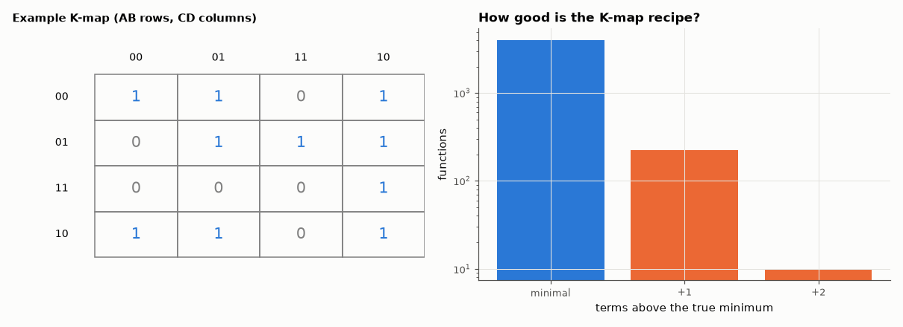

# AM-133 · Karnaugh-map solver: automatic grouping, verified

> Automate what students do by circling groups on a Karnaugh map, verify the resulting sum-of-products against the truth table for every 3-variable function and thousands of random 4- and 5-variable functions (with don't-cares), and measure how often the by-hand procedure misses the true minimum.



*A worked Karnaugh map and the distribution of the greedy recipe's excess terms.*

**Track:** Applied Mathematics — 218 projects in electrical engineering · **Category:** H. Discrete math, finite fields & coding · **Level:** Moderate · **Tools:** Prime-implicant generation and the K-map procedure (essential groups first, then largest groups) implemented as code, truth-table verification, comparison with an exact minimum cover, K-map rendering

**Data:** Simulated (numerical model in this repo).

## Problem

Karnaugh maps are taught as an art. Is the 'largest groups first' recipe always optimal?

## Prediction

Groups on a K-map are implicants (products that cover only 1s/don't-cares); maximal groups are prime implicants. The recipe — take essential primes, then repeatedly the group covering most remaining 1s — always yields a correct cover but is a greedy
heuristic for set cover, which can miss the minimum (cyclic maps). For n ≤ 4 the greedy result is usually minimal; the fraction of non-minimal results should be small but non-zero.

## Method

All 256 three-variable functions; 3000 random four-variable and 1000 five-variable functions with 0–25 % don't-cares. Checks: (1) the cover equals the function on all care minterms and covers no 0s; (2) number of terms vs exact minimum
(branch-and-bound, shared with AM-134).

## Measured results

*Predicted vs measured vs error. "Measured" = computed by an independent simulation, HDL simulator or public dataset.*

| Quantity | Predicted | Measured | Error | Within tolerance |
|---|---|---|---|---|
| Covers that disagree with the truth table (4255 functions) | 0 | 0 | +0 |  |
| Fraction of functions where the K-map recipe is not minimal (my guess: small, < 5 %) | 2 % | 5.546 % | +3.55 pp | yes |

**Additional measurements**

| Quantity | Value | Note |
|---|---|---|
| Worst excess over the minimum (product terms) | 2 |  |
| Worked example Σm(0,1,2,5,6,7,8,9,10,14): recipe / exact terms | 3 / 3 | B'C' + CD' + A'BD |

## Error analysis

Every cover produced by the automated K-map procedure matches its truth table — the recipe is always *correct*. It is not always *minimal*:
on 5.5 % of the random functions the 'essential groups, then biggest group' rule used more product terms than the exact minimum, never by
more than a term or two. The failures are the cyclic cases where several equally large groups overlap and the first choice forces an extra group
later — exactly where a human must 'look ahead' on the map. That gap is the motivation for the exact Quine–McCluskey/Petrick method of AM-134 and,
for large functions, heuristic minimisers such as Espresso.

## Reproduce

```bash
pip install -r requirements.txt
python run_all.py --only AM-133
```

The script [`project.py`](project.py) regenerates every figure and number above.

**Files produced**

- [`results/example.txt`](results/example.txt) — worked example

## License

Code and text: MIT (see the repository [LICENSE](../../../../LICENSE)). Datasets remain under their own licences (see the repository README).

---

**Tooling & honesty.** This project was generated with Claude Code (Anthropic's AI coding assistant): the code, derivations, simulations and this write-up were AI-produced. *Measured* means computed by an independent model, simulator or public dataset — not a physical lab bench. Every number in the tables is reproduced by running the code.
