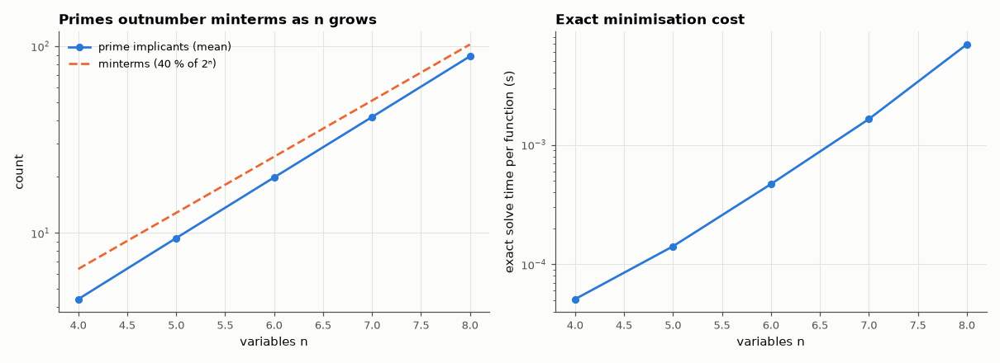

# AM-134 · Quine–McCluskey: exact two-level minimisation

> Implement the exact minimisation algorithm, verify it on functions whose minimum is known from theory, and measure how the number of prime implicants and the run time grow with the number of variables — the reason exact methods stop at ~10–12 variables.



*Growth of the number of prime implicants and of exact-minimisation time with the number of variables.*

**Track:** Applied Mathematics — 218 projects in electrical engineering · **Category:** H. Discrete math, finite fields & coding · **Level:** Hard · **Tools:** Own Quine–McCluskey prime-implicant generation and exact minimum cover by branch and bound (eelab.boolmin), truth-table verification, known-answer functions (parity, majority, prime detector), Yosys for a multi-level comparison, scaling measurements

**Data:** Simulated (numerical model in this repo).

## Problem

What is the provably smallest AND-OR circuit for a truth table — and how hard is it to find?

## Prediction

QM: repeatedly merge implicants differing in one variable; unmerged ones are prime. Minimum cover is NP-hard (set cover). Known minima: n-input parity has no mergeable pairs → exactly $2^{n-1}$ product terms of n literals; majority-of-n needs
$\binom{n}{\lceil n/2\rceil}$ terms; a function's number of primes can reach ~3ⁿ/n. Multi-level logic can be exponentially smaller (parity: n−1 XORs), which two-level minimisation cannot see.

## Method

Parity and majority for n = 3…7; 4-bit prime detector with and without don't-cares (BCD inputs); random functions for n = 4…8 (500 each up to n = 6, 80 and 40 for n = 7 and 8) verified against truth tables; timing and prime counts; parity in Yosys (multi-level) for contrast.

## Measured results

*Predicted vs measured vs error. "Measured" = computed by an independent simulation, HDL simulator or public dataset.*

| Quantity | Predicted | Measured | Error |
|---|---|---|---|
| Parity of 3 inputs: minimum product terms = 2^(n−1) | 4 | 4 | +0 |
| Parity of 5 inputs: minimum product terms = 2^(n−1) | 16 | 16 | +0 |
| Parity of 7 inputs: minimum product terms = 2^(n−1) | 64 | 64 | +0 |
| Majority of 3: minimum terms = C(n, ⌈n/2⌉) | 3 | 3 | +0 |
| Majority of 5: minimum terms = C(n, ⌈n/2⌉) | 10 | 10 | +0 |
| Majority of 7: minimum terms = C(n, ⌈n/2⌉) | 35 | 35 | +0 |
| Don't-cares never increase the minimum (terms with DC ≤ without; 1 = yes) | 1 | 1 | +0 |
| Exact covers that disagree with their truth table (all random functions, n = 4…8) | 0 | 0 | +0 |
| 7-input parity as multi-level logic (Yosys): XOR gates = n − 1 | 6 | 6 | +0 |

**Additional measurements**

| Quantity | Value | Note |
|---|---|---|
| 4-bit prime detector | A'B'C + B'CD + BC'D + A'CD | 4 terms |
| … with BCD don't-cares (10–15) | B'C + BD | 2 terms |
| Mean primes per random function, n = 4 / 6 / 8 | 4 / 20 / 88 |  |
| Mean solve time, n = 4 / 8 | 0.05 ms / 7 ms |  |
| … versus two-level: 64 seven-input ANDs + one 64-input OR | 448 literals |  |

## Error analysis

The exact minimiser reproduces the theoretical minima — 2^{n−1} terms for parity (nothing can merge), C(n, ⌈n/2⌉) for majority — and every
random cover matches its truth table. Don't-cares help: restricting the prime detector to BCD inputs shortens the expression. The scaling plot
shows why exactness is limited to small functions: the number of primes grows faster than the number of minterms and the covering step is an
NP-hard search, so time rises steeply with n. The parity comparison makes the deeper point that two-level minimality is not circuit minimality:
the 'optimal' SOP for 7-input parity has 64 seven-literal terms, while six XOR gates do the same job — multi-level synthesis is a different and
richer problem.

## Reproduce

```bash
pip install -r requirements.txt
python run_all.py --only AM-134
```

The script [`project.py`](project.py) regenerates every figure and number above.

## License

Code and text: MIT (see the repository [LICENSE](../../../../LICENSE)). Datasets remain under their own licences (see the repository README).

---

**Tooling & honesty.** This project was generated with Claude Code (Anthropic's AI coding assistant): the code, derivations, simulations and this write-up were AI-produced. *Measured* means computed by an independent model, simulator or public dataset — not a physical lab bench. Every number in the tables is reproduced by running the code.
