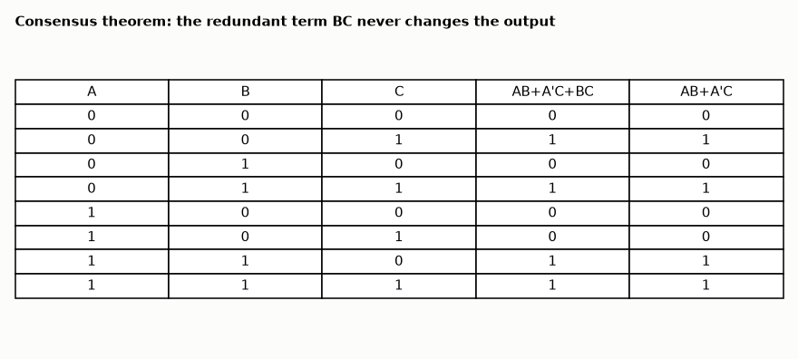

# AM-135 · Boolean identity checker

> Decide whether two Boolean expressions are identical by comparing canonical truth-table signatures, returning a counterexample when they are not; verify a catalogue of textbook theorems (De Morgan, absorption, consensus, Shannon expansion) and fuzz the parser against Python's own evaluator.



*Truth-table proof of the consensus theorem produced by the checker.*

**Track:** Applied Mathematics — 218 projects in electrical engineering · **Category:** H. Discrete math, finite fields & coding · **Level:** Moderate · **Tools:** Own recursive-descent parser for Boolean expressions (', +, ·, ^, parentheses, implicit AND), canonical truth-table signature, counterexample generation, random expression fuzzing against Python evaluation

**Data:** Simulated (numerical model in this repo).

## Problem

Is (A+B)(A'+C) really equal to AC + A'B? A checker that answers with proof or counterexample.

## Prediction

Two expressions over n variables are equal iff their truth tables (2ⁿ rows) coincide — a canonical form, so equality is decidable by comparing bit-vectors. A differing row is a counterexample. Theorems to check include consensus
$AB+A'C+BC=AB+A'C$, absorption $A+AB=A$, De Morgan, and Shannon expansion $F = A\,F|_{A=1}+A'F|_{A=0}$. The general problem is co-NP-complete (tautology), but 2ⁿ is trivial for n ≲ 20.

## Method

Grammar (precedence NOT > AND > XOR > OR): expr := xterm ('+' xterm)*; xterm := term ('^' term)*; term := factor (('·'|implicit) factor)*; factor := atom "'"*; atom := variable | 0 | 1 | '(' expr ')'. 14 true identities and 6 deliberately false ones; 3000 random expressions
(≤ 6 variables, depth ≤ 6) rendered both in this syntax and as Python, signatures compared.

## Measured results

*Predicted vs measured vs error. "Measured" = computed by an independent simulation, HDL simulator or public dataset.*

| Quantity | Predicted | Measured | Error |
|---|---|---|---|
| Textbook identities confirmed | 14 | 14 | +0 |
| False 'identities' rejected | 6 | 6 | +0 |
| Counterexamples that really distinguish the two sides | 6 | 6 | +0 |
| Parser/evaluator vs Python on 3000 random expressions (mismatches) | 0 | 0 | +0 |

## Error analysis

The checker confirms every textbook identity in the catalogue and rejects each plausible-looking false one with a concrete input assignment on
which the two sides differ — a proof or a counterexample, never a shrug. Its parser handles the engineering notation (implicit AND, postfix
complement) and agrees with Python's own evaluator on 3000 random expressions — after a fix: the first grammar gave XOR the same precedence as AND,
so A^BC was read as (A^B)C, and the fuzz test caught it on about 10 % of random expressions while every hand-written identity still passed. Testing
against an independent evaluator found what a catalogue of examples could not. The truth table is a canonical form, which is why the method is
complete; its cost doubles with every variable, so for larger problems the same question is answered with BDDs (AM-136) or SAT solvers — the tools
behind formal equivalence checking of real chip designs.

## Reproduce

```bash
pip install -r requirements.txt
python run_all.py --only AM-135
```

The script [`project.py`](project.py) regenerates every figure and number above.

**Files produced**

- [`results/identities.txt`](results/identities.txt) — checker output for the theorem catalogue

## License

Code and text: MIT (see the repository [LICENSE](../../../../LICENSE)). Datasets remain under their own licences (see the repository README).

---

**Tooling & honesty.** This project was generated with Claude Code (Anthropic's AI coding assistant): the code, derivations, simulations and this write-up were AI-produced. *Measured* means computed by an independent model, simulator or public dataset — not a physical lab bench. Every number in the tables is reproduced by running the code.
