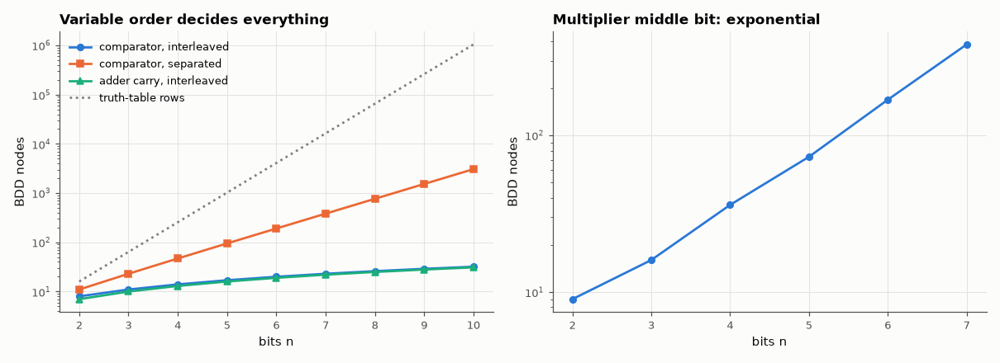

# AM-136 · Binary decision diagrams: compressing truth tables

> Build ROBDDs from scratch and measure how compactly they represent useful functions: linear size for adders and comparators with a good variable order, exponential with a bad one, and exponential regardless of order for multiplication — the facts that shaped formal verification.



*BDD sizes for comparators and adders under two variable orders, and for a multiplier output.*

**Track:** Applied Mathematics — 218 projects in electrical engineering · **Category:** H. Discrete math, finite fields & coding · **Level:** Hard · **Tools:** Own reduced ordered BDD package (unique table, memoised ITE/apply), node counts vs truth-table size, variable-ordering experiments on an n-bit comparator and adder, the hidden-weighted-bit and multiplier hard cases

**Data:** Simulated (numerical model in this repo).

## Problem

A 64-input function has 2⁶⁴ truth-table rows. How can a verification tool still reason about it exactly?

## Prediction

An ROBDD (fixed variable order, merged isomorphic subgraphs, no redundant tests) is canonical: two functions are equal iff their BDDs are identical nodes. Size depends dramatically on order: for the comparator $\bigwedge(a_i = b_i)$ the interleaved order
a₁b₁a₂b₂… needs 3n + 2 nodes, the separated order a₁…a_nb₁…b_n needs 3·2ⁿ − 1. The carry-out of an n-bit adder is linear when interleaved. Multiplier outputs need exponential BDDs for *every* order (Bryant 1991).

## Method

Node counts (including the two terminals) for n = 2…10: equality comparator under both orders, adder carry-out (interleaved), middle output bit of an n×n multiplier (n ≤ 7, interleaved). Canonicity test: two structurally different expressions of the
same function must return the identical node.

## Measured results

*Predicted vs measured vs error. "Measured" = computed by an independent simulation, HDL simulator or public dataset.*

| Quantity | Predicted | Measured | Error |
|---|---|---|---|
| Canonicity: AB + A'C and AB + A'C + BC reduce to the identical node (1 = yes) | 1 | 1 | +0 |
| Comparator, interleaved order: nodes = 3n + 2 (n = 10) | 32 | 32 | +0 |
| Comparator, separated order: nodes = 3·2ⁿ − 1 (n = 10) | 3071 | 3071 | +0 |
| Adder carry-out, interleaved: linear growth (nodes per extra bit) | 3 | 3 | +0 |
| Multiplier middle bit: node count grows exponentially (log₂ growth per bit > 0.5) | 1 | 1 | +0 |

**Additional measurements**

| Quantity | Value | Note |
|---|---|---|
| Multiplier middle-bit BDD nodes, n = 2…7 | 9, 16, 36, 73, 169, 381 |  |
| Compression, 10-bit comparator: truth-table rows / BDD nodes (good order) | 3.277e+04 × |  |

## Error analysis

The from-scratch BDD package reproduces the classic results exactly: the equality comparator needs 3n + 2 nodes when each aᵢ is tested next to its
bᵢ and 3·2ⁿ − 1 when all a's come first (the diagram must remember every a bit), and an adder's carry is linear in the interleaved order. With a good
order a 20-input function with a million truth-table rows is a few dozen nodes — and because the form is canonical, equivalence checking is a
pointer comparison. The multiplier's middle bit grows exponentially regardless of order, which is why BDD-based verification conquered adders,
comparators and control logic in the 1990s but multipliers needed other methods (and why today's tools combine BDDs with SAT).

## Reproduce

```bash
pip install -r requirements.txt
python run_all.py --only AM-136
```

The script [`project.py`](project.py) regenerates every figure and number above.

## License

Code and text: MIT (see the repository [LICENSE](../../../../LICENSE)). Datasets remain under their own licences (see the repository README).

---

**Tooling & honesty.** This project was generated with Claude Code (Anthropic's AI coding assistant): the code, derivations, simulations and this write-up were AI-produced. *Measured* means computed by an independent model, simulator or public dataset — not a physical lab bench. Every number in the tables is reproduced by running the code.
