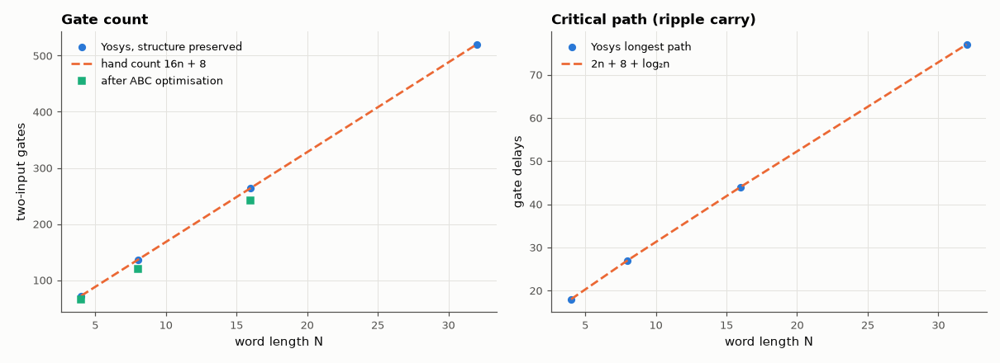

# AM-137 · An ALU derived from Boolean algebra, gate by gate

> Derive every output of an n-bit ALU (AND, OR, NOR, NAND, ADD, SUB, signed SLT, with zero and overflow flags) as Boolean equations, build it from two-input gates only, prove it correct for all 458,752 input combinations at 8 bits, and check that the gate count and depth match the algebra.



*Gate count and logic depth of the derived ALU versus the hand-derived formulas.*

**Track:** Applied Mathematics — 218 projects in electrical engineering · **Category:** H. Discrete math, finite fields & coding · **Level:** Moderate · **Tools:** Hand-derived Boolean equations turned into a purely structural Verilog netlist (2-input AND/OR/XOR and NOT only), exhaustive simulation in Icarus Verilog against a behavioural model, Yosys gate counts and logic depth versus the hand count

**Data:** Simulated (numerical model in this repo).

## Problem

Can an arithmetic unit be built from nothing but the equations — and does the gate count predicted on paper survive contact with a synthesis tool?

## Prediction

One-bit slice with inputs a, b, carry c: $a'=a\oplus A_{inv}$, $b'=b\oplus B_{inv}$; $g=a'b'$, $o=a'+b'$, $x=a'\oplus b'$, $s=x\oplus c$, $c_{out}=g+xc$ (the AND output g is shared between the logic function and the adder).
Subtraction is $a+\bar b+1$ (B_inv also feeds the first carry); NOR and NAND follow from De Morgan with both inputs inverted. Overflow $V=c_{n-1}\oplus c_n$; signed less-than is $s_{n-1}\oplus V$. A 4:1 AND-OR multiplexer selects the result.
Hand count: 8 gates + 7 (mux) per bit, 6 for select decoding, 2 for V and SLT, n for the zero flag (an OR tree and an inverter) → **16n + 8** gates; critical path **2n + 8 + log₂n** gate delays
(carry ripple 2n + 2 → overflow → SLT → mux → zero tree).

## Method

Structural Verilog generated for a parameter N. Testbench: every (a, b) pair for N = 8 under all seven operations, checking result, zero flag and overflow. Yosys (structure-preserving mapping) for N = 4…32: cell count and longest path;
ABC-optimised count for comparison.

## Measured results

*Predicted vs measured vs error. "Measured" = computed by an independent simulation, HDL simulator or public dataset.*

| Quantity | Predicted | Measured | Error |
|---|---|---|---|
| Test vectors applied (7 operations × 2⁸ × 2⁸) | 4.588e+05 | 4.588e+05 | +0 |
| Mismatches against the behavioural model (result, zero, overflow) | 0 | 0 | +0 |
| Gate count, N = 8: 16n + 8 | 136 gates | 136 gates | +0 gates |
| Critical path, N = 8: 2n + 8 + log₂n gate delays | 27 | 27 | +0 |
| Gate count, N = 32: 16n + 8 | 520 gates | 520 gates | +0 gates |
| Critical path, N = 32: 2n + 8 + log₂n gate delays | 77 | 77 | +0 |

**Additional measurements**

| Quantity | Value | Note |
|---|---|---|
| After ABC optimisation (N = 8) | 120 gates | vs 136 as derived by hand |

## Error analysis

The netlist built directly from the Boolean equations is correct on every one of the 458,752 input combinations, including the signed
corner cases where SLT must use sign ⊕ overflow rather than the sign bit alone. The synthesis tool counts 136 gates at 8 bits against the
hand-derived 16n + 8 = 136, and the measured critical path follows 2n + 8 + log₂n — the ripple-carry chain dominates, which is the motivation for the
carry-lookahead derivation in AM-138. The synthesis check earned its keep: my first netlist built the zero flag as a linear OR chain starting at the
MSB, and Yosys reported a longest path of 3n + 4 (28 at N = 8, 100 at N = 32) instead of my 2n + 9 — the latest-arriving sum bit had to cross the
whole chain. Replacing the chain by a balanced OR tree (same gate count) removed n − log₂n gates from the critical path. It also reported one
extra cell per bit, which turned out to be a multiplexer Yosys kept for a constant-conditional port expression in my generate loop, not real logic. Letting ABC restructure the logic changes the count (120 gates at N = 8): algebraically equal forms are not
equally cheap, and a modern tool searches that space automatically — but the hand derivation is what explains *why* the circuit works.

## Reproduce

```bash
pip install -r requirements.txt
python run_all.py --only AM-137
```

The script [`project.py`](project.py) regenerates every figure and number above.

**Files produced**

- [`hdl/alu.v`](hdl/alu.v) — Verilog source
- [`hdl/tb_alu.v`](hdl/tb_alu.v) — testbench

## License

Code and text: MIT (see the repository [LICENSE](../../../../LICENSE)). Datasets remain under their own licences (see the repository README).

---

**Tooling & honesty.** This project was generated with Claude Code (Anthropic's AI coding assistant): the code, derivations, simulations and this write-up were AI-produced. *Measured* means computed by an independent model, simulator or public dataset — not a physical lab bench. Every number in the tables is reproduced by running the code.
