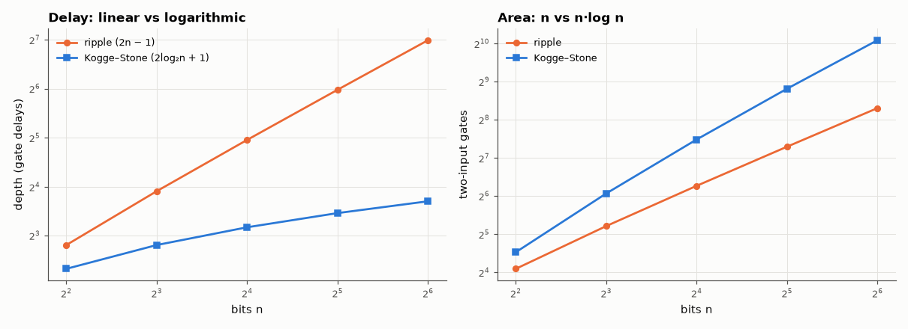

# AM-138 · Carry-lookahead derived: from ripple to parallel prefix

> Derive the generate/propagate carry recurrence, unroll it into lookahead equations, recognise the associative prefix operator that lets carries be computed in log₂n levels, and verify depth and size formulas for 4 to 64 bits on real gate netlists.



*Depth and gate count of ripple and Kogge–Stone adders built from the derived equations.*

**Track:** Applied Mathematics — 218 projects in electrical engineering · **Category:** H. Discrete math, finite fields & coding · **Level:** Moderate · **Tools:** Own gate-level netlist builder (2-input gates with automatic level tracking, bit-parallel evaluation over 64-bit words), ripple, 4-bit-group lookahead and Kogge–Stone prefix adders, exhaustive/random functional verification, depth and gate counts against derived formulas

**Data:** Simulated (numerical model in this repo).

## Problem

A ripple adder waits for the carry to crawl across every bit. How does algebra make a 64-bit add as fast as a few gates?

## Prediction

$g_i=a_ib_i$, $p_i=a_i\oplus b_i$, $c_{i+1}=g_i+p_ic_i$. Unrolling: $c_4=g_3+p_3g_2+p_3p_2g_1+p_3p_2p_1g_0+p_3p_2p_1p_0c_0$ (two levels of wide gates). The pair operator $(G,P)\circ(G',P')=(G+PG',\,PP')$ is
associative, so all prefixes $(G_{i:0},P_{i:0})$ can be computed by a tree: Kogge–Stone uses $\log_2 n$ levels with $n\log_2n-n+1$ prefix cells. With 2-input gates and c₀ = 0: ripple depth $2n-1$; Kogge–Stone depth $2\log_2n+1$.
Both $p=a\oplus b$ and $p=a+b$ give the same carries (since $g$ absorbs the difference).

## Method

Netlists built from 2-input AND/OR/XOR; depth = longest gate path, size = gate count. Verification: exhaustive for n = 4 and 8, 10⁵ random vectors for n = 16…64 (bit-parallel). The unrolled c₄ equation is checked against the recurrence on all 512 inputs
for both definitions of p.

## Measured results

*Predicted vs measured vs error. "Measured" = computed by an independent simulation, HDL simulator or public dataset.*

| Quantity | Predicted | Measured | Error |
|---|---|---|---|
| Unrolled c₄ equation vs recurrence vs true carry (512 inputs × both definitions of p) | 0 mismatches | 0 mismatches | +0 mismatches |
| Functional mismatches, both adders, n = 4…64 | 0 | 0 | +0 |
| Ripple depth at n = 64: 2n − 1 | 127 gate delays | 127 gate delays | +0 gate delays |
| Kogge–Stone depth = 2·log₂n + 1 for every n = 4…64 (mismatches) | 0 | 0 | +0 |
| Kogge–Stone depth at n = 64 | 13 gate delays | 13 gate delays | +0 gate delays |
| Kogge–Stone prefix cells at n = 64: n·log₂n − n + 1 | 321 | 321 | +0 |

**Additional measurements**

| Quantity | Value | Note |
|---|---|---|
| Speed-up at 64 bits (depth ratio) | 9.769 × |  |
| Area cost at 64 bits (gate ratio) | 3.442 × | 1091 vs 317 gates |

## Error analysis

The unrolled lookahead equation agrees with the recurrence on every input for both definitions of propagate, and both netlists add correctly at
every width. Depth follows 2n − 1 for ripple and 2·log₂n + 1 for the prefix tree. (I first derived 2·log₂n + 2 — one level for g/p, two per
prefix level, one for the sum XOR — and the netlist came out one level faster: the carry into the top bit is a prefix over only n − 1 bits, whose last
cell combines with a partner that is one gate shallower, so the final XOR is not on a longer path than the carry-out.) At 64 bits the prefix adder is
10× faster in gate delays, at 3.4× the gates (and, in silicon, a lot of wiring that this count ignores). The key algebraic step is
noticing that (G, P) pairs combine associatively: once carries are a prefix computation, any parallel-prefix network (Kogge–Stone, Brent–Kung,
Sklansky) trades depth, area and fan-out — the design space every fast adder since the 1970s lives in.

## Reproduce

```bash
pip install -r requirements.txt
python run_all.py --only AM-138
```

The script [`project.py`](project.py) regenerates every figure and number above.

**Files produced**

- [`data/adders.csv`](data/adders.csv)

## License

Code and text: MIT (see the repository [LICENSE](../../../../LICENSE)). Datasets remain under their own licences (see the repository README).

---

**Tooling & honesty.** This project was generated with Claude Code (Anthropic's AI coding assistant): the code, derivations, simulations and this write-up were AI-produced. *Measured* means computed by an independent model, simulator or public dataset — not a physical lab bench. Every number in the tables is reproduced by running the code.
