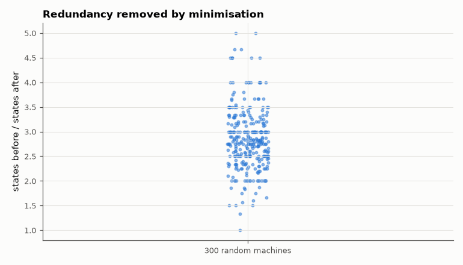

# AM-139 · FSM state minimisation by partition refinement

> Find and merge equivalent states of a finite-state machine. Verified three ways: recovering the known minimal size of deliberately inflated machines, agreeing with an independent table-filling algorithm, and proving behavioural equivalence on long random input sequences.



*State-count reduction achieved on the randomly inflated machines.*

**Track:** Applied Mathematics — 218 projects in electrical engineering · **Category:** H. Discrete math, finite fields & coding · **Level:** Hard · **Tools:** Own partition-refinement (Moore) minimiser, independent pair-marking (table-filling) implementation as a cross-check, machines inflated from known minimal machines, random-input equivalence testing, a worst-case machine for the number of refinement rounds

**Data:** Simulated (numerical model in this repo).

## Problem

A state diagram drawn by hand often has redundant states. How do we provably find the smallest equivalent machine?

## Prediction

Two states are equivalent iff no input sequence distinguishes their outputs. Start with the partition by output; repeatedly split blocks whose members go to different blocks under some input. The fixed point is the coarsest
consistent partition — the unique minimal machine (Myhill–Nerode). At most n − 2 splitting rounds are needed after the initial partition, and that bound is attained by a 'countdown' machine. Flip-flops saved: ⌈log₂n⌉ − ⌈log₂k⌉.

## Method

Mealy machines as tables next[s, x], out[s, x]. (1) 300 random minimal machines with k = 2…12 states, each inflated to up to 4k states by duplicating states (plus unreachable states); (2) a naive 8-state '1011' detector remembering
the last three bits; (3) a 20-state countdown machine. Cross-check by table-filling; equivalence by 20 000 random input symbols.

## Measured results

*Predicted vs measured vs error. "Measured" = computed by an independent simulation, HDL simulator or public dataset.*

| Quantity | Predicted | Measured | Error |
|---|---|---|---|
| Inflated machines reduced to exactly the known minimal size (300 machines, mean inflation 2.8×) | 0 failures | 0 failures | +0 failures |
| Disagreements with the independent table-filling algorithm | 0 | 0 | +0 |
| Machines whose minimised version behaves differently on 2000 random inputs | 0 | 0 | +0 |
| '1011' detector drawn with 8 states (last three bits): minimal states | 4 | 4 | +0 |
| … outputs identical on 20 000 random bits (mismatches) | 0 | 0 | +0 |
| Countdown machine (n = 20): refinement rounds = n − 2 | 18 | 18 | +0 |
| … and it is already minimal (states) | 20 | 20 | +0 |

**Additional measurements**

| Quantity | Value | Note |
|---|---|---|
| Flip-flops: before → after | 3 → 2 |  |

## Minimised '1011' detector

| state | next (x=0) | next (x=1) | out (x=0) | out (x=1) |
|---|---|---|---|---|
| → S0 | S0 | S1 | 0 | 0 |
| S1 | S2 | S1 | 0 | 0 |
| S2 | S0 | S3 | 0 | 0 |
| S3 | S2 | S1 | 0 | 1 |

## Error analysis

Partition refinement recovered the minimal machine in every trial: inflated machines collapsed back to their known size, the independent
pair-marking algorithm always agreed on the number of classes, and minimised machines were indistinguishable from the originals on long random
inputs. The naive eight-state '1011' detector needs only four states — two flip-flops instead of three — because remembering the last three bits
stores more than the detector needs (only the longest matched prefix matters). The countdown machine shows the worst case: each round can peel off
only one state, so n − 2 rounds are required; Hopcroft's algorithm gets the total work down to O(n log n) by always refining with the smaller half.

## Reproduce

```bash
pip install -r requirements.txt
python run_all.py --only AM-139
```

The script [`project.py`](project.py) regenerates every figure and number above.

## License

Code and text: MIT (see the repository [LICENSE](../../../../LICENSE)). Datasets remain under their own licences (see the repository README).

---

**Tooling & honesty.** This project was generated with Claude Code (Anthropic's AI coding assistant): the code, derivations, simulations and this write-up were AI-produced. *Measured* means computed by an independent model, simulator or public dataset — not a physical lab bench. Every number in the tables is reproduced by running the code.
