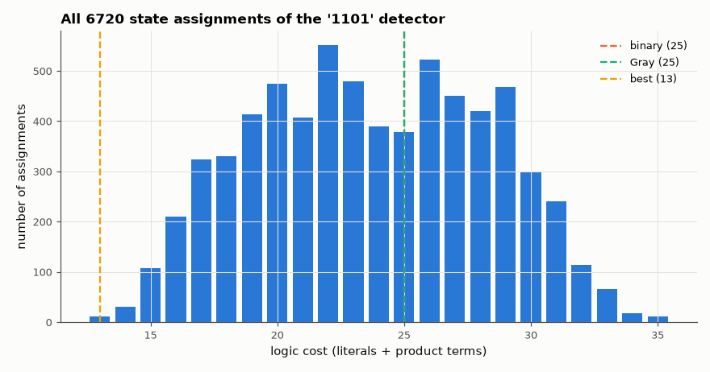

# AM-140 · State encoding optimisation: every assignment of a 5-state FSM

> The same state machine costs very different amounts of logic depending on which binary code each state gets. Enumerate every possible 3-bit assignment for a '1101' sequence detector, minimise the logic exactly for each, and see where the naive binary, Gray and one-hot choices rank.



*Distribution of exact two-level logic cost over every possible 3-bit state assignment.*

**Track:** Applied Mathematics — 218 projects in electrical engineering · **Category:** H. Discrete math, finite fields & coding · **Level:** Hard · **Tools:** Exhaustive enumeration of all 6720 three-bit state assignments, exact two-level minimisation of every next-state and output function (eelab.boolmin) with unused codes as don't-cares, one-hot encoding for comparison, simulation of the encoded logic against the behavioural FSM

**Data:** Simulated (numerical model in this repo).

## Problem

State names are arbitrary; their codes are not. How much logic does a good assignment save, and how good are the default choices?

## Prediction

With s states in b bits there are $2^b!/(2^b-s)!$ assignments (6720 for s = 5, b = 3; 1120 distinct up to renaming the flip-flops). Each gives next-state functions $D_i(q, x)$ and output $z(q)$; cost here = total literals + product terms of the exact minimum
SOP forms (unused codes are don't-cares). No closed form predicts the best assignment — the problem is NP-hard — which is why tools use heuristics (adjacent codes for states sharing successors) or one-hot (s flip-flops, very simple
per-flip-flop logic). My guess before running: a 2× spread between best and worst, with plain binary somewhere in the middle.

## Method

Moore '1101' detector (overlapping), states S0…S4, output in S4. All injective maps state → {0…7}; per assignment minimise D2, D1, D0 (4 variables) and z (3 variables). One-hot: 6 variables, non-one-hot codes as don't-cares.
The best assignment's equations are simulated on 5000 random bits against the state table.

## Measured results

*Predicted vs measured vs error. "Measured" = computed by an independent simulation, HDL simulator or public dataset.*

| Quantity | Predicted | Measured | Error | Within tolerance |
|---|---|---|---|---|
| Assignments enumerated: 8!/3! | 6720 | 6720 | +0 |  |
| Worst / best cost ratio (my guess: about 2×) | 2 × | 2.692 × | +34.62 % | yes |
| Distinct costs are invariant under flip-flop renaming (6720 / 6 classes have equal cost; violations) | 0 | 0 | +0 |  |
| Encoded logic vs behavioural FSM on 5000 random bits (best, binary, one-hot; mismatches) | 0 | 0 | +0 |  |
| Detections by the FSM vs occurrences of '1101' counted directly in the input | 277 | 277 | +0 |  |

**Additional measurements**

| Quantity | Value | Note |
|---|---|---|
| Best assignment (S0…S4) | 001 011 010 000 111 | cost 13 |
| Worst assignment | 011 000 101 100 110 | cost 35 |
| Plain binary 000,001,010,011,100: cost | 25 | better than or equal to 44 % of assignments |
| Gray order 000,001,011,010,110: cost | 25 | better than or equal to 44 % of assignments |
| One-hot (5 flip-flops): logic cost | 18 | vs 3 flip-flops for the binary encodings |

## Error analysis

Exhaustive search shows how much the arbitrary-looking choice of state codes matters: the worst assignment costs
2.7× the best (35 vs 13), and the two 'obvious' choices — counting in binary (25) or Gray order (25) — are
not optimal. Every encoded version, including the best one found, reproduces the behavioural machine exactly on random input. One-hot spends two
extra flip-flops to get next-state equations that read directly off the state diagram (cost 18); in FPGAs, where flip-flops are free and wide
gates are not, that trade is often right — which is why synthesis tools choose encodings automatically rather than trusting the designer's numbering.
For larger machines the search space explodes (16 states: 16! ≈ 2×10¹³), so heuristics replace enumeration.

## Reproduce

```bash
pip install -r requirements.txt
python run_all.py --only AM-140
```

The script [`project.py`](project.py) regenerates every figure and number above.

## License

Code and text: MIT (see the repository [LICENSE](../../../../LICENSE)). Datasets remain under their own licences (see the repository README).

---

**Tooling & honesty.** This project was generated with Claude Code (Anthropic's AI coding assistant): the code, derivations, simulations and this write-up were AI-produced. *Measured* means computed by an independent model, simulator or public dataset — not a physical lab bench. Every number in the tables is reproduced by running the code.
