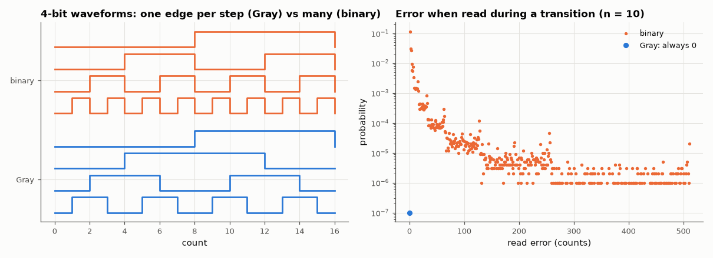

# AM-141 · Gray codes: one bit at a time

> Generate n-bit Gray codes three ways, prove the single-bit-change property exhaustively, and quantify why it matters: sampling a binary counter mid-transition can return a wildly wrong value, while a Gray counter is never off by more than one count.



*Gray versus binary counter waveforms and the distribution of mid-transition read errors.*

**Track:** Applied Mathematics — 218 projects in electrical engineering · **Category:** H. Discrete math, finite fields & coding · **Level:** Easy · **Tools:** Binary↔Gray conversion by XOR and prefix-XOR, reflected construction, exhaustive property checks up to 16 bits, Monte-Carlo model of sampling a counter whose bits switch with random skew (asynchronous FIFO pointer / rotary encoder)

**Data:** Simulated (numerical model in this repo).

## Problem

An encoder disc or a clock-domain-crossing pointer is read while it changes. How do we make a half-changed value harmless?

## Prediction

$g=b\oplus(b\gg1)$; inverse $b_i=\bigoplus_{j\ge i}g_j$ (prefix XOR). Successive codes differ in exactly one bit, including wrap-around (cyclic). Average bit flips per increment: Gray = 1; binary = $2-2^{1-n}$.
If bits change at slightly different instants, a binary transition k→k+1 that flips m bits can be read as any of $2^m$ mixtures — worst case 0111→1000 reads anything from 0 to 15 — whereas Gray can only read k or k+1: error ≤ 1 count.

## Method

Exhaustive checks for n = 1…16. Skew model: each changing bit switches at an independent random time inside the transition window; the counter is sampled at a uniformly random instant (10⁶ samples, n = 10).
Error = |decoded value − nearest true value|.

## Measured results

*Predicted vs measured vs error. "Measured" = computed by an independent simulation, HDL simulator or public dataset.*

| Quantity | Predicted | Measured | Error | Within tolerance |
|---|---|---|---|---|
| Adjacent codes (incl. wrap-around) not differing in exactly one bit, n = 1…16 | 0 | 0 | +0 |  |
| Round-trip binary → Gray → binary failures | 0 | 0 | +0 |  |
| XOR formula vs reflect-and-prefix construction (differences) | 0 | 0 | +0 |  |
| Mean bit flips per increment, binary (n = 10): 2 − 2^(1−n) | 1.998 | 1.998 | +0.00 % |  |
| Mean bit flips per increment, Gray | 1 | 1 | +0.00 % |  |
| Gray counter sampled mid-transition: worst error | 0 counts | 0 counts | +0 counts |  |
| Binary counter sampled mid-transition: worst error (2^(n−1) − 1 at the MSB carry, n = 10) | 511 counts | 511 counts | +0.00 % | yes |

**Additional measurements**

| Quantity | Value | Note |
|---|---|---|
| Binary: fraction of samples that are wrong (neither k nor k+1) | 22.64 % |  |
| Binary: RMS error when sampled mid-transition | 10.4 counts |  |

## Error analysis

All three constructions agree and every adjacent pair — including the wrap from the last code back to the first — differs in exactly one
bit for n up to 16. That single property makes a mid-transition read harmless: the Gray counter was never wrong in a million skewed samples, while
the binary counter returned a value that was neither the old nor the new count in 23 % of samples, with a worst error of
511 counts at the MSB carry (0111111111 → 1000000000, where a partial read can even return 0 or 1023). This is exactly why
asynchronous FIFO pointers and absolute rotary encoders use Gray code. It also halves switching activity (2.00 → 1 flips per count).

## Reproduce

```bash
pip install -r requirements.txt
python run_all.py --only AM-141
```

The script [`project.py`](project.py) regenerates every figure and number above.

**Files produced**

- [`results/gray4.txt`](results/gray4.txt) — 4-bit table: index, binary, Gray

## License

Code and text: MIT (see the repository [LICENSE](../../../../LICENSE)). Datasets remain under their own licences (see the repository README).

---

**Tooling & honesty.** This project was generated with Claude Code (Anthropic's AI coding assistant): the code, derivations, simulations and this write-up were AI-produced. *Measured* means computed by an independent model, simulator or public dataset — not a physical lab bench. Every number in the tables is reproduced by running the code.
