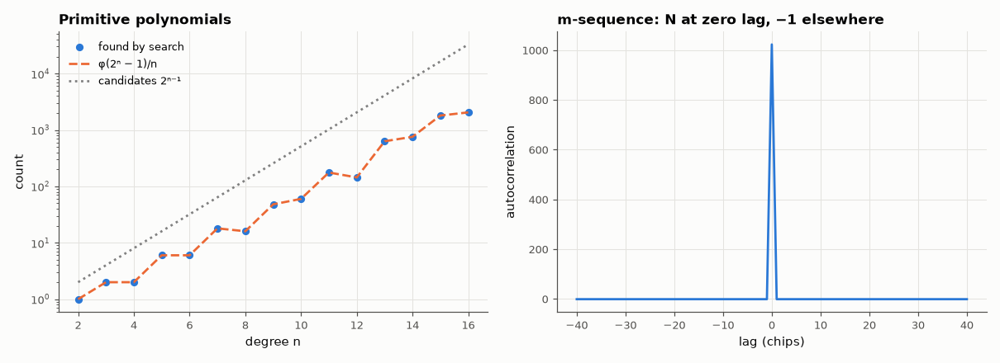

# AM-142 · LFSRs and primitive polynomials

> Find every primitive polynomial up to degree 16 by computing the multiplicative order of x, check the count against Euler's totient formula, and verify on simulated shift registers that primitive feedback gives the maximal period 2ⁿ − 1 with the classical pseudo-noise properties.



*Count of primitive polynomials versus the totient formula, and the two-valued autocorrelation of a 1023-chip m-sequence.*

**Track:** Applied Mathematics — 218 projects in electrical engineering · **Category:** H. Discrete math, finite fields & coding · **Level:** Moderate · **Tools:** Polynomial arithmetic over GF(2) with Python integers, exhaustive primitivity testing of every polynomial of degree 2–16, direct period measurement of simulated LFSRs, Berlekamp–Massey linear complexity, m-sequence balance/run/autocorrelation checks, Fibonacci vs Galois forms

**Data:** Simulated (numerical model in this repo).

## Problem

Which feedback taps make a shift register cycle through every non-zero state — and why does the answer come from field theory?

## Prediction

An LFSR with characteristic polynomial f(x) of degree n steps its state by multiplication by x in GF(2)[x]/f. The period is the order of x, which is maximal ($2^n-1$) iff f is primitive. There are $\varphi(2^n-1)/n$ primitive polynomials of degree n.
An m-sequence has $2^{n-1}$ ones and $2^{n-1}-1$ zeros, half its runs have length 1, a quarter length 2, …; its ±1 autocorrelation is N at lag 0 and −1 elsewhere; its linear complexity is n; shift-and-add gives another shift of itself.

## Method

For n = 2…16 and every f with f(0) = 1: order of x from modular exponentiation and the prime factorisation of 2ⁿ − 1. Periods of simulated Galois LFSRs measured by stepping (n ≤ 12). Properties on the n = 10 sequence from x¹⁰ + x³ + 1.
Fibonacci and Galois registers compared for cyclic equivalence.

## Measured results

*Predicted vs measured vs error. "Measured" = computed by an independent simulation, HDL simulator or public dataset.*

| Quantity | Predicted | Measured | Error | Within tolerance |
|---|---|---|---|---|
| Degrees 2–16 where the count of primitive polynomials ≠ φ(2ⁿ − 1)/n | 0 | 0 | +0 |  |
| Primitive polynomials of degree 8 | 16 | 16 | +0 |  |
| Primitive polynomials of degree 16 | 2048 | 2048 | +0 |  |
| Simulated LFSRs with primitive feedback whose period ≠ 2ⁿ − 1 | 0 | 0 | +0 |  |
| x⁴+x³+x²+x+1 (irreducible, not primitive): period | 5 | 5 | +0 |  |
| x⁴+x²+1 = (x²+x+1)²  (reducible): period | 6 | 6 | +0 |  |
| x¹⁰ + x³ + 1 is primitive (1 = yes) | 1 | 1 | +0 |  |
| m-sequence (N = 1023): number of ones | 512 | 512 | +0 |  |
| Total number of runs: 2^(n−1) | 512 | 512 | +0 |  |
| Runs of length 1: 2^(n−1−1) | 256 | 256 | +0 |  |
| Runs of length 2: 2^(n−1−2) | 128 | 128 | +0 |  |
| Runs of length 3: 2^(n−1−3) | 64 | 64 | +0 |  |
| Off-peak periodic autocorrelation (every lag): −1 | -1 | -1 | +3.5083e-14 | yes |
| … and minimum | -1 | -1 | -2.5313e-14 | yes |
| Linear complexity (Berlekamp–Massey on 60 bits) | 10 | 10 | +0 |  |
| Shift-and-add: seq ⊕ (seq shifted by 7) is itself a shift of seq (matches found) | 1 | 1 | +0 |  |
| Galois and Fibonacci registers generate the same sequence up to a shift (1 = yes) | 1 | 1 | +0 |  |

## Error analysis

The brute-force search finds exactly φ(2ⁿ − 1)/n primitive polynomials for every degree from 2 to 16 (16 of degree 8, 2048 of degree 16), and every
simulated register with primitive feedback walks through all 2ⁿ − 1 non-zero states, while irreducible-but-not-primitive and reducible polynomials
give short cycles. The degree-10 sequence has every textbook pseudo-noise property exactly: 512 ones, run lengths halving, a perfectly two-valued
autocorrelation, linear complexity 10 and the shift-and-add property. Those are the reasons m-sequences underlie scramblers, GPS C/A Gold codes,
BIST pattern generators and CRCs — and the low linear complexity is why a bare LFSR is useless as a cipher: 20 output bits reveal the whole sequence.

## Reproduce

```bash
pip install -r requirements.txt
python run_all.py --only AM-142
```

The script [`project.py`](project.py) regenerates every figure and number above.

**Files produced**

- [`results/primitive_polynomials.txt`](results/primitive_polynomials.txt) — counts and examples of primitive polynomials for degrees 2–16

## License

Code and text: MIT (see the repository [LICENSE](../../../../LICENSE)). Datasets remain under their own licences (see the repository README).

---

**Tooling & honesty.** This project was generated with Claude Code (Anthropic's AI coding assistant): the code, derivations, simulations and this write-up were AI-produced. *Measured* means computed by an independent model, simulator or public dataset — not a physical lab bench. Every number in the tables is reproduced by running the code.
