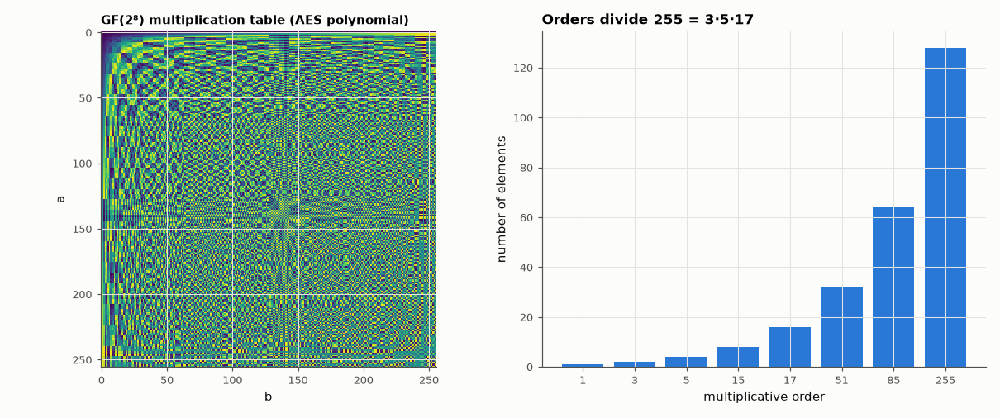

# AM-143 · A GF(2ᵐ) arithmetic library, verified against AES

> Build finite-field arithmetic from the definition — polynomials over GF(2) modulo an irreducible polynomial — and verify it exhaustively: field axioms, two independent inversion algorithms, agreement with a table-based implementation, and reproduction of the AES S-box from x ↦ x⁻¹.



*The GF(2⁸) multiplication table and the distribution of element orders.*

**Track:** Applied Mathematics — 218 projects in electrical engineering · **Category:** H. Discrete math, finite fields & coding · **Level:** Hard · **Tools:** Own polynomial-basis field class (carry-less multiply with reduction, inversion by extended Euclid and by Fermat), exhaustive field-axiom checks, cross-check against an independent log/antilog implementation, FIPS-197 known answers (AES multiplication examples and S-box)

**Data:** Simulated (numerical model in this repo).

## Problem

Error-correcting codes and ciphers do arithmetic where 1 + 1 = 0 and every non-zero byte has a reciprocal. How is that built, and how do we know it is right?

## Prediction

GF(2ᵐ) = GF(2)[x]/(f), f irreducible of degree m. Addition is XOR; multiplication is polynomial multiplication reduced mod f. The non-zero elements form a cyclic group of order $2^m-1$, so $a^{2^m-1}=1$ and $a^{-1}=a^{2^m-2}$; the number of
generators is $\varphi(2^m-1)$. Squaring is linear (Frobenius): $(a+b)^2=a^2+b^2$. AES uses f = x⁸+x⁴+x³+x+1 (0x11B): FIPS-197 gives {57}·{83} = {C1}, {57}·{13} = {FE}, and the S-box is an affine map of the inverse (S(00) = 63, S(53) = ED).
In that field 0x03 is a generator but 0x02 has order 51.

## Method

Exhaustive over all element pairs/triples for GF(16) and all pairs for GF(256) (vectorised where possible). Inverses by extended Euclid on polynomials and by exponentiation compared for every element. Cross-check with eelab.gf (log tables,
polynomial 0x11D). S-box computed and compared with the first row and spot values of FIPS-197, plus bijectivity.

## Measured results

*Predicted vs measured vs error. "Measured" = computed by an independent simulation, HDL simulator or public dataset.*

| Quantity | Predicted | Measured | Error |
|---|---|---|---|
| GF(16): commutativity, associativity, distributivity violations (all triples) | 0 | 0 | +0 |
| GF(256): non-zero rows of the multiplication table that are not permutations (no zero divisors) | 0 | 0 | +0 |
| Inverse by extended Euclid vs by a^(2⁸−2), and a·a⁻¹ = 1 (failures over 255 elements) | 0 | 0 | +0 |
| FIPS-197: {57}·{83} | 193 | 193 | +0 |
| FIPS-197: {57}·{13} | 254 | 254 | +0 |
| AES S-box first row (16 entries) reproduced from inverse + affine map (mismatches) | 0 | 0 | +0 |
| S-box(0x53) | 237 | 237 | +0 |
| S-box is a bijection with no fixed points (1 = yes) | 1 | 1 | +0 |
| Generators of GF(256)*: φ(255) | 128 | 128 | +0 |
| Order of 0x02 under the AES polynomial | 51 | 51 | +0 |
| Order of 0x03 under the AES polynomial | 255 | 255 | +0 |
| Element orders that do not divide 255 (Lagrange) | 0 | 0 | +0 |
| Frobenius (a + b)² = a² + b² violations | 0 | 0 | +0 |
| Agreement with the independent log-table implementation (poly 0x11D; differences) | 0 | 0 | +0 |
| … where 0x02 is a generator (order) | 255 | 255 | +0 |

## Error analysis

Built from nothing but XOR, shift and a reduction polynomial, the field passes every axiom exhaustively, its two inversion algorithms agree on
all 255 non-zero elements, and it reproduces the published AES arithmetic — including the S-box, which is just inversion followed by a fixed
affine map. The group structure matches theory: every order divides 255, exactly φ(255) = 128 elements generate the group, and under the AES
polynomial 0x02 is *not* a generator (order 51), which is why AES tables use 0x03 while Reed–Solomon codes choose 0x11D where 0x02 works. The same
class with a different polynomial agrees with the log-table implementation used by the repository's Reed–Solomon codec (AM-146).

## Reproduce

```bash
pip install -r requirements.txt
python run_all.py --only AM-143
```

The script [`project.py`](project.py) regenerates every figure and number above.

**Files produced**

- [`results/aes_sbox.txt`](results/aes_sbox.txt) — AES S-box computed from field inversion

## License

Code and text: MIT (see the repository [LICENSE](../../../../LICENSE)). Datasets remain under their own licences (see the repository README).

---

**Tooling & honesty.** This project was generated with Claude Code (Anthropic's AI coding assistant): the code, derivations, simulations and this write-up were AI-produced. *Measured* means computed by an independent model, simulator or public dataset — not a physical lab bench. Every number in the tables is reproduced by running the code.
