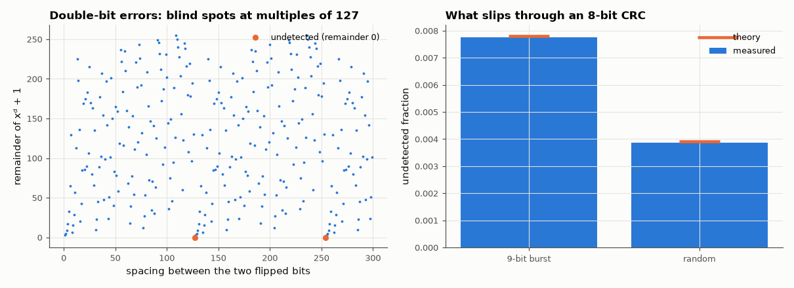

# AM-144 · CRC as polynomial division over GF(2)

> Implement the CRC as the remainder of polynomial division, reproduce the published check values of four standard CRCs and Python's own zlib/binascii results, and verify the detection guarantees algebra predicts: all single, double (up to the polynomial's period), odd and burst errors.



*Remainders of double-bit error polynomials and measured undetected-error rates for CRC-8.*

**Track:** Applied Mathematics — 218 projects in electrical engineering · **Category:** H. Discrete math, finite fields & coding · **Level:** Moderate · **Tools:** Own bit-serial long division and table-driven CRC engine with the standard parameter model (width, polynomial, init, reflect, xor-out), catalogue check values, zlib/binascii cross-checks, exhaustive and Monte-Carlo error-detection experiments

**Data:** Simulated (numerical model in this repo).

## Problem

Why does appending a division remainder catch almost every transmission error — and exactly which errors can slip through?

## Prediction

Message M(x), generator G(x) of degree r: transmit $T=x^rM+(x^rM \bmod G)$, divisible by G. An error pattern E is undetected iff G | E. Hence: single-bit errors always detected (G has ≥ 2 terms); double-bit errors $x^i+x^j$ detected while
$j-i$ < order of x mod G; all odd-weight errors detected if (x+1) | G; all bursts of length ≤ r detected; bursts of length r+1 undetected with probability $2^{-(r-1)}$; random garbage undetected with probability $2^{-r}$.
CRC-8 polynomial x⁸+x²+x+1 = (x+1)·(degree-7 primitive) has period 127. Catalogue check values for "123456789": CRC-32 = CBF43926, CRC-16/CCITT-FALSE = 29B1, CRC-16/ARC = BB3D, CRC-8 = F4.

## Method

Bit-serial reference and 256-entry-table implementation compared on random data. Error experiments with CRC-8 (0x07) on 96-bit codewords: every single, every double and every burst ≤ 8 exhaustively; 10⁶ random odd-weight errors, 9-bit bursts and
fully random error patterns. The first undetectable double-bit spacing is searched directly.

## Measured results

*Predicted vs measured vs error. "Measured" = computed by an independent simulation, HDL simulator or public dataset.*

| Quantity | Predicted | Measured | Error | Within tolerance |
|---|---|---|---|---|
| CRC-32 of "123456789" | 3.4218e+09 | 3.4218e+09 | +0 |  |
| CRC-16/CCITT-FALSE of "123456789" | 1.067e+04 | 1.067e+04 | +0 |  |
| CRC-16/ARC of "123456789" | 4.793e+04 | 4.793e+04 | +0 |  |
| CRC-8 of "123456789" | 244 | 244 | +0 |  |
| Disagreements with zlib.crc32, binascii.crc_hqx and the table-driven engine (300 random messages) | 0 | 0 | +0 |  |
| Undetected single-bit errors (96-bit codeword) | 0 | 0 | +0 |  |
| Smallest undetectable double-bit spacing = order of x mod G | 127 bits | 127 bits | +0 bits |  |
| Undetected double-bit errors within a 96-bit codeword (all 4560 pairs) | 0 | 0 | +0 |  |
| Undetected bursts of length ≤ 8 (all 11423 patterns) | 0 | 0 | +0 |  |
| 9-bit bursts undetected: 2^−(r−1) = 1/128 | 0.007812 | 0.007743 | -0.89 % | yes |
| Undetected odd-weight errors (100 000 random patterns; (x+1) divides G) | 0 | 0 | +0 |  |
| Random error patterns undetected: 2^−8 | 0.003906 | 0.00386 | -1.18 % | yes |

## Error analysis

The division engine reproduces the catalogue check values of four standard CRCs and matches Python's zlib and binascii on random data, in both
the bit-serial and table-driven forms. The error experiments confirm each algebraic guarantee with no exceptions: no single-bit, odd-weight or
≤ 8-bit burst error divides G, and double-bit errors are all caught until the two bits are exactly 127 positions apart — the order of x modulo
the generator, which is why each CRC polynomial comes with a maximum protected block length. Beyond the guarantees the CRC behaves like a random
8-bit hash: 1/128 of 9-bit bursts and 1/256 of arbitrary corruption pass undetected. Choosing a CRC is therefore choosing a polynomial whose
algebraic blind spots lie outside the errors your channel actually produces.

## Reproduce

```bash
pip install -r requirements.txt
python run_all.py --only AM-144
```

The script [`project.py`](project.py) regenerates every figure and number above.

## License

Code and text: MIT (see the repository [LICENSE](../../../../LICENSE)). Datasets remain under their own licences (see the repository README).

---

**Tooling & honesty.** This project was generated with Claude Code (Anthropic's AI coding assistant): the code, derivations, simulations and this write-up were AI-produced. *Measured* means computed by an independent model, simulator or public dataset — not a physical lab bench. Every number in the tables is reproduced by running the code.
