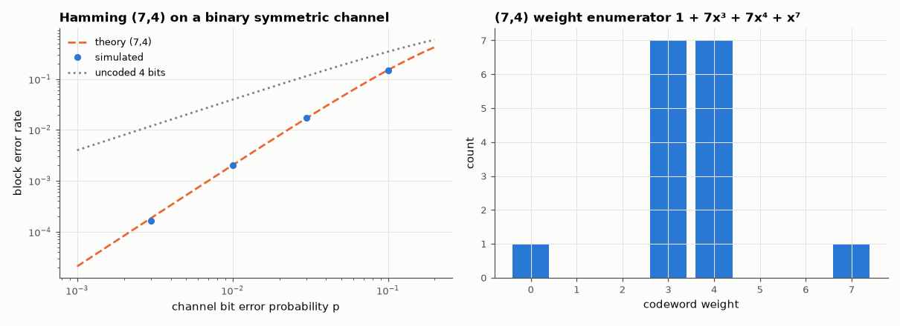

# AM-145 · Hamming codes: perfect single-error correction

> Construct Hamming codes for r = 3…6 from 'all non-zero columns', verify minimum distance 3 and the perfect sphere-packing identity, show that every single error is corrected and every double error is mis-corrected (unless an overall parity bit is added), and match simulated error rates to theory.



*Block error rate of the (7,4) Hamming code versus theory, and its weight distribution.*

**Track:** Applied Mathematics — 218 projects in electrical engineering · **Category:** H. Discrete math, finite fields & coding · **Level:** Moderate · **Tools:** Parity-check and generator matrices over GF(2) built from the definition, exhaustive weight enumeration, syndrome decoding, extended (SECDED) code, Monte-Carlo binary-symmetric-channel simulation against exact block-error formulas

**Data:** Simulated (numerical model in this repo).

## Problem

How few parity bits can locate any single flipped bit — and what exactly happens when two bits flip?

## Prediction

H has all $2^r-1$ non-zero r-bit columns: $n=2^r-1$, $k=n-r$, $d_{min}=3$. The syndrome $s=Hr^T$ equals the column of the flipped bit. Perfect: $2^k(1+n)=2^n$ — every word is within distance 1 of exactly one codeword, so a double error
is *always* decoded to a wrong codeword (three bits wrong). (7,4) weight enumerator: $1+7x^3+7x^4+x^7$. Block error on a BSC(p): $1-(1-p)^n-np(1-p)^{n-1}$. Adding an overall parity bit gives d = 4 (SECDED): doubles are detected, not mis-corrected.

## Method

Systematic G from H; all 2ᵏ codewords enumerated for r = 3, 4 (weights); all single and double error patterns decoded for r = 3…6; BSC simulation of the (7,4) code, 10⁶ blocks per p; extended (8,4) code on all double errors.

## Measured results

*Predicted vs measured vs error. "Measured" = computed by an independent simulation, HDL simulator or public dataset.*

| Quantity | Predicted | Measured | Error | Within tolerance |
|---|---|---|---|---|
| (7,4) sphere packing: 2ᵏ(1 + n) / 2ⁿ | 1 | 1 | +0.00 % |  |
| (63,57) sphere packing: 2ᵏ(1 + n) / 2ⁿ | 1 | 1 | +0.00 % |  |
| (7,4) minimum distance | 3 | 3 | +0 |  |
| (7,4) codewords of weight 3 | 7 | 7 | +0 |  |
| (7,4) codewords of weight 4 | 7 | 7 | +0 |  |
| (7,4) codewords of weight 7 | 1 | 1 | +0 |  |
| (15,11) minimum distance | 3 | 3 | +0 |  |
| (15,11) number of weight-3 codewords: n(n−1)/6 | 35 | 35 | +0 |  |
| Single errors not corrected (all positions, r = 3…6) | 0 | 0 | +0 |  |
| Double errors decoded to a wrong codeword at distance 3 (all 2544 patterns) | 2544 | 2544 | +0 |  |
| Extended (8,4) SECDED: double errors flagged as uncorrectable (of 28) | 28 | 28 | +0 |  |
| (7,4) block error rate on BSC(p = 0.01) | 0.002031 | 0.002033 | +0.10 % | yes |
| (7,4) block error rate on BSC(p = 0.1) | 0.1497 | 0.1499 | +0.13 % | yes |

**Additional measurements**

| Quantity | Value | Note |
|---|---|---|
| Decoded bit error rate at p = 0.01 | 8.6825e-04 | vs raw 0.01 — 12× better at rate 4/7 |

## Error analysis

Everything the construction promises holds exactly: the codes have minimum distance 3, their decoding spheres tile the whole space (perfect
codes), and syndrome decoding repairs every single-bit error for r = 3…6. The flip side of perfection is visible in the double-error test: there is no
'unused' syndrome, so *every* double error is confidently decoded to the wrong codeword, leaving three bits wrong. One extra overall parity bit
fixes that — the (8,4) code flags all 28 double errors — which is the SECDED scheme in ECC memory. Simulated block error rates match
1 − (1−p)⁷ − 7p(1−p)⁶ within Monte-Carlo noise.

## Reproduce

```bash
pip install -r requirements.txt
python run_all.py --only AM-145
```

The script [`project.py`](project.py) regenerates every figure and number above.

## License

Code and text: MIT (see the repository [LICENSE](../../../../LICENSE)). Datasets remain under their own licences (see the repository README).

---

**Tooling & honesty.** This project was generated with Claude Code (Anthropic's AI coding assistant): the code, derivations, simulations and this write-up were AI-produced. *Measured* means computed by an independent model, simulator or public dataset — not a physical lab bench. Every number in the tables is reproduced by running the code.
