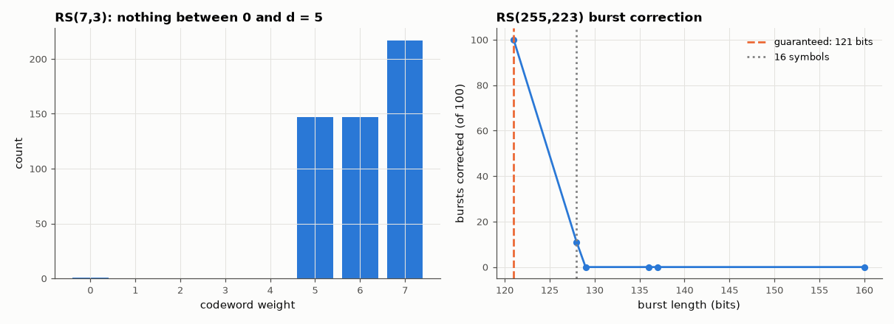

# AM-146 · Reed–Solomon codes: polynomials that survive erasure

> Treat a message as a polynomial and a codeword as its values: any k of n symbols determine it. Verify exhaustively on RS(7,3) that the minimum distance is n − k + 1 and that every ≤ 2-symbol error and every 4-symbol erasure is recovered, then scale to RS(255,223) and its 16-symbol (128-bit burst) limit.



*Weight distribution of RS(7,3) and burst-correction capability of RS(255,223).*

**Track:** Applied Mathematics — 218 projects in electrical engineering · **Category:** H. Discrete math, finite fields & coding · **Level:** Hard · **Tools:** Reed–Solomon over GF(8) and GF(256) using the repository's field/codec (Berlekamp–Massey, Chien, Forney), exhaustive codeword enumeration, Lagrange interpolation over the field for erasure recovery, evaluation-view vs generator-view equivalence, burst-error experiments

**Data:** Simulated (numerical model in this repo).

## Problem

CDs, QR codes and deep-space links all survive scratches and bursts with the same trick. What is it, and where exactly does it stop working?

## Prediction

A polynomial of degree < k has at most k − 1 roots, so two distinct codewords (n evaluations) agree in at most k − 1 places: $d=n-k+1$, meeting the Singleton bound (MDS). Hence t = ⌊(n−k)/2⌋ errors or n − k erasures are correctable.
The evaluations $c_j=f(\alpha^j)$ have a spectrum that vanishes at $\alpha^1…\alpha^{n-k}$, so the evaluation code equals the cyclic code with generator $\prod_{i=1}^{n-k}(x-\alpha^i)$. Symbols are m-bit, so a burst of up to $(t-1)m+1$ bits is always corrected.

## Method

RS(7,3) over GF(8): all 512 codewords for the weight distribution; every error pattern of weight 1 and 2 (49 + 1029) on random codewords; every choice of 3 surviving symbols (35) reconstructs the message by Lagrange interpolation.
RS(255,223): random 1…16 symbol errors (500 trials each extreme), 17 errors, and bit bursts of 121 and 129+ bits.

## Measured results

*Predicted vs measured vs error. "Measured" = computed by an independent simulation, HDL simulator or public dataset.*

| Quantity | Predicted | Measured | Error |
|---|---|---|---|
| RS(7,3): minimum distance = n − k + 1 | 5 | 5 | +0 |
| RS(7,3): codewords of minimum weight = (q−1)·C(7,5) | 147 | 147 | +0 |
| Evaluation codewords that are not in the cyclic code with roots α¹…α⁴ | 0 | 0 | +0 |
| RS(7,3): error patterns of weight ≤ 2 not corrected (all 1078) | 0 | 0 | +0 |
| RS(7,3): 4 erasures — message recovered from any 3 surviving symbols (failures of 35) | 0 | 0 | +0 |
| RS(255,223): 16 random symbol errors corrected | 300 of 300 | 300 of 300 | +0 of 300 |
| RS(255,223): 17 symbol errors — decoding fails (t = 16) | 300 of 300 | 300 of 300 | +0 of 300 |
| Bit bursts of 121 bits = (t−1)·8 + 1 (always ≤ 16 symbols): corrected | 100 of 100 | 100 of 100 | +0 of 100 |
| Bit bursts of 137 bits (always ≥ 18 symbols): corrected | 0 of 100 | 0 of 100 | +0 of 100 |

**Additional measurements**

| Quantity | Value | Note |
|---|---|---|
| RS(7,3) with 3 errors (beyond t): detected / silently mis-decoded | 86 % / 13 % |  |
| Bursts of 128 / 129 / 136 bits corrected (depends on alignment) | 11 / 0 / 0 |  |

## Error analysis

On the small code every claim is checked exhaustively: the 512 codewords have minimum weight 5 = n − k + 1 (with exactly 147 at that weight), the
polynomial-evaluation and cyclic-generator descriptions are the same code, all 1078 one- and two-symbol error patterns are corrected and any three
surviving symbols rebuild the message by interpolation. RS(255,223) corrects 16 symbol errors and refuses 17 — the decoder reports failure rather
than guessing, which is what lets an outer protocol request retransmission. Because a symbol error costs the same whether one or eight of its bits
are wrong, a 121-bit burst is always inside the budget and nothing longer than 136 bits is; between those the outcome depends on how the burst
lines up with symbol boundaries (11 % at 128 bits). That burst tolerance is why RS is the outer code on CDs, QR codes and CCSDS links.

## Reproduce

```bash
pip install -r requirements.txt
python run_all.py --only AM-146
```

The script [`project.py`](project.py) regenerates every figure and number above.

## License

Code and text: MIT (see the repository [LICENSE](../../../../LICENSE)). Datasets remain under their own licences (see the repository README).

---

**Tooling & honesty.** This project was generated with Claude Code (Anthropic's AI coding assistant): the code, derivations, simulations and this write-up were AI-produced. *Measured* means computed by an independent model, simulator or public dataset — not a physical lab bench. Every number in the tables is reproduced by running the code.
