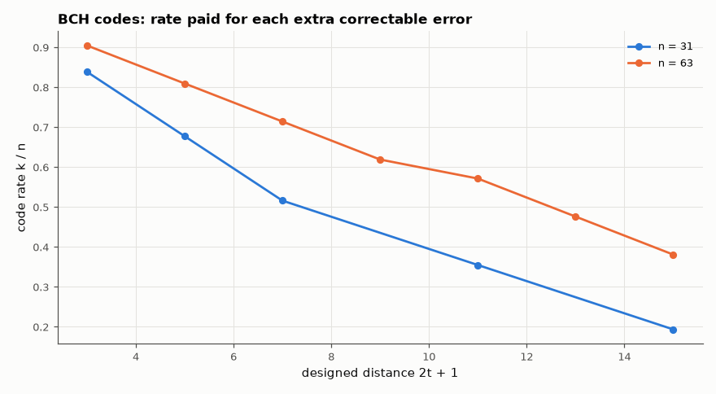

# AM-147 · BCH codes from cyclotomic cosets

> Construct binary BCH codes by requiring α, α², …, α²ᵗ to be roots of every codeword: derive the generators of the length-15 codes, reproduce the published (n, k, t) tables for n = 31 and 63 from the coset structure, confirm the BCH bound d ≥ 2t + 1, and decode every correctable error pattern.



*Rate versus designed distance for the binary BCH codes of length 31 and 63 constructed here.*

**Track:** Applied Mathematics — 218 projects in electrical engineering · **Category:** H. Discrete math, finite fields & coding · **Level:** Hard · **Tools:** Cyclotomic cosets and minimal polynomials over GF(2ᵐ), generator construction, own algebraic decoder (syndromes, Berlekamp–Massey, Chien search), exhaustive weight enumeration and error-pattern tests, published (n, k, t) tables

**Data:** Simulated (numerical model in this repo).

## Problem

Hamming codes fix one error. How do you design a binary code to fix exactly t errors, for any t you choose?

## Prediction

Over GF(2), if β is a root of a binary polynomial so are β², β⁴, … — the cyclotomic coset. The generator is the LCM of the minimal polynomials of α¹…α²ᵗ, so n − k = total size of the distinct cosets hit. BCH bound: 2t consecutive roots ⇒ d ≥ 2t + 1.
Length 15: t = 1 → g = x⁴+x+1 (k = 11); t = 2 → x⁸+x⁷+x⁶+x⁴+1 (k = 7); t = 3 → x¹⁰+x⁸+x⁵+x⁴+x²+x+1 (k = 5). Tables: n = 31: k = 26, 21, 16, 11, 6 for t = 1, 2, 3, 5, 7; n = 63: k = 57, 51, 45, 39, 36, 30, 24 for t = 1…7.
Decoding: syndromes $S_i=r(\alpha^i)$, Berlekamp–Massey for the error locator, Chien search for its roots.

## Method

Generators built by multiplying minimal polynomials (coefficients must land in {0, 1}). (15,7) and (15,5): all codewords enumerated for the true minimum distance; every error pattern of weight ≤ t decoded. (63,45,t=3): 2000 random
patterns of weight ≤ 3 and weight 4.

## Measured results

*Predicted vs measured vs error. "Measured" = computed by an independent simulation, HDL simulator or public dataset.*

| Quantity | Predicted | Measured | Error |
|---|---|---|---|
| n = 15, t = 1: generator polynomial (as an integer) = 0x13 | 19 | 19 | +0 |
| n = 15, t = 2: generator polynomial (as an integer) = 0x1d1 | 465 | 465 | +0 |
| n = 15, t = 3: generator polynomial (as an integer) = 0x537 | 1335 | 1335 | +0 |
| Published (n, k, t) table entries for n = 31 and 63 not reproduced (12 entries) | 0 | 0 | +0 |
| (15,7): true minimum distance vs BCH bound 2t + 1 | 5 | 5 | +0 |
| (15,7): error patterns of weight ≤ 2 not corrected (all 120) | 0 | 0 | +0 |
| (15,5): true minimum distance vs BCH bound 2t + 1 | 7 | 7 | +0 |
| (15,5): error patterns of weight ≤ 3 not corrected (all 575) | 0 | 0 | +0 |
| (63,45,t=3): random patterns of 1–3 errors corrected | 2000 of 2000 | 2000 of 2000 | +0 of 2000 |

**Additional measurements**

| Quantity | Value | Note |
|---|---|---|
| (63,45): 4 errors → decoder reports failure / mis-corrects | 80 % / 20 % |  |

## Cyclotomic cosets mod 15

- {1, 2, 4, 8} → minimal polynomial of degree 4
- {3, 6, 12, 9} → minimal polynomial of degree 4
- {5, 10} → minimal polynomial of degree 2
- {7, 14, 13, 11} → minimal polynomial of degree 4

## Error analysis

Multiplying the minimal polynomials picked out by the cyclotomic cosets reproduces the textbook generators for length 15 and all twelve
published (n, k, t) entries for lengths 31 and 63 — the dimension of a BCH code is pure coset bookkeeping. The exhaustively measured minimum
distances equal the BCH bound 2t + 1, and the algebraic decoder (syndromes → Berlekamp–Massey → Chien search) corrects every error pattern up to t.
Beyond t it behaves honestly most of the time: with four errors in the t = 3 code it reports failure in 80 % of trials and
mis-corrects in the rest. Note the uneven steps in rate: adding α⁵ to the required roots of the n = 15 code costs only two parity bits because its
coset {5, 10} is small — which is why some (n, k) combinations are bargains.

## Reproduce

```bash
pip install -r requirements.txt
python run_all.py --only AM-147
```

The script [`project.py`](project.py) regenerates every figure and number above.

## License

Code and text: MIT (see the repository [LICENSE](../../../../LICENSE)). Datasets remain under their own licences (see the repository README).

---

**Tooling & honesty.** This project was generated with Claude Code (Anthropic's AI coding assistant): the code, derivations, simulations and this write-up were AI-produced. *Measured* means computed by an independent model, simulator or public dataset — not a physical lab bench. Every number in the tables is reproduced by running the code.
