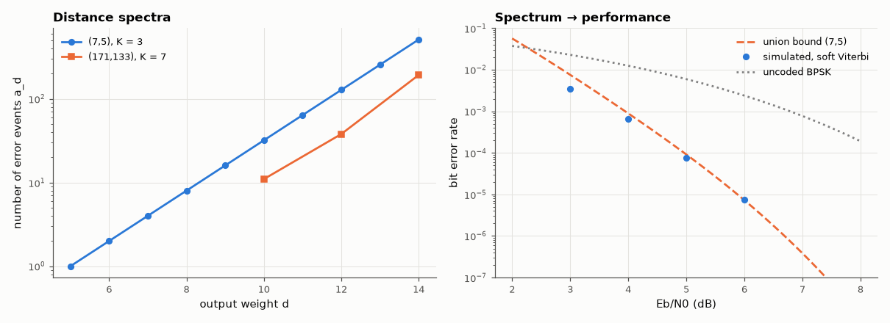

# AM-148 · Convolutional codes: state diagrams, trellises and distance spectra

> Compute the free distance and distance spectrum of convolutional codes directly from their trellis, check the K = 3 result against the transfer function T(D) = D⁵/(1 − 2D) and the K = 7 NASA code against published values, demonstrate a catastrophic code, and compare simulated BER with the union bound.



*Distance spectra of the K = 3 and K = 7 codes and the (7,5) BER against its union bound.*

**Track:** Applied Mathematics — 218 projects in electrical engineering · **Category:** H. Discrete math, finite fields & coding · **Level:** Hard · **Tools:** Trellis enumeration of error events (distance spectrum) by dynamic programming over (state, weight), transfer-function closed form for the (7,5) code, catastrophic-code test via polynomial GCD, batch Viterbi simulation against the union bound

**Data:** Simulated (numerical model in this repo).

## Problem

A convolutional code has no block length and no codeword list. What determines how well it corrects errors?

## Prediction

The encoder is a finite-state machine; codewords are paths in its trellis. Performance is governed by paths that leave the all-zero path and re-merge: for the (7,5)₈ K = 3 code, signal-flow-graph reduction gives $T(D)=D^5/(1-2D)$ ⇒ $d_{free}=5$,
$a_d=2^{d-5}$ paths and $c_d=(d-4)2^{d-5}$ information-bit errors at distance d. The K = 7 (171,133)₈ code has $d_{free}=10$, $a_{10}=11$, $a_{12}=38$, $c_{10}=36$, $c_{12}=211$. Soft-decision bound: $P_b\le\sum_d c_d\,Q(\sqrt{2dR\,E_b/N_0})$.
A code is catastrophic iff gcd(g₁, g₂) ≠ 1: some infinite-weight input produces finite-weight output.

## Method

Spectrum: propagate a table {(state, output weight, input weight): count} from the first diverging branch until paths re-merge, keeping weights ≤ d_max. Simulation: BPSK/AWGN, terminated 1000-bit blocks, soft Viterbi, 4×10⁶ bits at 5 dB
and 2×10⁷ at 6 dB. Catastrophic example (6,5)₈: g₁ = 1+D, g₂ = 1+D² share the factor 1+D.

## Measured results

*Predicted vs measured vs error. "Measured" = computed by an independent simulation, HDL simulator or public dataset.*

| Quantity | Predicted | Measured | Error | Within tolerance |
|---|---|---|---|---|
| (7,5) K = 3: free distance | 5 | 5 | +0 |  |
| (7,5): path counts a_d = 2^(d−5) for d = 5…14 (mismatches) | 0 | 0 | +0 |  |
| (7,5): bit weights c_d = (d−4)·2^(d−5) for d = 5…14 (mismatches) | 0 | 0 | +0 |  |
| (171,133) K = 7: free distance | 10 | 10 | +0 |  |
| (171,133): a₁₀ | 11 | 11 | +0 |  |
| (171,133): a₁₂ | 38 | 38 | +0 |  |
| (171,133): c₁₀ | 36 | 36 | +0 |  |
| (171,133): c₁₂ | 211 | 211 | +0 |  |
| (171,133): no odd-weight error events (a₁₁ + a₁₃) | 0 | 0 | +0 |  |
| gcd(g₁, g₂) for (7,5): 1 ⇒ non-catastrophic | 1 | 1 | +0 |  |
| gcd(g₁, g₂) for (6,5): 1 + D = 0b11 ⇒ catastrophic | 3 | 3 | +0 |  |
| (7,5) soft Viterbi BER at 5 dB vs union bound (304 errors) | 9.1655e-05 | 7.6000e-05 | -17.08 % | yes |
| (7,5) soft Viterbi BER at 6 dB vs union bound (151 errors) | 7.2831e-06 | 7.5500e-06 | +3.66 % | yes |

**Additional measurements**

| Quantity | Value | Note |
|---|---|---|
| All-ones input (weight 2000): output weight, catastrophic (6,5) vs good (7,5) | 3 vs 2001 | a handful of channel errors can therefore cause unbounded decoded errors |
| BER at 3 dB: simulated vs union bound (bound is loose at low SNR) | 3.42e-03 vs 7.55e-03 |  |

## Error analysis

The trellis enumeration reproduces the closed-form spectrum of the (7,5) code term by term and the published values for the NASA K = 7 code
(d_free = 10 with 11 minimum-weight events, and no odd-weight events at all). Those few numbers predict performance: at 5 and 6 dB the simulated
BER sits on the union bound, while at 3 dB the bound overestimates (7.6e-03 vs 3.4e-03) because overlapping error events are counted more than
once. The catastrophic example shows why generator choice is not just about distance: with g₁ and g₂ sharing the factor 1 + D, an input of 2000
ones encodes to a weight-3 sequence — a few channel errors could turn the all-zero message into all ones.

## Reproduce

```bash
pip install -r requirements.txt
python run_all.py --only AM-148
```

The script [`project.py`](project.py) regenerates every figure and number above.

## License

Code and text: MIT (see the repository [LICENSE](../../../../LICENSE)). Datasets remain under their own licences (see the repository README).

---

**Tooling & honesty.** This project was generated with Claude Code (Anthropic's AI coding assistant): the code, derivations, simulations and this write-up were AI-produced. *Measured* means computed by an independent model, simulator or public dataset — not a physical lab bench. Every number in the tables is reproduced by running the code.
