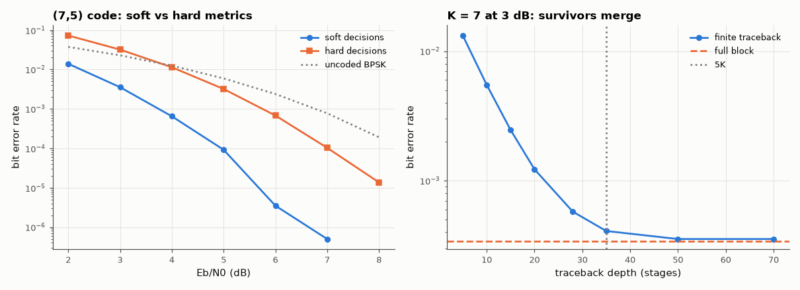

# AM-149 · The Viterbi algorithm as dynamic programming

> Show that Viterbi decoding is exactly a shortest-path dynamic programme: it returns the same answer as exhaustive maximum-likelihood search and as Dijkstra on the trellis, at linear instead of exponential cost; then measure the ≈ 2 dB gain of soft decisions and the '5 × constraint length' traceback rule.



*Soft- versus hard-decision BER of the (7,5) code and the effect of traceback depth for the K = 7 code.*

**Track:** Applied Mathematics — 218 projects in electrical engineering · **Category:** H. Discrete math, finite fields & coding · **Level:** Hard · **Tools:** Batch Viterbi decoder (add–compare–select as a shortest-path recursion), brute-force maximum-likelihood search over all codewords, Dijkstra on the explicit trellis graph (networkx), hard- vs soft-decision simulation, finite traceback-depth experiment on the K = 7 code

**Data:** Simulated (numerical model in this repo).

## Problem

Maximum-likelihood decoding means comparing the received signal with every possible message. How does Viterbi do that without the exponential cost?

## Prediction

The path metric is additive over trellis stages, so Bellman's principle applies: the best path into a state extends a best path into one of its predecessors. Keeping one survivor per state gives the ML path with $N\cdot2^{K-1}$ add–compare–select steps
instead of $2^N$ comparisons. Soft decisions (correlation metric) gain ≈ 2 dB over hard decisions (Hamming metric) on AWGN. Survivors merge after a few constraint lengths, so decisions can be released after a traceback of ≈ 5K stages with negligible loss.

## Method

(7,5) K = 3 code, 10 information bits + tail: all 1024 codewords scored by correlation for 400 noisy blocks at 0 dB — metric of the Viterbi output vs the true maximum. One block as an explicit graph (nodes = (time, state), edge weight = Hamming distance):
Dijkstra vs Viterbi. BER curves hard/soft, 2×10⁶ bits per point. K = 7 (171,133): BER vs traceback depth 5…70 at 3 dB.

## Measured results

*Predicted vs measured vs error. "Measured" = computed by an independent simulation, HDL simulator or public dataset.*

| Quantity | Predicted | Measured | Error | Within tolerance |
|---|---|---|---|---|
| Viterbi path metric vs exhaustive ML maximum over 1024 codewords (max difference, 400 blocks) | 0 | 1.4211e-14 | +1.4211e-14 | yes |
| Blocks where Viterbi and brute-force ML choose different messages | 0 | 0 | +0 |  |
| Hamming cost of the Viterbi path vs Dijkstra's shortest path on the trellis graph | 3 | 3 | +0 |  |
| Soft-decision gain over hard decisions at BER 10⁻⁴ | 2 dB | 2.056 dB | +0.05649 dB | yes |
| K = 7: BER with traceback depth 5K = 35 relative to full-block traceback | 1 × | 1.195 × | +19.51 % | yes |
| K = 7: traceback depth K = 7 is far too short (BER ratio to full > 10; 1 = yes) | 1 | 1 | +0 |  |

**Additional measurements**

| Quantity | Value | Note |
|---|---|---|
| Blocks decoded wrongly at 0 dB (by both — ML is optimal, not infallible) | 68 of 400 |  |
| Work: add–compare–selects (N·2^(K−1)·2) vs codewords to compare (2^N), N = 1000, K = 3 | 8000 vs 2^1000 |  |
| K = 7 at 3 dB: BER at depth 5 / 15 / 35 / full | 1.3e-02 / 2.5e-03 / 4.1e-04 / 3.4e-04 |  |

## Error analysis

On 400 heavily corrupted blocks the Viterbi decoder returned a codeword with exactly the maximum correlation found by scoring all 1024
candidates, and on the explicit trellis graph its path cost equals Dijkstra's shortest path — it *is* dynamic programming on a layered graph, with
the state as the 'everything that matters about the past'. The cost is linear in message length: 8000 add–compare–selects for a 1000-bit block
instead of 2¹⁰⁰⁰ comparisons. Feeding the decoder unquantised channel values instead of hard bits is worth 2.1 dB at BER 10⁻⁴, essentially
for free. And survivors really do merge: with the K = 7 code a traceback of 35 stages gives the same BER as waiting for the whole block
(4.1e-04 vs 3.4e-04), while 5 stages is catastrophic — the practical basis of the '5K' rule used in hardware decoders.

## Reproduce

```bash
pip install -r requirements.txt
python run_all.py --only AM-149
```

The script [`project.py`](project.py) regenerates every figure and number above.

## License

Code and text: MIT (see the repository [LICENSE](../../../../LICENSE)). Datasets remain under their own licences (see the repository README).

---

**Tooling & honesty.** This project was generated with Claude Code (Anthropic's AI coding assistant): the code, derivations, simulations and this write-up were AI-produced. *Measured* means computed by an independent model, simulator or public dataset — not a physical lab bench. Every number in the tables is reproduced by running the code.
