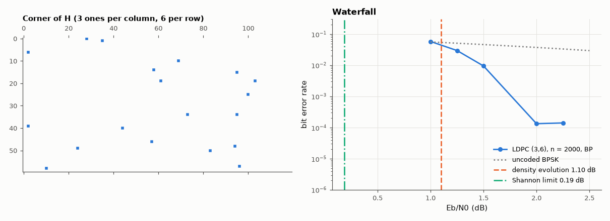

# AM-150 · LDPC codes: decoding by passing messages on a bipartite graph

> Build a rate-½ LDPC code as a sparse bipartite graph, decode it by iterative message passing, predict its noise threshold with density evolution, and compare the simulated waterfall of a 2000-bit code with that threshold and with the Shannon limit.



*Part of the sparse parity-check matrix and the simulated BER with the density-evolution threshold and Shannon limit.*

**Track:** Applied Mathematics — 218 projects in electrical engineering · **Category:** H. Discrete math, finite fields & coding · **Level:** Hard · **Tools:** Random regular (3,6) Tanner-graph construction with 4-cycle removal, girth by breadth-first search (checked with networkx), GF(2) Gaussian elimination for an encoder, vectorised sum-product (belief-propagation) decoder, density evolution by population dynamics, Monte-Carlo BER

**Data:** Simulated (numerical model in this repo).

## Problem

How can a code defined by a random sparse graph get within a decibel of the Shannon limit — with a decoder that only passes local messages?

## Prediction

Tanner graph: variable nodes (bits) and check nodes (parity equations). Sum-product: variable→check message = channel LLR + other incoming checks; check→variable: $2\tanh^{-1}\prod\tanh(m/2)$ over the other edges. On a cycle-free graph this is exact
bit-wise MAP; short cycles (girth 4) hurt. Density evolution tracks the message distribution for infinite length: the regular (3,6) ensemble has a BI-AWGN threshold of **1.11 dB** (Richardson–Urbanke), against the rate-½ Shannon limit of 0.19 dB. A finite code's
waterfall sits a few tenths of a dB above the threshold and sharpens with length.

## Method

n = 2000, m = 1000, column weight 3, row weight 6: random socket permutation, then edge swaps until no double edges or 4-cycles remain. Encoder from Gaussian elimination (H·c = 0 verified). BP: up to 60 iterations, 200 blocks per Eb/N0 (all-zero
codeword by symmetry, plus random codewords at one point as a check). Density evolution: 50 000 sampled messages, 400 iterations, bisection on Eb/N0.

## Measured results

*Predicted vs measured vs error. "Measured" = computed by an independent simulation, HDL simulator or public dataset.*

| Quantity | Predicted | Measured | Error | Within tolerance |
|---|---|---|---|---|
| Column weight / row weight of H (regular: 3 and 6; number of violations) | 0 | 0 | +0 |  |
| Girth of the Tanner graph after removing 4-cycles | 6 | 6 | +0 |  |
| … confirmed by networkx.girth | 6 | 6 | +0 |  |
| Encoder: H·cᵀ = 0 for 50 random codewords (non-zero syndromes) | 0 | 0 | +0 |  |
| Density-evolution threshold of the (3,6) ensemble (literature: 1.11 dB) | 1.11 dB | 1.102 dB | -0.008438 dB | yes |
| Waterfall (BER = 10⁻³) of the n = 2000 code vs the infinite-length threshold (finite-length gap < 0.7 dB) | 1.11 dB | 1.549 dB | +0.4392 dB | yes |
| Random (non-zero) codewords at 2 dB: blocks decoded correctly | 100 of 100 | 100 of 100 | +0 of 100 | yes |

**Additional measurements**

| Quantity | Value | Note |
|---|---|---|
| Rank of H / code dimension k | 1000 / 1000 | rate 0.5000 (H has 0 redundant rows) |
| Gap to the rate-½ BI-AWGN Shannon limit (0.19 dB) at BER 10⁻³ | 1.362 dB |  |
| Uncoded BPSK BER at 2 dB (for scale) | 0.03751 |  |
| BER / FER at 1.5 dB and 2.0 dB | 9.5e-03 / 0.14   and   1.3e-04 / 0.003 |  |

## Error analysis

A code that is nothing but a random sparse bipartite graph, decoded by nodes exchanging local beliefs, shows a cliff: the bit error rate of the
2000-bit code collapses between 1.25 and 2 dB (BER 10⁻³ at 1.55 dB), 1.4 dB from the Shannon limit, where uncoded BPSK still has
an error rate of 4 %. Density evolution run on sampled message populations puts the infinite-length threshold of the (3,6) ensemble at
1.10 dB (literature 1.11 dB); the finite code's waterfall is a few tenths of a dB above it, as expected from finite-length scaling. The
construction removed all 4-cycles (girth 6), which matters because message passing assumes incoming messages are independent — exactly true only
on a tree. Irregular degree distributions optimised by density evolution close most of the remaining gap to capacity; that, plus linear-time
decoding, is why LDPC codes are in Wi-Fi, DVB-S2 and 5G.

## Reproduce

```bash
pip install -r requirements.txt
python run_all.py --only AM-150
```

The script [`project.py`](project.py) regenerates every figure and number above.

**Files produced**

- [`data/ber.csv`](data/ber.csv)

## License

Code and text: MIT (see the repository [LICENSE](../../../../LICENSE)). Datasets remain under their own licences (see the repository README).

---

**Tooling & honesty.** This project was generated with Claude Code (Anthropic's AI coding assistant): the code, derivations, simulations and this write-up were AI-produced. *Measured* means computed by an independent model, simulator or public dataset — not a physical lab bench. Every number in the tables is reproduced by running the code.
