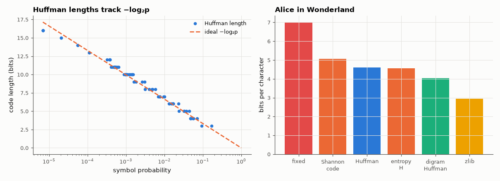

# AM-151 · Huffman coding: the optimal prefix code, built greedily

> Build Huffman codes from scratch, prove on small alphabets that no prefix code does better, verify H ≤ L < H + 1 and Gallager's tighter redundancy bound on a real book, round-trip the whole text bit-exactly, and show where symbol-by-symbol coding stops: skewed sources and context.



*Huffman code lengths against the ideal −log₂p, and compression of a real text by several methods.*

**Track:** Applied Mathematics — 218 projects in electrical engineering · **Category:** H. Discrete math, finite fields & coding · **Level:** Moderate · **Tools:** Own heap-based Huffman construction, canonical code, bit-exact encoder/decoder, brute-force optimality check over all Kraft-tight length assignments, real English text (Project Gutenberg), comparison with Shannon code lengths, pair coding and zlib

**Data:** Project Gutenberg eBook #11 (public domain), fetched on first run and cached.

## Problem

Morse gave 'e' a short code by intuition. What is the provably best variable-length code for a given set of symbol frequencies?

## Prediction

For symbol probabilities pᵢ the optimal prefix code merges the two least probable symbols repeatedly (greedy is optimal because the two rarest symbols can always be made siblings at maximum depth). Its mean length satisfies
$H\le L<H+1$ with $H=-\sum p_i\log_2p_i$; more tightly $L-H\le p_{max}+0.086$ (Gallager). Kraft: $\sum2^{-l_i}=1$ for a complete code. L = H exactly iff all pᵢ are powers of ½. Coding pairs of symbols reduces the per-symbol overhead and starts to exploit
correlation between neighbouring letters.

## Method

Data: the text of 'Alice's Adventures in Wonderland' (≈ 144 k characters). Optimality check: 300 random distributions on 3–6 symbols against exhaustive search over all length assignments with Kraft sum ≤ 1. Round trip of the entire text.
Pair (digram) Huffman; zlib level 9 for context.

## Measured results

*Predicted vs measured vs error. "Measured" = computed by an independent simulation, HDL simulator or public dataset.*

| Quantity | Predicted | Measured | Error | Within tolerance |
|---|---|---|---|---|
| Huffman worse than the best prefix code found by exhaustive search (300 random sources, 3–6 symbols) | 0 | 0 | +0 |  |
| Dyadic source (½, ¼, ⅛, 1/16, 1/16): L = H exactly | 1.875 bit | 1.875 bit | +0.00 % |  |
| Kraft sum Σ2^(−lᵢ) of the Huffman code | 1 | 1 | +0.00 % | yes |
| Source coding bound: H ≤ L < H + 1 (1 = holds) | 1 | 1 | +0 |  |
| Gallager bound: L − H ≤ p_max + 0.086 (1 = holds) | 1 | 1 | +0 |  |
| Encode → decode of the whole book: characters that differ | 0 | 0 | +0 |  |
| Encoded size = Σ fᵢ·lᵢ | 6.656e+05 bit | 6.656e+05 bit | +0.00 % | yes |
| Prefix-free: codewords that are a prefix of another | 0 | 0 | +0 |  |
| Pair (digram) Huffman: bits per character beats single-symbol Huffman (1 = yes) | 1 | 1 | +0 |  |
| Skewed binary source (0.99, 0.01): Huffman cannot go below 1 bit/symbol | 1 bit | 1 bit | +0.00 % |  |

**Additional measurements**

| Quantity | Value | Note |
|---|---|---|
| Text length / alphabet size | 144599 characters / 75 symbols |  |
| Entropy H / Huffman L / redundancy | 4.5646 / 4.6027 / 0.0381 bit per character | p_max = 0.170 (space) |
| Shannon code lengths ⌈−log₂p⌉: mean | 5.06 bit/char | valid but wasteful — Huffman is never worse |
| Fixed-length code | 7 bit/char |  |
| Digram Huffman / digram entropy per character | 4.0316 / 4.0178 bit |  |
| zlib -9 (LZ77 + Huffman, long contexts) | 2.945 bit/char |  |
| … while its entropy is | 0.08079 bit | the gap arithmetic coding closes (AM-208) |

## Most frequent symbols

| symbol | probability | −log₂p | code length | codeword |
|---|---|---|---|---|
| ' ' | 0.1702 | 2.55 | 3 | `000` |
| 'e' | 0.0937 | 3.42 | 3 | `001` |
| 't' | 0.0715 | 3.81 | 4 | `1001` |
| 'a' | 0.0570 | 4.13 | 4 | `0100` |
| 'o' | 0.0558 | 4.16 | 4 | `1000` |
| 'h' | 0.0496 | 4.33 | 4 | `0101` |
| 'n' | 0.0481 | 4.38 | 4 | `0111` |
| 'i' | 0.0474 | 4.40 | 4 | `0110` |
| 's' | 0.0440 | 4.51 | 5 | `10111` |
| 'r' | 0.0372 | 4.75 | 5 | `10110` |
| 'd' | 0.0331 | 4.92 | 5 | `10100` |
| 'l' | 0.0324 | 4.95 | 5 | `10101` |

## Error analysis

The greedy merge is optimal: in 300 random small sources no exhaustive search found a better prefix code, and for a dyadic source the code
meets the entropy exactly. On a real book the Huffman code needs 4.603 bits per character against an entropy of 4.565 — a redundancy of only
0.038 bit, inside Gallager's bound — and the whole text round-trips bit-exactly. Two limits show where Huffman stops. First, a code
word is at least one bit, so a very skewed source (0.99/0.01) is coded at 1 bit/symbol against an entropy of 0.08 — the motivation for arithmetic
coding. Second, the entropy of single letters is not the entropy of English: coding letter pairs already gets to 4.03 bits per character and
zlib, which models long repeats, reaches 2.95. Huffman is optimal for the model it is given; better compression comes from better models.

## Reproduce

```bash
pip install -r requirements.txt
python run_all.py --only AM-151
```

The script [`project.py`](project.py) regenerates every figure and number above.

## License

Code and text: MIT (see the repository [LICENSE](../../../../LICENSE)). Datasets remain under their own licences (see the repository README).

---

**Tooling & honesty.** This project was generated with Claude Code (Anthropic's AI coding assistant): the code, derivations, simulations and this write-up were AI-produced. *Measured* means computed by an independent model, simulator or public dataset — not a physical lab bench. Every number in the tables is reproduced by running the code.
